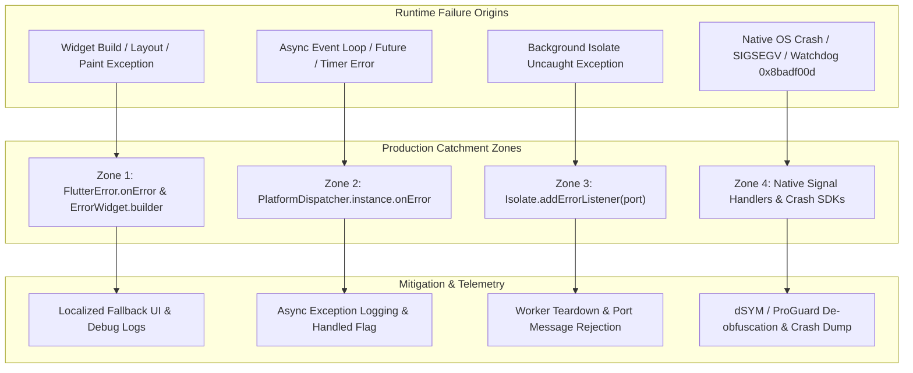
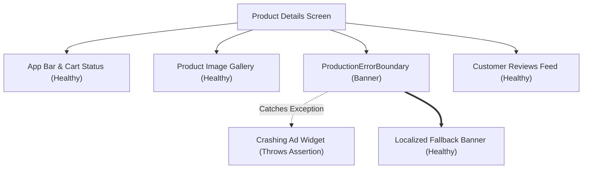
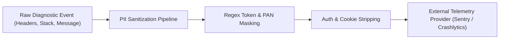

# Flutter Error Handling for Production Applications

In early Flutter development, error handling is often treated as an afterthought: wrap a network request in `try/catch`, print the error to the console, and hope for the best. In production, that approach disintegrates rapidly. A single unhandled assertion during a widget layout pass can trigger the dreaded "Red Screen of Death" in debug mode or freeze rendering with a silent grey rectangle in release mode. Meanwhile, uncaught asynchronous exceptions escape the widget tree entirely, background worker isolates fail silently while leaving UI spinners hanging indefinitely, and low-level native operating system crashes terminate the host process before Dart can record a single line of telemetry.

Building a resilient mobile product requires moving beyond ad-hoc exception catching. It demands a deliberate, multi-layered error architecture that isolates failures at their point of origin, models domain expectations through compiler-enforced type hierarchies, protects user privacy through rigorous telemetry scrubbing, and preserves the user experience through localized fallback boundaries.

This guide explores how to design, implement, and verify an end-to-end production error handling architecture in Flutter using Dart 3.

---

## The Four Production Error Catchment Zones

A common architectural flaw in Flutter applications is attempting to catch every error through a single top-level handler. In reality, modern Flutter applications run across multiple runtimes, isolates, and execution contexts. Unhandled failures slip through different cracks depending on where and how they originate.

A robust error handling architecture must configure four distinct **Catchment Zones**.



### Catchment Zones at a Glance

| Catchment Zone | Trigger Mechanism | Interception API | Default Release Behavior | Recommended Production Action |
| :--- | :--- | :--- | :--- | :--- |
| **Zone 1: Framework UI & Render** | Layout overflows, render assertions, widget build crashes | `FlutterError.onError` and `ErrorWidget.builder` | Blank grey box (`ColoredBox`), frozen layout | Render localized fallback UI; dispatch scrubbed diagnostic payload to telemetry |
| **Zone 2: Async Event Loop** | Uncaught `Future` rejections, microtasks, detached `Timer` callbacks | `PlatformDispatcher.instance.onError` | Error printed to standard error; app continues or enters unstable state | Record sanitized stack trace; return `true` to mark error as handled and avoid crash |
| **Zone 3: Background Isolates** | Uncaught exceptions inside secondary worker isolates (`Isolate.spawn`) | `isolate.addErrorListener(port)` or `Isolate.run` | Secondary isolate terminates silently; main isolate port listener hangs | Forward serialized error across port to main thread; cancel pending Futures |
| **Zone 4: Native Platform & OS** | Mach exceptions, SIGSEGV, SIGBUS, Android ANRs, iOS watchdog (`0x8badf00d`) | Native Crashlytics / Sentry / Bugsnag SDKs | Immediate kernel termination / OS kill dialog | Native signal handlers record tombstone; upload dSYM / ProGuard mapping files |

---

### Zone 1: Framework-Level Render and Widget Errors

When an exception occurs during the execution of a widget's `build()` method, layout calculation (`performLayout()`), or painting phase, it is intercepted by Flutter's framework layer rather than the Dart root isolate's general unhandled error hook.

In Flutter's rendering pipeline, `ComponentElement.performRebuild()` executes inside a framework try/catch block. When a build method throws:
1. Flutter forwards the error to `FlutterError.onError`.
2. Flutter replaces the failing widget subtree with the widget produced by `ErrorWidget.builder`.

In release mode, the default `ErrorWidget.builder` renders an empty grey box (`ColoredBox(color: Colors.grey)`). If a critical navigation shell or root scaffold throws during build, the entire mobile screen turns grey, leaving users stranded with no indication of what failed or how to recover.

In production, you must configure two hooks:

```dart
// 1. Intercept framework diagnostics and pipe them to your crash telemetry
FlutterError.onError = (FlutterErrorDetails details) {
  if (kReleaseMode) {
    // In release mode, route the structured failure to telemetry
    TelemetryService.instance.recordFlutterError(details);
  } else {
    // In debug and profile modes, dump to terminal console for local debugging
    FlutterError.dumpErrorToConsole(details);
  }
};

// 2. Replace the default grey rectangle with a branded, resilient fallback UI
ErrorWidget.builder = (FlutterErrorDetails details) {
  return ProductionCrashFallbackWidget(details: details);
};
```

---

### Zone 2: Asynchronous and Event-Loop Errors

Asynchronous Dart code runs on the isolate's event loop. When a `Future` completes with an error that has no registered `.catchError()` or `await try/catch` handler, or when a callback in a `Timer` throws an exception, the framework-level `FlutterError.onError` hook will **never** receive it.

Historically, Flutter developers wrapped their entire `runApp()` invocation inside `runZonedGuarded`:

```dart
// LEGACY PATTERN (Discouraged in modern Flutter):
runZonedGuarded(() {
  runApp(const MyApp());
}, (error, stack) {
  // Catch uncaught async errors
});
```

Starting in modern Flutter (Flutter 3.3+ / Dart 2.15+), `PlatformDispatcher.instance.onError` is the official, high-performance standard that supersedes `runZonedGuarded`. 

#### Why `PlatformDispatcher.onError` Supersedes `runZonedGuarded`

1. **Zero Zone Overhead**: Creating custom Dart zones introduces microtask scheduling overhead and alters event loop boundaries across the application.
2. **Engine Binding Reliability**: Initializing binary messengers and platform channels (`WidgetsFlutterBinding.ensureInitialized()`) inside custom zones historically led to subtle initialization ordering bugs and context mismatches.
3. **Explicit Handling Semantics**: `PlatformDispatcher.instance.onError` accepts a callback returning a `bool`. Returning `true` informs the Flutter engine that the error has been safely intercepted and handled, preventing the underlying platform embedder from terminating the process.

```dart
// MODERN PRODUCTION STANDARD:
PlatformDispatcher.instance.onError = (Object error, StackTrace stack) {
  TelemetryService.instance.recordAsyncError(
    error,
    stack,
    reason: 'Uncaught root isolate asynchronous error',
  );
  // Return true to prevent the host platform from treating this as an unhandled crash
  return true;
};
```

---

### Zone 3: Background Isolate Failures

Dart utilizes an actor-based concurrency model where each `Isolate` maintains its own dedicated memory heap and independent event loop. Memory is never shared between isolates; data is transferred exclusively via deep-copy message passing through `SendPort` and `ReceivePort`.

Because memory and event loops are strictly partitioned:
- An unhandled exception inside a background isolate **will not** trigger `PlatformDispatcher.instance.onError` on the main UI isolate.
- It **will not** trigger `FlutterError.onError`.

If an unhandled exception occurs inside a worker isolate spawned via `Isolate.spawn`, the worker isolate terminates immediately. Any `ReceivePort` on the main isolate awaiting a response message will hang forever, leaving user interfaces trapped in perpetual loading indicators.

To handle secondary isolate failures, you must register an explicit error port when spawning the isolate:

```dart
import 'dart:isolate';

/// Spawns a background worker isolate configured with explicit error monitoring.
Future<Isolate> spawnMonitoredWorker({
  required void Function(SendPort sendPort) entryPoint,
  required SendPort dataPort,
  required void Function(String error, StackTrace stack) onWorkerError,
}) async {
  final errorPort = ReceivePort();
  final exitPort = ReceivePort();

  final isolate = await Isolate.spawn(
    entryPoint,
    dataPort,
    onError: errorPort.sendPort,
    onExit: exitPort.sendPort,
    errorsAreFatal: true,
  );

  // Isolate error messages arrive as a 2-element list: [errorString, stackTraceString]
  errorPort.listen((dynamic message) {
    if (message is List<dynamic> && message.length >= 2) {
      final errorDescription = message[0].toString();
      final stackTrace = StackTrace.fromString(message[1].toString());
      onWorkerError(errorDescription, stackTrace);
    }
  });

  // Clean up port listeners when the isolate terminates
  exitPort.listen((dynamic _) {
    errorPort.close();
    exitPort.close();
  });

  return isolate;
}
```

#### One-Shot Computations: `Isolate.run`

For ephemeral background workloads (such as parsing a large JSON payload or processing image bytes), modern Dart provides `Isolate.run`. Unlike manual `Isolate.spawn` lifecycles, `Isolate.run` automatically captures exceptions thrown inside the worker isolate, serializes them across the exit channel, and rethrows them as a rejected `Future` on the calling isolate:

```dart
Future<AppResult<List<Product>, DomainFailure>> parseProductCatalog(String rawJson) async {
  try {
    // Isolate.run intercepts worker errors and re-throws them on the calling isolate
    final products = await Isolate.run(() => decodeAndParseCatalog(rawJson));
    return Ok(products);
  } on FormatException catch (e, stack) {
    return Err(ValidationFailure('Invalid catalog format', cause: e), stack);
  } catch (e, stack) {
    return Err(UnexpectedFailure('Failed to process catalog payload', cause: e), stack);
  }
}
```

---

### Zone 4: Native Platform Crashes and Watchdogs

Not all crashes originate within the Dart VM. When working with native plugins, platform channels, camera hardware, or local SQLite engines, applications encounter low-level failures written in C, C++, Objective-C, Swift, Java, or Kotlin.

Dart VM catch hooks cannot intercept:
1. **POSIX Signals & Mach Exceptions**: Memory access violations (`SIGSEGV`, `SIGBUS`), illegal instructions (`SIGILL`), or aborts (`SIGABRT`).
2. **iOS Darwin Watchdog Terminations (`0x8badf00d`)**: The iOS operating system watchdog monitors main-thread responsiveness. If an application blocks the main thread during launch or background resume for too long, the operating system terminates the process with exception code `0x8badf00d` ("ate bad food"). Dart code is killed instantly by the kernel without executing finalizers.
3. **Android Application Not Responding (ANR)**: When the Android main thread is blocked by heavy synchronous work or deadlocks for 5 seconds or more, the OS displays an ANR dialogue.

#### Interception and De-obfuscation

Zone 4 failures must be captured at the native OS layer by platform crash reporting SDKs (such as Firebase Crashlytics, Sentry, or Bugsnag). These SDKs install low-level native signal handlers via `sigaction` and hook into Java `Thread.setDefaultUncaughtExceptionHandler`.

When compiling Flutter applications for release using code obfuscation:

```bash
flutter build appbundle --obfuscate --split-debug-info=./build/symbols
flutter build ipa --obfuscate --split-debug-info=./build/symbols
```

All human-readable function names, class names, and file paths are stripped from the binary to reduce size and impede reverse engineering. An obfuscated stack trace appears as a sequence of raw memory offsets:

```text
#00 abs 0000000104a3c124 _kDartIsolateSnapshotInstructions + 0x124
#01 abs 0000000104a3c890 _kDartIsolateSnapshotInstructions + 0x890
```

To make native crash reports actionable, your continuous integration (CI/CD) deployment pipeline must archive and upload:
- **Dart Symbol Files**: The `.symbols` files generated in `./build/symbols`.
- **iOS dSYM Files**: Debug Symbol packages generated by Xcode in `./build/ios/archive/Runner.xcarchive/dSYMs`.
- **Android ProGuard / R8 Mapping Files**: The `mapping.txt` file located in `build/app/outputs/mapping/release/`.

Without automated symbol upload, native and obfuscated crash dumps cannot be decoded into actionable line numbers.

---

## Functional Error Modeling with Dart 3 Sealed Classes

In many codebases, errors are propagated by throwing naked exceptions:

```dart
// FRAGILE CODEBASE PATTERN: Naked exception throwing
Future<UserProfile> fetchUserProfile(String userId) async {
  final response = await httpClient.get('/users/$userId');
  if (response.statusCode == 200) {
    return UserProfile.fromJson(response.data);
  } else if (response.statusCode == 401) {
    throw AuthException('Session expired');
  } else {
    throw ServerException('Failed to fetch user');
  }
}
```

This pattern introduces major reliability hazards in production:
- **Hidden Signatures**: The return type `Future<UserProfile>` conceals that the function can throw `AuthException`, `ServerException`, `SocketException`, or `FormatException`.
- **Accidental Swallowing**: Callers frequently use generic `try / catch (e)` blocks that catch both expected domain conditions (e.g., user offline) and critical programming defects (e.g., `TypeError` or `RangeError`), silently swallowing bugs.
- **Missing Compiler Enforcement**: If a developer forgets to handle `AuthException`, the compiler will not warn them. The error manifests as an unhandled runtime crash in production.

Dart 3 introduced **sealed classes**, enabling functional, compiler-enforced result modeling without external third-party dependencies.

### Naked Exceptions vs Functional Result Modeling

| Evaluation Dimension | Naked Exceptions (`throw / catch`) | Functional Result (`AppResult<T, E>`) |
| :--- | :--- | :--- |
| **Signature Transparency** | Completely hidden. Callers cannot infer failure types from the signature alone. | Fully explicit. `AppResult<UserProfile, DomainFailure>` declares all possible outcomes. |
| **Compiler Enforcement** | None. Unhandled exceptions compile cleanly and crash at runtime. | Strict. Dart 3 pattern matching enforces exhaustive branch handling at compile time. |
| **Control Flow** | Non-local jumps. Stack unwinding can bypass resource cleanup and state resets. | Localized, linear execution. Callers branch cleanly using switch expressions. |
| **Bug vs Failure Distinction** | Obscured. A syntax or type bug is caught identically to a 404 HTTP response. | Clear. Programming bugs crash fast in tests; anticipated domain failures are modeled types. |
| **Refactoring Safety** | Fragile. Renaming or adding a new exception type cannot be verified across call sites. | Robust. Adding a new subtype to a sealed hierarchy flags every incomplete switch statement. |

---

### Designing a Production `AppResult<T, E>` Hierarchy

A clean implementation defines a sealed base class `AppResult<T, E>` with two terminal implementations: `Ok<T, E>` and `Err<T, E>`.

```dart
/// A discriminated union representing either a successful computation [Ok]
/// or an expected failure [Err].
sealed class AppResult<T, E> {
  const AppResult();

  bool get isOk => this is Ok<T, E>;
  bool get isErr => this is Err<T, E>;

  T? get valueOrNull => switch (this) {
        Ok(:final value) => value,
        Err() => null,
      };

  E? get errorOrNull => switch (this) {
        Ok() => null,
        Err(:final error) => error,
      };

  /// Transforms the success value using [transform] while preserving failure state.
  AppResult<R, E> map<R>(R Function(T value) transform) {
    return switch (this) {
      Ok(:final value) => Ok(transform(value)),
      Err(:final error, :final stackTrace) => Err(error, stackTrace),
    };
  }

  /// Chains an asynchronous operation returning another [AppResult].
  Future<AppResult<R, E>> andThen<R>(
    Future<AppResult<R, E>> Function(T value) operation,
  ) async {
    return switch (this) {
      Ok(:final value) => await operation(value),
      Err(:final error, :final stackTrace) => Err(error, stackTrace),
    };
  }
}

final class Ok<T, E> extends AppResult<T, E> {
  final T value;
  const Ok(this.value);
}

final class Err<T, E> extends AppResult<T, E> {
  final E error;
  final StackTrace? stackTrace;
  const Err(this.error, [this.stackTrace]);
}
```

---

### Structuring a Clean Domain Failure Taxonomy

Low-level protocol exceptions (such as `SocketException`, `DioException`, or `SqliteException`) should never leak into the presentation layer. Doing so couples your widgets to specific networking and database libraries, complicating refactoring and testing.

Define a cohesive, domain-level failure hierarchy:

```dart
/// Root failure contract isolating presentation logic from transport details.
sealed class DomainFailure {
  final String userMessage;
  final String? internalCode;
  final Object? cause;

  const DomainFailure(
    this.userMessage, {
    this.internalCode,
    this.cause,
  });
}

final class NetworkFailure extends DomainFailure {
  final int? httpStatusCode;
  final bool isTimeout;

  const NetworkFailure(
    super.userMessage, {
    this.httpStatusCode,
    this.isTimeout = false,
    super.internalCode,
    super.cause,
  });
}

final class AuthFailure extends DomainFailure {
  final bool isSessionExpired;

  const AuthFailure(
    super.userMessage, {
    this.isSessionExpired = true,
    super.internalCode,
    super.cause,
  });
}

final class ValidationFailure extends DomainFailure {
  final Map<String, String> fieldViolations;

  const ValidationFailure(
    super.userMessage, {
    this.fieldViolations = const {},
    super.internalCode,
    super.cause,
  });
}

final class StorageFailure extends DomainFailure {
  const StorageFailure(
    super.userMessage, {
    super.internalCode,
    super.cause,
  });
}

final class UnexpectedFailure extends DomainFailure {
  const UnexpectedFailure(
    super.userMessage, {
    super.internalCode,
    super.cause,
  });
}
```

---

### Exhaustive Pattern Matching in Presentation Logic

By pairing sealed class hierarchies with Dart 3 switch expressions, the compiler guarantees that every possible failure condition is accounted for:

```dart
Widget buildContent(BuildContext context, AppResult<UserProfile, DomainFailure> state) {
  return switch (state) {
    Ok(:final value) => UserProfileView(profile: value),
    Err(:final error) => switch (error) {
        NetworkFailure(:final isTimeout, :final userMessage) => OfflineRetryCard(
            message: isTimeout ? 'Connection timed out. Please verify your network.' : userMessage,
            onRetry: () => controller.refresh(),
          ),
        AuthFailure(:final isSessionExpired) => SessionExpiredBanner(
            showReLoginButton: isSessionExpired,
            onLoginTapped: () => navigator.pushNamed('/login'),
          ),
        ValidationFailure(:final fieldViolations) => FormErrorSummary(
            errors: fieldViolations,
          ),
        StorageFailure(:final userMessage) => LocalStorageWarning(
            message: userMessage,
          ),
        UnexpectedFailure(:final userMessage) => GenericErrorCard(
            message: userMessage,
            onReportTapped: () => controller.submitFeedback(),
          ),
      },
  };
}
```

If a future update introduces a new failure type (for example, `PermissionDeniedFailure`), the Dart compiler will immediately highlight every switch expression across your UI layer that fails to handle the new case.

---

## User Experience and Partial Failure Isolation (Error Boundaries)

In a complex production application, screens are composed of multiple decoupled widgets: navigation bars, live feeds, banner advertisements, personalized recommendations, and financial summaries.

If an unexpected null pointer or parsing mismatch occurs inside a promotional banner widget, the entire mobile screen should **never** collapse into an error view. The application should isolate the failure to the broken component, render an unobtrusive fallback, log the failure to telemetry, and allow the user to continue interacting with the rest of the application.



### Implementing a `ProductionErrorBoundary` Widget

Flutter widgets rebuild via `ComponentElement`. To create a localized boundary that traps child build crashes, wraps state mutations, and provides recovery mechanisms, use a dedicated boundary widget:

```dart
import 'package:flutter/foundation.dart';
import 'package:flutter/material.dart';

/// A localized error containment widget that catches rendering and state failures
/// within a subtree and presents a recovery fallback rather than crashing the screen.
class ProductionErrorBoundary extends StatefulWidget {
  final Widget child;
  final String boundaryIdentifier;
  final Widget Function(BuildContext context, Object error, VoidCallback onRetry)? errorBuilder;
  final VoidCallback? onReset;

  const ProductionErrorBoundary({
    super.key,
    required this.child,
    required this.boundaryIdentifier,
    this.errorBuilder,
    this.onReset,
  });

  @override
  State<ProductionErrorBoundary> createState() => _ProductionErrorBoundaryState();
}

class _ProductionErrorBoundaryState extends State<ProductionErrorBoundary> {
  Object? _activeError;
  StackTrace? _activeStackTrace;

  @override
  void initState() {
    super.initState();
    _activeError = null;
    _activeStackTrace = null;
  }

  void _handleSubtreeError(Object error, StackTrace stackTrace) {
    setState(() {
      _activeError = error;
      _activeStackTrace = stackTrace;
    });

    // Dispatch telemetry with boundary context
    TelemetryService.instance.recordCustomError(
      error: error,
      stackTrace: stackTrace,
      attributes: {
        'boundary_id': widget.boundaryIdentifier,
        'isolation_level': 'widget_subtree',
      },
    );
  }

  void _resetBoundary() {
    setState(() {
      _activeError = null;
      _activeStackTrace = null;
    });
    widget.onReset?.call();
  }

  @override
  Widget build(BuildContext context) {
    if (_activeError != null) {
      if (widget.errorBuilder != null) {
        return widget.errorBuilder!(context, _activeError!, _resetBoundary);
      }
      return DefaultBoundaryFallback(
        boundaryName: widget.boundaryIdentifier,
        onRetry: _resetBoundary,
      );
    }

    // In Flutter, layout and element build errors from children can be intercepted
    // by wrapping child builds in a custom layout or error catcher.
    return widget.child;
  }
}

class DefaultBoundaryFallback extends StatelessWidget {
  final String boundaryName;
  final VoidCallback onRetry;

  const DefaultBoundaryFallback({
    super.key,
    required this.boundaryName,
    required this.onRetry,
  });

  @override
  Widget build(BuildContext context) {
    return Container(
      padding: const EdgeInsets.all(12.0),
      margin: const EdgeInsets.symmetric(vertical: 4.0),
      decoration: BoxDecoration(
        color: Theme.of(context).colorScheme.errorContainer.withValues(alpha: 0.3),
        borderRadius: BorderRadius.circular(8.0),
        border: Border.all(
          color: Theme.of(context).colorScheme.error.withValues(alpha: 0.5),
        ),
      ),
      child: Row(
        children: [
          Icon(
            Icons.warning_amber_rounded,
            color: Theme.of(context).colorScheme.error,
          ),
          const SizedBox(width: 12.0),
          Expanded(
            child: Text(
              'Unable to display content at this time.',
              style: Theme.of(context).textTheme.bodySmall,
            ),
          ),
          TextButton(
            onPressed: onRetry,
            child: const Text('Retry'),
          ),
        ],
      ),
    );
  }
}
```

---

## Contextual Diagnostics, Breadcrumbs, and PII Scrubbing

A stack trace in isolation is rarely sufficient to diagnose why a production defect occurred. Knowing that a null pointer was encountered on line 42 does not reveal:
- What navigation path the user took to arrive at that screen.
- What UI buttons were tapped prior to the crash.
- What API endpoints responded with non-200 status codes.
- Whether the device was operating under critical operating system memory pressure.

To reconstruct incidents reliably, crash reporting systems capture **Breadcrumbs**—a sequential timeline of diagnostic events recorded leading up to a failure.

### Constructing Contextual Breadcrumbs

A comprehensive breadcrumb architecture tracks four diagnostic streams:

1. **Navigation Transitions**: Intercepting route pushes, pops, and modal presentations using a custom `NavigatorObserver`.
2. **User Interactions**: Logging high-level intent events (e.g., `tap: checkout_button`, `pull_to_refresh: transaction_history`).
3. **Network Telemetry**: Recording HTTP methods, sanitized endpoints, status codes, and latency figures (excluding sensitive request/response payloads).
4. **System Environment Events**: Listening to operating system lifecycle changes (`AppLifecycleState`) and memory pressure alerts (`WidgetsBindingObserver.didHaveMemoryPressure`).

```dart
class TelemetryObserver extends NavigatorObserver {
  @override
  void didPush(Route<dynamic> route, Route<dynamic>? previousRoute) {
    super.didPush(route, previousRoute);
    TelemetryService.instance.addBreadcrumb(
      category: 'navigation',
      message: 'Navigated to ${route.settings.name ?? "unnamed_route"}',
      level: BreadcrumbLevel.info,
    );
  }
}
```

---

### The PII Security Boundary: Data Sanitization

Transmitting raw exception messages, HTTP headers, or state dumps directly to third-party telemetry providers (such as Datadog, Sentry, or Firebase) introduces severe privacy and compliance vulnerabilities. Under regulatory frameworks like GDPR, HIPAA, and PCI-DSS, inadvertently transmitting Personally Identifiable Information (PII), payment card numbers, or session credentials carries substantial legal liability.

A production error pipeline must enforce a strict **Data Sanitization Boundary** before any event leaves the device:



#### Implementing a Telemetry Sanitizer

```dart
class TelemetrySanitizer {
  // Regex to detect JSON Web Tokens (Bearer eyJ...)
  static final RegExp _jwtPattern = RegExp(
    r'Bearer\s+[A-Za-z0-9-_=]+\.[A-Za-z0-9-_=]+\.?[A-Za-z0-9-_.+/=]*',
    caseSensitive: false,
  );

  // Regex to detect email addresses
  static final RegExp _emailPattern = RegExp(
    r'[a-zA-Z0-9._%+-]+@[a-zA-Z0-9.-]+\.[a-zA-Z]{2,}',
  );

  // Regex to detect 13 to 19 digit credit card numbers (PAN sequences)
  static final RegExp _creditCardPattern = RegExp(
    r'\b(?:\d[ -]*?){13,19}\b',
  );

  // Blocklist of sensitive header keys that must always be redacted
  static const Set<String> _blacklistedHeaders = {
    'authorization',
    'cookie',
    'set-cookie',
    'x-api-key',
    'x-auth-token',
    'proxy-authorization',
  };

  /// Sanitizes an arbitrary string by masking sensitive patterns.
  static String scrubString(String input) {
    var output = input;
    output = output.replaceAllMapped(_jwtPattern, (_) => 'Bearer [REDACTED_JWT]');
    output = output.replaceAllMapped(_emailPattern, (_) => '[REDACTED_EMAIL]');
    output = output.replaceAllMapped(_creditCardPattern, (_) => '[REDACTED_CARD]');
    return output;
  }

  /// Sanitizes HTTP headers by stripping sensitive credentials.
  static Map<String, String> scrubHeaders(Map<String, String> headers) {
    final sanitized = <String, String>{};
    for (final entry in headers.entries) {
      if (_blacklistedHeaders.contains(entry.key.toLowerCase())) {
        sanitized[entry.key] = '[REDACTED_HEADER]';
      } else {
        sanitized[entry.key] = scrubString(entry.value);
      }
    }
    return sanitized;
  }
}
```

---

## Production Application Bootstrap: Self-Contained Implementation

Below is a complete, syntactically valid Dart 3 implementation demonstrating the initialization of all catchment zones, custom error fallback widgets, and telemetry dispatching during application startup.

```dart
import 'dart:async';
import 'dart:ui';
import 'package:flutter/foundation.dart';
import 'package:flutter/material.dart';

// =============================================================================
// TELEMETRY & CRASH REPORTING HARNESS
// =============================================================================

enum BreadcrumbLevel { debug, info, warning, error }

class DiagnosticBreadcrumb {
  final String category;
  final String message;
  final BreadcrumbLevel level;
  final DateTime timestamp;

  DiagnosticBreadcrumb({
    required this.category,
    required this.message,
    required this.level,
    DateTime? timestamp,
  }) : timestamp = timestamp ?? DateTime.now();
}

class TelemetryService {
  TelemetryService._();
  static final TelemetryService instance = TelemetryService._();

  final List<DiagnosticBreadcrumb> _breadcrumbs = [];
  static const int _maxBreadcrumbCapacity = 50;

  void addBreadcrumb({
    required String category,
    required String message,
    BreadcrumbLevel level = BreadcrumbLevel.info,
  }) {
    if (_breadcrumbs.length >= _maxBreadcrumbCapacity) {
      _breadcrumbs.removeAt(0);
    }
    _breadcrumbs.add(
      DiagnosticBreadcrumb(
        category: category,
        message: TelemetrySanitizer.scrubString(message),
        level: level,
      ),
    );
  }

  void recordFlutterError(FlutterErrorDetails details) {
    final sanitizedException = TelemetrySanitizer.scrubString(details.exceptionAsString());
    final library = details.library ?? 'unknown_framework_library';
    
    // In production, dispatch this payload to your crash reporting service
    debugPrint('[Telemetry] Framework Error Captured: $sanitizedException in $library');
  }

  void recordAsyncError(Object error, StackTrace stackTrace, {String? reason}) {
    final sanitizedError = TelemetrySanitizer.scrubString(error.toString());
    
    // In production, dispatch this payload with current breadcrumbs
    debugPrint('[Telemetry] Async Root Error: $sanitizedError, Reason: $reason');
  }

  void recordCustomError({
    required Object error,
    required StackTrace stackTrace,
    Map<String, String>? attributes,
  }) {
    final sanitizedError = TelemetrySanitizer.scrubString(error.toString());
    debugPrint('[Telemetry] Localized Boundary Error: $sanitizedError, Meta: $attributes');
  }
}

// =============================================================================
// PII SANITIZATION ENGINE
// =============================================================================

class TelemetrySanitizer {
  static final RegExp _jwtPattern = RegExp(
    r'Bearer\s+[A-Za-z0-9-_=]+\.[A-Za-z0-9-_=]+\.?[A-Za-z0-9-_.+/=]*',
    caseSensitive: false,
  );
  static final RegExp _emailPattern = RegExp(
    r'[a-zA-Z0-9._%+-]+@[a-zA-Z0-9.-]+\.[a-zA-Z]{2,}',
  );

  static String scrubString(String input) {
    return input
        .replaceAllMapped(_jwtPattern, (_) => 'Bearer [REDACTED_TOKEN]')
        .replaceAllMapped(_emailPattern, (_) => '[REDACTED_EMAIL]');
  }
}

// =============================================================================
// PRODUCTION FALLBACK UI
// =============================================================================

class ProductionCrashFallbackWidget extends StatelessWidget {
  final FlutterErrorDetails details;

  const ProductionCrashFallbackWidget({super.key, required this.details});

  @override
  Widget build(BuildContext context) {
    return Material(
      color: Colors.white,
      child: Center(
        child: Padding(
          padding: const EdgeInsets.symmetric(horizontal: 24.0),
          child: Column(
            mainAxisSize: MainAxisSize.min,
            children: [
              const Icon(
                Icons.error_outline_rounded,
                color: Colors.redAccent,
                size: 56.0,
              ),
              const SizedBox(height: 16.0),
              const Text(
                'Something unexpected occurred',
                style: TextStyle(
                  fontSize: 20.0,
                  fontWeight: FontWeight.bold,
                  color: Colors.black87,
                ),
                textAlign: TextAlign.center,
              ),
              const SizedBox(height: 8.0),
              const Text(
                'Our engineering team has been notified. Please try restarting the application or reloading the screen.',
                style: TextStyle(fontSize: 14.0, color: Colors.black54),
                textAlign: TextAlign.center,
              ),
              const SizedBox(height: 24.0),
              FilledButton(
                onPressed: () {
                  // In production, execute a safe navigation reset or screen rebuild
                },
                child: const Text('Refresh View'),
              ),
            ],
          ),
        ),
      ),
    );
  }
}

// =============================================================================
// APPLICATION ENTRY POINT BOOTSTRAP
// =============================================================================

void main() {
  // Guarantee engine bindings are ready prior to attaching top-level hooks
  WidgetsFlutterBinding.ensureInitialized();

  // Zone 1: Intercept framework layout, render, and build assertions
  FlutterError.onError = (FlutterErrorDetails details) {
    if (kReleaseMode) {
      TelemetryService.instance.recordFlutterError(details);
    } else {
      FlutterError.dumpErrorToConsole(details);
    }
  };

  // Zone 1 UI Fallback: Replace release mode grey screen with branded error UI
  ErrorWidget.builder = (FlutterErrorDetails details) {
    return ProductionCrashFallbackWidget(details: details);
  };

  // Zone 2: Intercept unhandled asynchronous exceptions in the root isolate
  PlatformDispatcher.instance.onError = (Object error, StackTrace stack) {
    TelemetryService.instance.recordAsyncError(
      error,
      stack,
      reason: 'Root isolate asynchronous unhandled error',
    );
    // Returning true prevents the Flutter engine from executing hard OS termination
    return true;
  };

  runApp(const MainApplicationShell());
}

class MainApplicationShell extends StatelessWidget {
  const MainApplicationShell({super.key});

  @override
  Widget build(BuildContext context) {
    return MaterialApp(
      title: 'Production Resilience Demo',
      theme: ThemeData(
        useMaterial3: true,
        colorSchemeSeed: Colors.indigo,
      ),
      home: const Scaffold(
        body: Center(
          child: Text('Resilient Flutter Application Active'),
        ),
      ),
    );
  }
}
```

---

## Common Production Anti-Patterns

When reviewing mobile codebases across enterprise organizations, several recurring anti-patterns consistently degrade error visibility and system resilience.

### 1. The Swallowed Exception and Null Return Trap

```dart
// ANTI-PATTERN: Silent null failure
Future<User?> loadUserProfile() async {
  try {
    return await apiService.getUser();
  } catch (e) {
    // Swallows network disconnects, 401s, 500s, and JSON type cast bugs identically
    return null;
  }
}
```

Returning `null` on failure forces every calling widget to perform null checks without having any context as to *why* the value is missing. Was the phone offline? Did the session token expire? Did the JSON response structure change? Use `AppResult<User, DomainFailure>` to make the failure state explicit and actionable.

### 2. Wrapping `runApp` in Legacy `runZonedGuarded`

Carrying over deprecated Flutter 1.x patterns introduces unnecessary zone layers that complicate binary communication and microtask queuing. Adopt `PlatformDispatcher.instance.onError` for clean, zone-free asynchronous catchment.

### 3. Telemetry Flooding Without Deduplication

If a continuous animation loop or scroll controller encounters an unhandled exception inside a build pass, it can throw 60 times per second. Without client-side rate limiting and error fingerprint deduplication, a single user session can flood your crash reporting backend with thousands of identical diagnostic events within seconds, exhausting service quotas and obscuring unrelated incidents.

### 4. Raw Exception Dumping to User Interfaces

Displaying raw technical strings like `FormatException: Unexpected character at line 1` or `DioException [bad response]: 502` directly to end users creates confusion and exposes internal infrastructure details. Translate technical exceptions into empathetic, actionable domain messages at architectural boundaries.

### 5. Neglecting Background Isolate Error Listeners

Spawning background isolates using `Isolate.spawn` without registering an `onError: receivePort.sendPort` listener guarantees that background worker crashes will evaporate silently into VM standard error, leaving user interfaces permanently stuck waiting for responses.

---

## Production Error Handling Verification Checklist

Before deploying a Flutter application to public app stores, verify that your error architecture satisfies every operational requirement in this checklist:

### Catchment & Initialization
- [ ] `WidgetsFlutterBinding.ensureInitialized()` is invoked at the very beginning of `main()`.
- [ ] `FlutterError.onError` routes framework exceptions to your telemetry pipeline in release mode while preserving `dumpErrorToConsole` in debug mode.
- [ ] `ErrorWidget.builder` is overridden to display a branded fallback widget instead of the default grey rectangle.
- [ ] `PlatformDispatcher.instance.onError` is configured to catch unhandled asynchronous futures, timers, and microtasks, returning `true` to avoid process exit.
- [ ] All background isolates spawned via `Isolate.spawn` register an explicit `onError` port listener.

### Domain Modeling & Architecture
- [ ] Business logic and repository methods return typed `AppResult<T, E>` unions rather than throwing naked, undeclared exceptions.
- [ ] Domain failures are organized into a clean sealed class hierarchy (`NetworkFailure`, `AuthFailure`, `ValidationFailure`, `StorageFailure`).
- [ ] Presentation widgets use exhaustive pattern matching (`switch` expressions) to enforce complete handling of all failure conditions at compile time.
- [ ] Technical transport exceptions (`SocketException`, `DioException`, `SqliteException`) are converted to domain failures at the repository boundary and never leak into UI widgets.

### Observability, Privacy & Telemetry
- [ ] Telemetry pipelines enforce automated PII scrubbing for JWTs, API tokens, email addresses, and payment card numbers before transmission.
- [ ] Telemetry events capture breadcrumbs including navigation transitions, user interactions, and system memory warnings.
- [ ] Client-side error deduplication or rate limiting is enabled to prevent log flooding during repetitive animation or layout loop exceptions.
- [ ] CI/CD release workflows automatically archive and upload Dart `.symbols` files, iOS dSYMs, and Android ProGuard/R8 `mapping.txt` files for stack trace de-obfuscation.

### Resilience & User Experience
- [ ] Critical screens wrap complex or third-party subtrees in localized error boundaries to isolate partial component failures.
- [ ] User-facing failure messages provide clear, actionable recovery options (such as a retry action or navigation reset) rather than generic error codes.

---

## Conclusion

Resilient error handling in Flutter is not about preventing every conceivable runtime failure. Network connections drop, third-party APIs return malformed responses, device memory runs low, and unexpected race conditions occur.

True production readiness means building a system that anticipates failure at every layer of the stack. By establishing strict boundaries across the four catchment zones, replacing fragile exceptions with compiler-enforced `AppResult` types, isolating widget build crashes within localized boundaries, and scrubbing telemetry payloads to protect user privacy, you create a Flutter application that fails gracefully, recovers quickly, and delivers an uninterrupted user experience.
