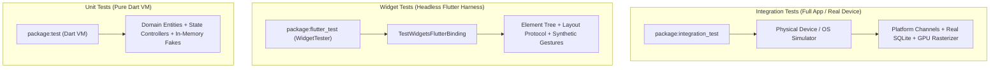
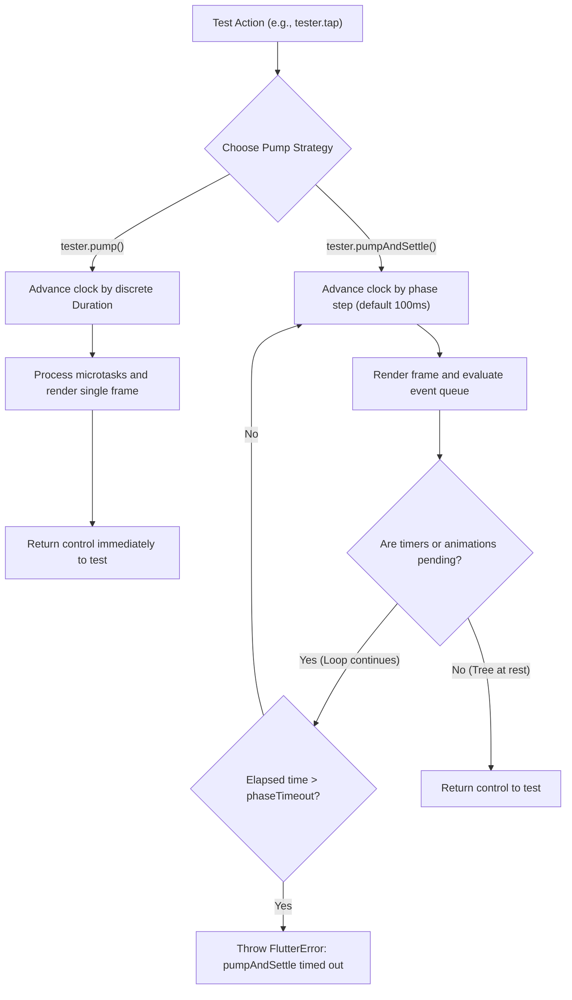
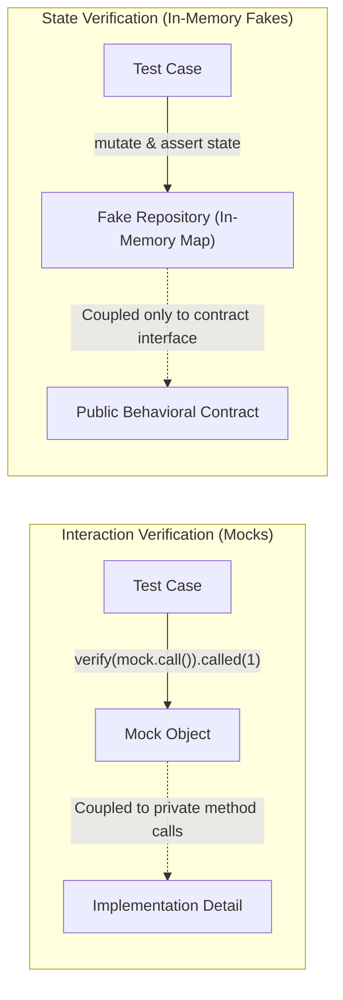
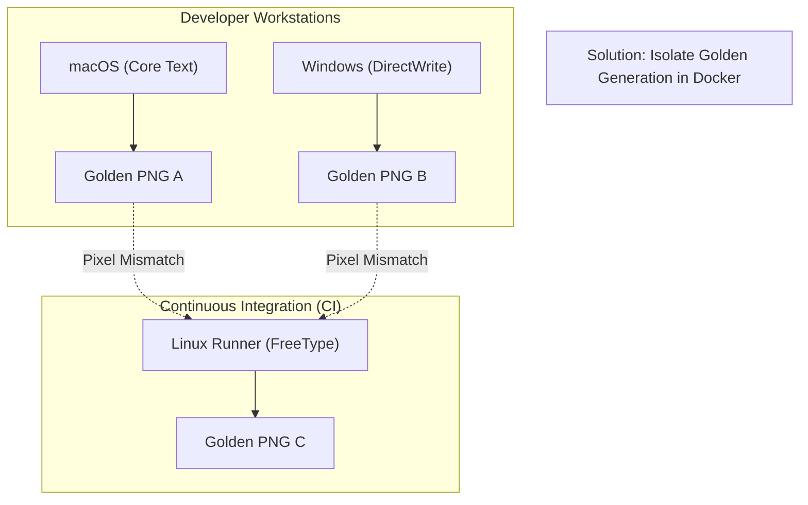

# Flutter Testing: Unit, Widget, and Integration Tests Explained

Automated testing in mobile development is fundamentally multi-layered. Testing pure business rules on a real mobile device is slow, fragile, and wasteful of compute resources. Conversely, verifying user interaction solely through isolated domain tests is impossible because rendering, gesture disambiguation, responsive constraints, and lifecycle events require a UI execution environment.

Flutter provides a unique architectural advantage: its layered engine and custom rendering pipeline allow developers to run high-fidelity UI tests headlessly on developer workstations without launching an operating system simulator. However, realizing this advantage requires an intentional testing strategy. Teams that do not understand the boundaries between execution environments often suffer from two extremes: brittle test suites tightly coupled to private implementation details, or painfully slow continuous integration pipelines that run every interaction through full end-to-end device automation.

This guide provides an architectural blueprint for testing production Flutter applications. It examines the execution mechanics of the Flutter testing pyramid, dissects asynchronous frame pumping and clock simulation, contrasts test double methodologies, addresses visual regression pitfalls, and demonstrates self-contained, typed Dart 3 test implementations.

---

## The Flutter Testing Pyramid and Execution Environments

A sustainable test suite balances feedback velocity, execution fidelity, and maintenance overhead. In Flutter, automated tests fall into three distinct tiers, each operating within a different runtime environment.



### 1. Unit Tests (Standalone Dart VM)
Unit tests execute within a pure Dart virtual machine process. They do not initialize the Flutter C++ engine, Skia or Impeller graphics pipelines, or native platform channels. 

- **Primary Target**: Pure business logic, value objects, domain entities, mathematical calculations, serialization schemas, and state controllers (such as Bloc, Cubit, or `ValueNotifier`).
- **Velocity**: Sub-second execution for hundreds of test cases.
- **Limitation**: Cannot verify widget rendering, constraints, user taps, or native operating system integrations.

### 2. Widget Tests (Headless `flutter_test` Harness)
Widget tests run using `testWidgets` and the `WidgetTester` utility provided by `package:flutter_test`. They run inside a specialized headless environment governed by `TestWidgetsFlutterBinding`. 

Unlike standard unit tests, widget tests construct real widget and element trees, calculate box layouts, perform hit-testing, dispatch synthetic gestures, and evaluate widget tree rebuilds. However, they do not spawn an Android emulator or iOS simulator, nor do they require a physical GPU rasterizer; rendering occurs against an in-memory mock canvas.

- **Primary Target**: Component rendering, conditional layout visibility, form input handling, user tap reactions, state-to-UI bindings, and navigation triggers.
- **Velocity**: Typically tens to hundreds of milliseconds per test file.
- **Limitation**: Platform channels must be mocked or faked. Hardware-specific rendering quirks or OS-level web views cannot be exercised directly.

### 3. Integration Tests (`package:integration_test`)
Integration tests compile the complete application binary (`.apk`, `.aab`, or `.app`) and deploy it to a physical device, desktop runner, or simulator. Operating via `IntegrationTestWidgetsFlutterBinding`, they drive the app externally or through an internal runner script.

- **Primary Target**: Critical end-to-end user journeys (e.g., biometric authentication, in-app checkout, push notification reception), database migrations, deep-link handling, and performance frame-budget profiling.
- **Velocity**: Minutes per suite due to compilation, deployment, and device startup overhead.
- **Limitation**: Sensitive to device network latency, hardware instability, and OS permission dialogues.

### Architectural Comparison Across Testing Tiers

| Dimension | Unit Tests | Widget Tests | Integration Tests |
| :--- | :--- | :--- | :--- |
| **Execution Runtime** | Standalone Dart VM | Headless `flutter_test` harness | Physical mobile hardware or OS simulator |
| **Flutter Engine Active** | No | Yes (Headless C++ engine binding) | Yes (Full engine, embedder, and runner) |
| **GPU Rasterizer** | None | In-memory mock canvas | Hardware GPU / Impeller / Skia |
| **Platform Channels** | Requires fake/mock | Requires fake/mock | Real native OS platform channels |
| **Clock Management** | Real time / `FakeAsync` | Automated virtual `FakeAsync` | Real wall-clock time |
| **Execution Speed** | Milliseconds per suite | Sub-second per test | Multi-minute deployment & execution |
| **Primary Scope** | Domain logic, parsers, controllers | Layout, user input, UI state transitions | Critical end-to-end user workflows |

---

## Asynchronous Frame Pumping and the Test Clock

One of the most common sources of confusion and test flakiness in Flutter stems from how asynchronous events and UI frames are pumped. In production, Flutter relies on the operating system VSYNC pulse to trigger frame rendering. In the `flutter_test` environment, time is virtualized through Dart's `FakeAsync` zone, and the test author controls clock advancement.



### `tester.pump()` vs. `tester.pumpAndSettle()`

The `WidgetTester` provides two foundational methods for advancing state:

1. **`tester.pump([Duration? duration])`**:
   - Schedules a single frame and processes pending microtasks.
   - If an optional `duration` is passed (e.g., `tester.pump(const Duration(milliseconds: 200))`), the virtual clock advances by that duration before triggering the frame.
   - Does **not** wait for running animations or scheduled timers to finish. It returns immediately after the single frame is produced.

2. **`tester.pumpAndSettle([Duration duration = const Duration(milliseconds: 100)])`**:
   - Repeatedly calls `pump()` with the given step duration until no more frames are scheduled, no timers are pending, and the microtask queue is empty.
   - It simulates the passage of time until the UI reaches a completely settled, static resting state.

### The `pumpAndSettle` Timeout Trap

A frequent failure mode in widget testing is calling `tester.pumpAndSettle()` on a screen containing an ongoing, repeating animation. 

Consider a screen displaying an indefinite loading spinner (`CircularProgressIndicator`), a pulsing skeleton shimmer, or an active ticker stream. Because these widgets continuously register new animation frame callbacks or timers on every tick, the event queue is never empty. Calling `pumpAndSettle()` forces Flutter to loop until it hits its configured timeout, throwing:

```text
FlutterError: pumpAndSettle timed out
```

### Production Pumping Disciplines

To avoid test flakiness and timeout errors:

- **Never call `pumpAndSettle()` when an indefinite animation is active**. Use bounded frame pumping instead:
  ```dart
  // Trigger the action
  await tester.tap(find.byKey(const Key('submit_button')));

  // Pump a single frame to register the click and start the async operation
  await tester.pump();

  // Advance the virtual clock by a bounded duration to resolve the mock/fake
  await tester.pump(const Duration(milliseconds: 150));
  ```
- **Use Condition-Based Polling Pumps**: When waiting for an asynchronous state change that does not guarantee an idle scheduler, use a predicate loop:
  ```dart
  Future<void> pumpUntilFound(
    WidgetTester tester,
    Finder finder, {
    Duration timeout = const Duration(seconds: 2),
    Duration step = const Duration(milliseconds: 50),
  }) async {
    final end = DateTime.now().add(timeout);
    while (DateTime.now().isBefore(end)) {
      await tester.pump(step);
      if (tester.any(finder)) return;
    }
    throw StateError('Timed out waiting for finder: $finder');
  }
  ```

| Method | Clock Advancement | Loop Behavior | Safe with Looping Animations? |
| :--- | :--- | :--- | :--- |
| `tester.pump()` | Exactly 0 ms (or specified delta) | Single frame execution | Yes |
| `tester.pump(Duration)` | Specified duration | Advances clock, renders 1 frame | Yes |
| `tester.pumpAndSettle()` | Incremental steps (100ms default) | Loops until tree is fully idle | **No** (throws timeout error) |

---

## Test Double Disciplines: The Case for In-Memory Fakes over Mocks

In unit and widget testing, isolating the component under test from external infrastructure (such as HTTP clients, Bluetooth radios, or local disk storage) is mandatory. However, how teams implement test doubles determines whether their test suite remains maintainable or becomes an impediment to refactoring.

According to Gerard Meszaros's *xUnit Test Patterns* taxonomy, test doubles are categorized into five types:

1. **Dummy**: An object passed to satisfy type signatures but never accessed or invoked.
2. **Stub**: An object providing pre-programmed canned answers to specific method calls.
3. **Spy**: A stub that additionally records execution telemetry (e.g., call counts, passed arguments).
4. **Mock**: An object pre-programmed with explicit behavioral expectations that verifies interactions (`verify(mock.save()).called(1)`).
5. **Fake**: A working, stateful implementation of an interface that takes shortcuts unsuitable for production (such as an in-memory hash map replacing an encrypted SQLite database).



### Why Mock-Heavy Tests Degrade Maintainability

Mocking libraries such as `mocktail` or `mockito` make it easy to stub return values and verify call counts. However, heavy reliance on mocks introduces significant architectural friction:

- **Coupling to Implementation Details**: When a test verifies that `userRepository.fetchUserById('101')` was called exactly once, the test mirrors the internal method orchestration of the calling class. If you refactor the controller to batch requests or replace two calls with a cached query, the test fails even though the end-to-end behavior is completely correct.
- **Fragile Setup Cascades**: Stubs often require intricate setup chains (`when(() => client.send(any())).thenAnswer(...)`). As domain entities evolve, updating these stub chains across hundreds of isolated test files requires extensive boilerplate maintenance.
- **Lack of Contract Consistency**: Mocks can be configured to return inconsistent or impossible states (e.g., returning `null` for a method contract that runtime code expects to always return an entity), masking subtle integration bugs.

### The Superiority of In-Memory Fakes

An in-memory fake implements the abstract domain repository interface using standard Dart collections (`Map<String, T>`). 

- **Stateful Realism**: A fake repository genuinely saves, updates, queries, and deletes entities in memory. When a controller saves a user and subsequently reads it, the fake behaves like a real database.
- **Refactor Resilience**: Tests assert on *observable output state* (`expect(controller.value, isA<ProfileSuccess>())`) rather than method invocations. The internal implementation of the controller can be rewritten without breaking the test.
- **Reusability Across Tiers**: The exact same `FakeUserRepository` can be used in pure Dart VM unit tests, headless widget tests, and offline development mock flavors.

### Comparison: Fakes vs. Mocks vs. Stubs

| Characteristic | In-Memory Fake | Behavioral Mock | Canned Stub |
| :--- | :--- | :--- | :--- |
| **Implementation** | Real, lightweight in-memory logic | Dynamic proxy generated via reflection/code-gen | Hardcoded return values |
| **Verification Style** | State verification (`expect(data, expected)`) | Interaction verification (`verify(call).called(1)`) | Indirect output verification |
| **Refactoring Safety** | High (tests observable contracts) | Low (breaks on internal restructuring) | Medium |
| **Setup Overhead** | Written once per repository contract | Configured per individual test case | Configured per individual test case |
| **Lifecycle Fidelity** | Preserves state transitions across steps | Static; requires manually chaining responses | Static |

---

## Practical Code Architecture: From Domain to UI to Integration

To see how these principles interact in a clean architecture, let us build a complete, self-contained profile management feature and its corresponding test suites across all three tiers using Dart 3.

### 1. The Domain Entity, Repository Contract, and In-Memory Fake

We begin by defining the immutable domain model and the abstract repository interface:

```dart
// domain/user_profile.dart
final class UserProfile {
  final String id;
  final String email;
  final String displayName;

  const UserProfile({
    required this.id,
    required this.email,
    required this.displayName,
  });

  UserProfile copyWith({
    String? email,
    String? displayName,
  }) {
    return UserProfile(
      id: id,
      email: email ?? this.email,
      displayName: displayName ?? this.displayName,
    );
  }

  @override
  bool operator ==(Object other) =>
      identical(this, other) ||
      other is UserProfile &&
          runtimeType == other.runtimeType &&
          id == other.id &&
          email == other.email &&
          displayName == other.displayName;

  @override
  int get hashCode => Object.hash(id, email, displayName);
}

// domain/user_repository.dart
abstract interface class UserRepository {
  Future<UserProfile?> findById(String id);
  Future<void> save(UserProfile profile);
  Future<void> updateDisplayName(String id, String newName);
}
```

Now we construct the in-memory fake repository. It implements `UserRepository` using an internal `Map<String, UserProfile>`:

```dart
// test/fakes/fake_user_repository.dart
class FakeUserRepository implements UserRepository {
  final Map<String, UserProfile> _storage = {};
  bool simulateNetworkError = false;

  @override
  Future<UserProfile?> findById(String id) async {
    if (simulateNetworkError) {
      throw StateError('Simulated network failure');
    }
    return _storage[id];
  }

  @override
  Future<void> save(UserProfile profile) async {
    if (simulateNetworkError) {
      throw StateError('Simulated network failure');
    }
    _storage[profile.id] = profile;
  }

  @override
  Future<void> updateDisplayName(String id, String newName) async {
    if (simulateNetworkError) {
      throw StateError('Simulated network failure');
    }
    final existing = _storage[id];
    if (existing == null) {
      throw ArgumentError('User with id "$id" does not exist');
    }
    _storage[id] = existing.copyWith(displayName: newName);
  }

  // Test convenience helpers
  void seedUser(UserProfile user) {
    _storage[user.id] = user;
  }

  void clear() {
    _storage.clear();
    simulateNetworkError = false;
  }
}
```

### 2. The Application State Controller

Next, we define the presentation state model and the controller using Dart 3 sealed classes and `ValueNotifier`:

```dart
// controllers/profile_controller.dart
import 'package:flutter/foundation.dart';

sealed class ProfileState {
  const ProfileState();
}

final class ProfileInitial extends ProfileState {
  const ProfileInitial();
}

final class ProfileLoading extends ProfileState {
  const ProfileLoading();
}

final class ProfileSuccess extends ProfileState {
  final UserProfile profile;
  const ProfileSuccess(this.profile);
}

final class ProfileFailure extends ProfileState {
  final String message;
  const ProfileFailure(this.message);
}

class ProfileController extends ValueNotifier<ProfileState> {
  final UserRepository _repository;

  ProfileController(this._repository) : super(const ProfileInitial());

  Future<void> loadProfile(String id) async {
    value = const ProfileLoading();
    try {
      final user = await _repository.findById(id);
      if (user != null) {
        value = ProfileSuccess(user);
      } else {
        value = const ProfileFailure('User not found');
      }
    } catch (e) {
      value = ProfileFailure(e.toString());
    }
  }

  Future<void> updateDisplayName(String id, String newName) async {
    final trimmed = newName.trim();
    if (trimmed.isEmpty) {
      value = const ProfileFailure('Display name cannot be empty');
      return;
    }

    value = const ProfileLoading();
    try {
      await _repository.updateDisplayName(id, trimmed);
      final updated = await _repository.findById(id);
      if (updated != null) {
        value = ProfileSuccess(updated);
      } else {
        value = const ProfileFailure('Profile synchronization failed');
      }
    } catch (e) {
      value = ProfileFailure(e.toString());
    }
  }
}
```

### 3. Tier 1: Unit Testing Domain Logic and State Transitions

With the fake repository and controller in place, we write fast, deterministic unit tests. Notice how tests assert on emitted states and verify that repository storage was updated without mocking method calls:

```dart
// test/unit/profile_controller_test.dart
import 'package:flutter_test/flutter_test.dart';

void main() {
  group('ProfileController Unit Tests', () {
    late FakeUserRepository fakeRepository;
    late ProfileController controller;

    setUp(() {
      fakeRepository = FakeUserRepository();
      controller = ProfileController(fakeRepository);
    });

    tearDown(() {
      controller.dispose();
    });

    test('initial state is ProfileInitial', () {
      expect(controller.value, isA<ProfileInitial>());
    });

    test('loadProfile transitions from Loading to Success when user exists', () async {
      const existingUser = UserProfile(
        id: 'usr_101',
        email: 'dev@openstair.io',
        displayName: 'Dev Lead',
      );
      fakeRepository.seedUser(existingUser);

      final stateTransitions = <ProfileState>[];
      controller.addListener(() => stateTransitions.add(controller.value));

      await controller.loadProfile('usr_101');

      expect(stateTransitions, [
        isA<ProfileLoading>(),
        isA<ProfileSuccess>().having(
          (s) => s.profile.displayName,
          'displayName',
          'Dev Lead',
        ),
      ]);
    });

    test('updateDisplayName rejects empty strings without updating repository', () async {
      const existingUser = UserProfile(
        id: 'usr_101',
        email: 'dev@openstair.io',
        displayName: 'Dev Lead',
      );
      fakeRepository.seedUser(existingUser);

      await controller.updateDisplayName('usr_101', '   ');

      expect(controller.value, isA<ProfileFailure>().having(
        (f) => f.message,
        'message',
        'Display name cannot be empty',
      ));

      // Assert fake repository data was not mutated
      final stored = await fakeRepository.findById('usr_101');
      expect(stored?.displayName, 'Dev Lead');
    });

    test('updateDisplayName persists changes and transitions to ProfileSuccess', () async {
      const existingUser = UserProfile(
        id: 'usr_101',
        email: 'dev@openstair.io',
        displayName: 'Old Name',
      );
      fakeRepository.seedUser(existingUser);

      await controller.updateDisplayName('usr_101', 'New Name');

      expect(controller.value, isA<ProfileSuccess>().having(
        (s) => s.profile.displayName,
        'displayName',
        'New Name',
      ));

      // Assert stateful persistence inside the fake
      final stored = await fakeRepository.findById('usr_101');
      expect(stored?.displayName, 'New Name');
    });
  });
}
```

### 4. Tier 2: Widget Testing UI Rendering and Interactions

Now we implement the presentation layer widget and test it headlessly.

```dart
// ui/profile_edit_screen.dart
import 'package:flutter/material.dart';

class ProfileEditScreen extends StatefulWidget {
  final ProfileController controller;
  final String userId;

  const ProfileEditScreen({
    super.key,
    required this.controller,
    required this.userId,
  });

  @override
  State<ProfileEditScreen> createState() => _ProfileEditScreenState();
}

class _ProfileEditScreenState extends State<ProfileEditScreen> {
  late final TextEditingController _nameController;

  @override
  void initState() {
    super.initState();
    _nameController = TextEditingController();
    widget.controller.loadProfile(widget.userId);
    widget.controller.addListener(_syncNameController);
  }

  void _syncNameController() {
    final state = widget.controller.value;
    if (state is ProfileSuccess && _nameController.text.isEmpty) {
      _nameController.text = state.profile.displayName;
    }
  }

  @override
  void dispose() {
    widget.controller.removeListener(_syncNameController);
    _nameController.dispose();
    super.dispose();
  }

  @override
  Widget build(BuildContext context) {
    return Scaffold(
      appBar: AppBar(title: const Text('Edit Profile')),
      body: ValueListenableBuilder<ProfileState>(
        valueListenable: widget.controller,
        builder: (context, state, _) {
          return switch (state) {
            ProfileInitial() || ProfileLoading() => const Center(
                child: CircularProgressIndicator(key: Key('loading_indicator')),
              ),
            ProfileFailure(:final message) => Center(
                child: Column(
                  mainAxisAlignment: MainAxisAlignment.center,
                  children: [
                    Text(message, key: const Key('error_message')),
                    ElevatedButton(
                      onPressed: () => widget.controller.loadProfile(widget.userId),
                      child: const Text('Retry'),
                    ),
                  ],
                ),
              ),
            ProfileSuccess(:final profile) => Padding(
                padding: const EdgeInsets.all(16.0),
                child: Column(
                  crossAxisAlignment: CrossAxisAlignment.stretch,
                  children: [
                    Text('Email: ${profile.email}', key: const Key('email_label')),
                    const SizedBox(height: 12),
                    TextField(
                      key: const Key('name_field'),
                      controller: _nameController,
                      decoration: const InputDecoration(labelText: 'Display Name'),
                    ),
                    const SizedBox(height: 16),
                    ElevatedButton(
                      key: const Key('save_button'),
                      onPressed: () {
                        widget.controller.updateDisplayName(
                          widget.userId,
                          _nameController.text,
                        );
                      },
                      child: const Text('Save Changes'),
                    ),
                  ],
                ),
              ),
          };
        },
      ),
    );
  }
}
```

The corresponding widget test demonstrates finder chaining (`find.descendant`), text entry simulation (`tester.enterText`), button taps, and bounded frame pumps:

```dart
// test/widget/profile_edit_screen_test.dart
import 'package:flutter/material.dart';
import 'package:flutter_test/flutter_test.dart';

void main() {
  group('ProfileEditScreen Widget Tests', () {
    late FakeUserRepository fakeRepository;
    late ProfileController controller;

    setUp(() {
      fakeRepository = FakeUserRepository();
      fakeRepository.seedUser(const UserProfile(
        id: 'usr_202',
        email: 'alex@openstair.io',
        displayName: 'Alex Rivers',
      ));
      controller = ProfileController(fakeRepository);
    });

    tearDown(() {
      controller.dispose();
    });

    Widget buildTestHarness() {
      return MaterialApp(
        home: ProfileEditScreen(
          controller: controller,
          userId: 'usr_202',
        ),
      );
    }

    testWidgets('renders user profile and handles name update submission', (tester) async {
      await tester.pumpWidget(buildTestHarness());

      // Advance clock past initial asynchronous loadProfile microtasks
      await tester.pump();

      // Finder chaining: locate TextField within the ProfileEditScreen
      final nameFieldFinder = find.descendant(
        of: find.byType(ProfileEditScreen),
        matching: find.byKey(const Key('name_field')),
      );
      final saveButtonFinder = find.byKey(const Key('save_button'));

      expect(nameFieldFinder, findsOneWidget);
      expect(find.text('Alex Rivers'), findsOneWidget);
      expect(find.text('Email: alex@openstair.io'), findsOneWidget);

      // Simulate keyboard input
      await tester.enterText(nameFieldFinder, 'Alex Stone');
      await tester.pump(); // Render updated text in widget tree

      expect(find.text('Alex Stone'), findsOneWidget);

      // Tap the save button
      await tester.tap(saveButtonFinder);

      // Bounded pump: advance clock 50ms to allow async repository update to complete
      await tester.pump(const Duration(milliseconds: 50));

      // Verify the widget tree still renders the updated name
      expect(find.text('Alex Stone'), findsOneWidget);

      // Verify persistence directly via the Fake repository
      final savedUser = await fakeRepository.findById('usr_202');
      expect(savedUser?.displayName, 'Alex Stone');
    });

    testWidgets('displays error text when user profile load fails', (tester) async {
      await tester.pumpWidget(
        MaterialApp(
          home: ProfileEditScreen(
            controller: controller,
            userId: 'invalid_user_id',
          ),
        ),
      );

      // Process the asynchronous loadProfile rejection
      await tester.pump();

      expect(find.byKey(const Key('error_message')), findsOneWidget);
      expect(find.text('User not found'), findsOneWidget);
      expect(find.byKey(const Key('name_field')), findsNothing);
    });
  });
}
```

### 5. Tier 3: Integration Testing with `package:integration_test`

Finally, we test the full journey on a physical device or emulator using the official integration test harness:

```dart
// integration_test/profile_workflow_test.dart
import 'package:flutter/material.dart';
import 'package:flutter_test/flutter_test.dart';
import 'package:integration_test/integration_test.dart';
// Import your app's main entrypoint
import 'package:openstair_app/main.dart' as app;

void main() {
  final binding = IntegrationTestWidgetsFlutterBinding.ensureInitialized();

  group('End-to-End Profile Workflow', () {
    testWidgets('user signs in, navigates to profile, and updates display name', (tester) async {
      // Launch compiled app binary on device
      app.main();
      await tester.pumpAndSettle();

      // Navigate to profile settings
      final profileTab = find.byKey(const Key('bottom_nav_profile'));
      expect(profileTab, findsOneWidget);
      await tester.tap(profileTab);
      await tester.pumpAndSettle();

      // Measure performance telemetry during interaction
      await binding.traceAction(
        () async {
          final nameField = find.byKey(const Key('name_field'));
          await tester.enterText(nameField, 'Jordan Rivers');
          await tester.pump();

          final saveButton = find.byKey(const Key('save_button'));
          await tester.tap(saveButton);
          await tester.pumpAndSettle();
        },
        reportKey: 'profile_update_action',
      );

      // Verify the saved data is reflected on screen
      expect(find.text('Jordan Rivers'), findsOneWidget);
    });
  });
}
```

---

## Visual Regression Testing: Goldens and the Cross-Platform Raster Disparity

Widget and unit tests verify logic and tree structure, but they cannot verify whether a button is accidentally occluded by another widget, whether text clipped due to font scaling, or if a gradient render broke. Golden tests solve this by rasterizing a widget into an image and comparing it pixel-by-pixel against an approved baseline PNG.

```dart
testWidgets('ProfileCard matches golden visual baseline', (tester) async {
  await tester.pumpWidget(
    const MaterialApp(
      home: Scaffold(
        body: Center(
          child: ProfileCard(
            name: 'Taylor Reed',
            role: 'Staff Systems Architect',
          ),
        ),
      ),
    ),
  );

  // Compare against approved golden image
  await expectLater(
    find.byType(ProfileCard),
    matchesGoldenFile('goldens/profile_card_default.png'),
  );
});
```

### The Cross-Platform Raster Disparity Hazard

Teams often introduce golden tests locally on macOS, commit the generated `.png` baselines, and immediately see their continuous integration pipeline fail on Linux CI agents.

This failure occurs because of **sub-pixel font rendering differences across operating systems**:
- **macOS** uses Core Text for font shaping and glyph rasterization.
- **Linux** (standard in GitHub Actions or GitLab CI runners) uses FreeType and Fontconfig.
- **Windows** uses DirectWrite.

Even when identical TrueType or OpenType font files are loaded, different OS rasterizers handle subpixel anti-aliasing, hinting, and fractional coordinate rounding differently. A single font glyph can vary by a fraction of a pixel in anti-aliasing alpha values, causing a strict pixel-by-pixel byte comparison to fail.



### Production Solutions for Golden Testing

1. **Docker-Isolated Golden Generation**:
   Never generate production golden baselines directly on developer host operating systems. Instead, standardize on a fixed Linux Docker container (matching your CI runner environment) for generating and verifying goldens:
   ```bash
   # Update goldens inside a Docker container matching CI
   docker run --rm -v $(pwd):/app -w /app ghcr.io/cirruslabs/flutter:3.24.0 \
     flutter test --update-goldens test/goldens/
   ```

2. **Deterministic Font Loading**:
   By default, Flutter's test environment replaces all fonts with a mock monospace font (`Ahem`) to prevent OS font differences. If your tests load custom typography (such as Roboto or Inter), ensure font loaders are explicitly initialized in `testWidgets`:
   ```dart
   setUpAll(() async {
     final fontLoader = FontLoader('Inter');
     fontLoader.addFont(rootBundle.load('assets/fonts/Inter-Regular.ttf'));
     await fontLoader.load();
   });
   ```

3. **Golden Suite Tagging**:
   Separate golden tests from fast unit/widget tests using test tags. Configure your local test runners to skip goldens during routine local development while executing them strictly in CI:
   ```dart
   @Tags(['golden'])
   import 'package:flutter_test/flutter_test.dart';
   ```
   ```bash
   # Fast local test execution
   flutter test --exclude-tags=golden

   # CI pipeline verification
   flutter test --tags=golden
   ```

---

## Performance Profiling and Telemetry in Integration Tests

In mobile engineering, functional correctness is only half the battle; an app that passes all functional tests can still drop frames, freeze during list scrolling, or cause memory pressure. Flutter's `integration_test` package allows developers to capture frame timing metrics directly on real hardware.

### Capturing Frame Timing with `traceAction`

Using `IntegrationTestWidgetsFlutterBinding.traceAction()`, you can profile specific user interactions:

```dart
testWidgets('measure catalog scroll frame build performance', (tester) async {
  app.main();
  await tester.pumpAndSettle();

  // Record timeline trace during a fast fling gesture
  await binding.traceAction(
    () async {
      await tester.fling(
        find.byKey(const Key('product_catalog_list')),
        const Offset(0, -800),
        2500, // Velocity in pixels per second
      );
      await tester.pumpAndSettle();
    },
    reportKey: 'catalog_scroll_timeline',
  );

  // Write timeline summary to disk
  final summary = binding.reportData?['catalog_scroll_timeline'];
  // Telemetry can be parsed and archived in CI artifacts
});
```

### Evaluating Performance Telemetry

When run with `flutter drive --profile`:
- The integration runner outputs detailed timeline traces containing:
  - `frame_build_times`: Duration spent by the UI thread executing Dart code and building widget elements.
  - `frame_rasterizer_times`: Duration spent by the raster thread (GPU) processing draw commands and uploading textures.
  - `missed_frame_build_budget_count`: Number of frames that exceeded the hardware refresh interval (e.g., 16.6ms for 60Hz displays or 8.3ms for 120Hz ProMotion displays).
- CI pipelines can compare these summaries against baseline performance thresholds, flagging PRs that introduce shader compilation jank or unoptimized list item layouts.

---

## Common Testing Pitfalls and Failure Modes

### 1. Inverted Testing Pyramid (UI-Heavy Test Suites)
Teams transitioning from web end-to-end automation often write very few unit tests, attempting to verify all validation rules, formatting utilities, and error handling through full integration tests. This leads to slow continuous integration builds, high flakiness from device instability, and painful root-cause debugging. 

**Remedy**: Push 80% of behavioral assertions down to fast Dart VM unit tests and headless widget tests. Reserve integration tests for critical user journeys.

### 2. Coupling Tests to Widget Tree Depth
Using deeply nested widget finders like `find.byWidgetPredicate` that inspect structural wrappers (`Padding`, `SizedBox`, or `Container`) couples tests to aesthetic styling. A designer changing padding from 8px to 12px should not break an interaction test.

**Remedy**: Use semantic keys (`find.byKey(const Key('user_input'))`) or domain-oriented text matchers (`find.text('Submit')`). Prefer `find.descendant` to establish contextual scope without asserting exact hierarchy depth.

### 3. Mixing Real Time with Fake Time
Calling `await Future.delayed(Duration(seconds: 1))` in a widget test pauses the real operating system thread, but it does not advance Flutter's internal virtual clock. As a result, the widget tree remains un-pumped and timers fail to resolve.

**Remedy**: Never use `Future.delayed` to wait for widget updates in `testWidgets`. Use `await tester.pump(duration)` to explicitly advance the virtual test clock.

### 4. Over-Mocking Domain Contracts
Using mocks to verify that a controller calls a repository method (`verify(repo.save(any())).called(1)`) provides false confidence. If the repository signature changes or query parameters are refactored, tests break without verifying whether the actual business data was preserved.

**Remedy**: Standardize on stateful in-memory fakes. Verify that the repository's stored data matches expectations after the operation completes.

---

## Production Testing Verification Checklist

Before approving changes to a Flutter testing architecture, verify that your test suite adheres to these production engineering criteria:

- [ ] **Boundary Separation**: Pure business logic, value objects, and parsing schemas run as unit tests on the Dart VM without Flutter engine bindings.
- [ ] **Headless Execution**: Widget tests exercise UI layout, form inputs, and state updates without launching OS simulators or physical devices.
- [ ] **Frame Pumping Discipline**: Tests with looping animations or spinners avoid `pumpAndSettle()`, relying on bounded duration pumps (`tester.pump(duration)`).
- [ ] **Refactor-Resilient Doubles**: Shared domain interfaces use stateful in-memory fakes rather than brittle interaction-verified mocks.
- [ ] **Docker-Locked Goldens**: Visual regression tests run against golden baselines generated in a standardized Linux container to eliminate cross-platform raster disparities.
- [ ] **Finder Resiliency**: Finders target explicit keys, semantic text labels, or `find.descendant` hierarchies rather than fragile visual containers (`Padding`, `Column`).
- [ ] **Virtual Time Purity**: Tests use `tester.pump(duration)` rather than wall-clock `Future.delayed` to advance time deterministically.
- [ ] **Telemetry Profiling**: Critical scrolling or navigation flows in `integration_test` capture frame timing summaries using `traceAction()`.
- [ ] **Disposal Verification**: Controllers, streams, and text editing controllers created in tests are explicitly disposed in `tearDown()`.

---

## Conclusion

A well-architected Flutter testing strategy is an engine of velocity, not an operational tax. By establishing strict boundaries between the testing tiers—reserving unit tests for domain invariants, widget tests for headless user interaction, and integration tests for device-level telemetry—teams build suites that execute in seconds while maintaining comprehensive production coverage.

By replacing fragile, mock-heavy interaction checks with robust in-memory fakes, and understanding the mechanics of Flutter's virtual clock and rasterization pipelines, you ensure your test suite remains a resilient safety net that empowers continuous refactoring and fearless deployment.
