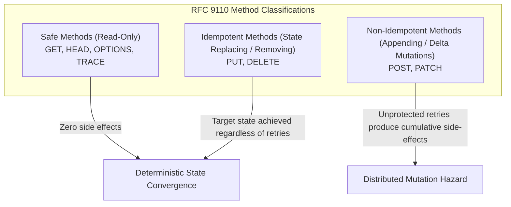
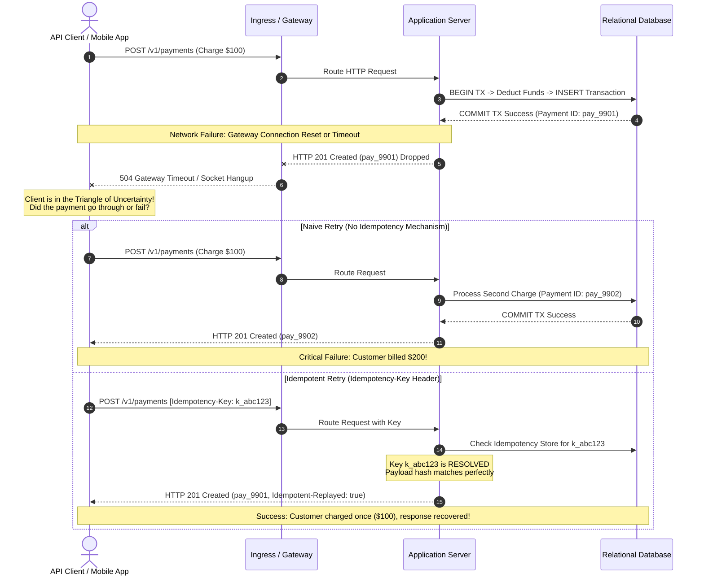
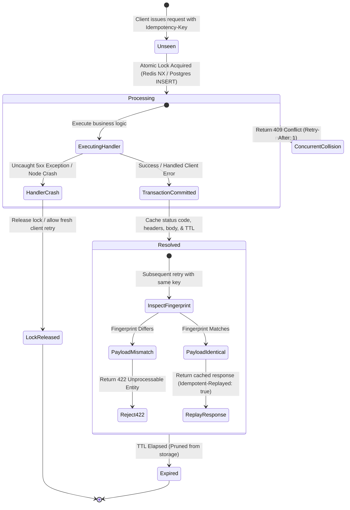
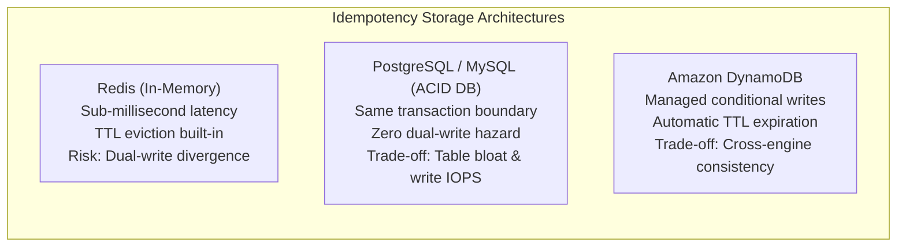
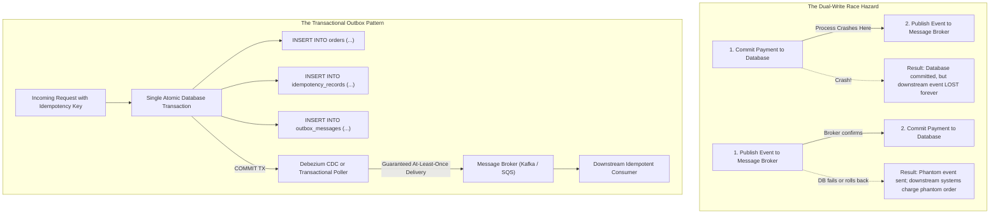

# Building Idempotent APIs for Reliable Applications

In distributed computing, networks are inherently asynchronous and unreliable. Packets can be dropped, delayed, duplicated, or reordered. When a mobile client or microservice issues a mutation over an HTTP connection—such as creating an order, executing a bank transfer, or reserving inventory—a network interruption leaves the client in a state of fundamental uncertainty. The client cannot know whether the server executed the mutation, failed mid-execution, or completed the transaction but lost the connection before transmitting the response.

If the client retries naively, it risks executing duplicate mutations: billing a customer twice or provisioning multiple resources. If the client abandons the operation, the transaction remains half-finished.

**Idempotence** is the architectural property that resolves this dilemma. An idempotent API guarantees that executing the same operation multiple times yields the exact same persistent system state as executing it once. This article explores the mathematical foundations, HTTP protocol semantics, distributed locking mechanics, payload fingerprinting, database atomicity patterns, and production implementation strategies required to build rock-solid idempotent backend APIs.

---

## 1. The Foundations of Idempotence

### Mathematical Definition

In abstract algebra, an element $x$ with respect to a binary operation $\circ$ is idempotent if:

$$x \circ x = x$$

Similarly, a unary function $f$ is idempotent under functional composition if applying it multiple times produces the identical outcome as applying it once:

$$f(f(x)) = f(x)$$

By mathematical induction, applying an idempotent function $N$ times (for any integer $N \ge 1$) produces the exact same result as applying it once:

$$f^N(x) = f(x) \quad \forall N \ge 1$$

### Idempotence in Distributed Systems and APIs

When applied to stateful computer systems and web services, the definition is adapted to state transitions. Let $S_t$ represent the global state of the server at time $t$, and let $r$ represent an incoming mutation request. The state transition function $T(S, r)$ maps the current state and the request to a new state $S_{t+1}$:

$$S_{t+1} = T(S_t, r)$$

An API endpoint is idempotent if executing the identical request $r$ repeatedly across arbitrary time intervals leaves the persistent system state unchanged after the initial execution:

$$T(T(S_t, r), r) = T(S_t, r)$$

### State Mutation vs. Response Representation

A common misconception among API engineers is that idempotence requires returning the exact same HTTP status code or byte-for-byte response body on every invocation. 

**Idempotence applies strictly to the state of the server's resources, not necessarily to the ephemeral transport representation.**

Consider the standard HTTP `DELETE` method:
1. **Request 1**: `DELETE /v1/orders/ord_1024` removes the active order. The server returns `204 No Content` (or `200 OK` with the deleted resource payload).
2. **Request 2**: `DELETE /v1/orders/ord_1024` arrives shortly after. The resource no longer exists. The server returns `404 Not Found`.

Because the resource does not exist after Request 1, and still does not exist after Request 2, the server's persistent state is completely identical. The operation is fully idempotent despite the variation in HTTP status codes (`204` vs `404`).

However, for transactional business mutations—such as `POST /v1/charges`—clients expect not only identical state convergence on the server, but also a **deterministic response replay**. If the client lost its connection during the initial request, it needs the generated charge identifier and receipt details to proceed with its own local workflow.

---

## 2. HTTP Protocol Semantics: Safe, Idempotent, and Non-Idempotent Methods

The Internet Engineering Task Force (IETF) defines the authoritative semantics for HTTP methods in [RFC 9110 (HTTP Semantics, Section 9.2)](https://www.rfc-editor.org/rfc/rfc9110.html#section-9.2). Understanding how the specification classifies methods into **Safe**, **Idempotent**, and **Non-Idempotent** is essential for maintainable [REST API design](/blog/rest-api-design-principles).



### Safe Methods

An HTTP method is considered **safe** if its defined semantics are essentially read-only. The server does not alter its resource state when servicing a safe request (excluding internal telemetry, access logs, or cache updates).

- **`GET`**: Transfers a current representation of the target resource.
- **`HEAD`**: Identical to `GET` except the server must not return the response message body.
- **`OPTIONS`**: Requests information about communication options and supported methods for the target resource.
- **`TRACE`**: Performs a message loop-back test along the path to the target resource.

Because safe methods perform zero state mutations, applying them $N$ times causes zero net mutations. Therefore, **all safe methods are inherently idempotent**.

### Idempotent (Mutating) Methods

Idempotent mutating methods alter state, but repeated identical requests yield the identical resource state.

- **`PUT`**: Replaces all current representations of the target resource with the request payload. If a client executes `PUT /v1/users/usr_42` with `{ "displayName": "Alice" }` five times in succession, the target resource ends up with the display name `"Alice"` in every scenario.
- **`DELETE`**: Demands that the origin server remove the association between the target resource and its URI. Calling `DELETE /v1/documents/doc_88` multiple times ensures the document remains deleted.

### Non-Idempotent Methods

Methods in this category cause cumulative side effects if repeated:

- **`POST`**: Designed for subordinate resource creation, command execution, or arbitrary data processing where the target resource processes the enclosed entity according to its own semantics. Repeated calls to `POST /v1/orders` typically create distinct order entities with unique primary keys.
- **`PATCH`**: RFC 5789 defines `PATCH` for partial resource modification. While a `PATCH` document that sets static properties (e.g. `{ "status": "ARCHIVED" }`) can behave idempotently, `PATCH` as a specification is non-idempotent because patch formats (such as JSON Patch RFC 6902) support relative delta operations, such as incrementing a counter or appending an element to an array.

| HTTP Method | RFC 9110 Safe? | RFC 9110 Idempotent? | Mathematical Model | Example State Impact on Retries |
| :--- | :--- | :--- | :--- | :--- |
| **`GET`** | **Yes** | **Yes** | $f(x) = x$ | Zero state changes; read-only representation returned. |
| **`HEAD`** | **Yes** | **Yes** | $f(x) = x$ | Zero state changes; metadata headers returned. |
| **`OPTIONS`**| **Yes** | **Yes** | $f(x) = x$ | Zero state changes; capabilities inspected. |
| **`PUT`** | No | **Yes** | $f(f(x)) = f(x)$ | Complete resource state replaced; subsequent identical calls rewrite identical state. |
| **`DELETE`** | No | **Yes** | $f(f(x)) = f(x)$ | Target resource removed; subsequent calls confirm absence. |
| **`POST`** | No | **No** | $f(f(x)) \ne f(x)$ | Resources created or commands executed cumulatively on each retry. |
| **`PATCH`** | No | **No** | $f(f(x)) \ne f(x)$ | Delta mutations (array append, arithmetic increment) accumulate. |

Because modern web architectures rely heavily on `POST` for creating resources, executing financial transactions, and queuing asynchronous jobs, engineers must explicitly introduce an application-level idempotency mechanism to make `POST` and `PATCH` operations resilient to network retries.

---

## 3. The Distributed Mutation Hazard: Why Networks Demand Idempotency

To understand why application-level idempotency is mandatory, we must evaluate the distributed environment in which client-server interactions occur.

One of the fundamental fallacies of distributed computing is that *the network is reliable*. In reality, an HTTP transaction between an API client and a backend database traverses multiple untrusted networks, edge routers, cloud load balancers, reverse proxies, and application worker threads.

### The Return-Path Drop (The Two Generals' Dilemma)

Consider what happens when a client sends a mutating request across an uncommitted network link:



### The Triangle of Mutation Uncertainty

When a client encounters a transport-level error—such as a TCP connection reset, TLS handshake failure, DNS timeout, or HTTP `504 Gateway Timeout`—the failure could have occurred at any of three distinct execution phases:

1. **Pre-Ingress Drop**: The request packet was lost before reaching the server's network perimeter. The application server never saw the request, and zero database mutations took place.
2. **Mid-Execution Crash**: The server received the request and began executing the transaction, but crashed or timed out mid-flight (e.g. out-of-memory kill or deadlocked worker). The database transaction may have rolled back or may be stuck in an uncommitted state.
3. **Post-Commit Egress Drop**: The server executed the transaction, committed the mutation to the primary database, and dispatched external webhooks. However, on the return path, the network socket closed before the client received the HTTP `200 OK` or `201 Created` response.

Without an idempotency contract, the client cannot differentiate between Case 1 (nothing happened) and Case 3 (everything succeeded). If the client retries, Case 3 causes duplicate charges. If the client does not retry, Case 1 causes lost orders.

---

## 4. The Idempotency Key Architecture

The industry-standard solution for making non-idempotent endpoints resilient to retries is the **Idempotency Key Pattern**, formalized by the IETF draft specification [The Idempotency-Key HTTP Header Field](https://datatracker.ietf.org/doc/draft-ietf-httpapi-idempotency-key-header/).

Under this pattern, the client generates a globally unique identifier before initiating a mutating request and transmits it in an HTTP header:

```http
POST /v1/charges HTTP/1.1
Host: api.example.com
Authorization: Bearer sec_live_94827492
Idempotency-Key: 7b8f8d22-26cb-4b71-8bc6-943fcf867d71
Content-Type: application/json

{
  "amount": 10000,
  "currency": "usd",
  "customerId": "cus_9931",
  "source": "tok_visa"
}
```

### Key Generation and Tenancy Scoping

To avoid collisions and security vulnerabilities, the server must enforce strict scoping rules:

1. **Client-Side Generation**: The client generates the key using a cryptographically secure random identifier, such as a **UUID v4** (128 bits of entropy) or a **ULID** (Universally Unique Lexicographically Sortable Identifier).
2. **Tenant and Principal Scoping**: The server must never treat an idempotency key as globally unique across all system users. An idempotency key must be strictly scoped to the authenticated tenant, organization, or user account:

$$\text{Storage Key} = \text{tenant\_id} + \text{":"} + \text{idempotency\_key}$$

Failing to scope by tenant creates a severe security vulnerability: User B could guess or front-run an idempotency key generated by User A, allowing User B to inspect cached responses belonging to User A or hijack their mutations.

### Request Payload Fingerprinting

What happens if a buggy client generates a single `Idempotency-Key` and uses it across two completely different API calls?
- Request 1: `POST /v1/transfers` with `{ "recipient": "Alice", "amount": 50 }`
- Request 2: `POST /v1/transfers` with `{ "recipient": "Bob", "amount": 5000 }`

If the server simply checked whether the key existed and returned the cached response of Request 1, Request 2 would silently fail to transfer funds to Bob while returning a false success receipt for Alice.

To prevent this catastrophic hazard, the server must compute a **cryptographic request fingerprint** (hash) of the incoming request parameters and store it alongside the key.

$$\text{Fingerprint} = \text{SHA-256}(\text{Method} \parallel \text{":"} \parallel \text{CanonicalPath} \parallel \text{":"} \parallel \text{CanonicalJSONBody})$$

When an existing key is presented:
- **Identical Fingerprint**: The client is legitimately retrying a dropped or timed-out request. Proceed with lock coordination or cached response replay.
- **Mismatched Fingerprint**: The client has illegally reused an idempotency key with different parameters. The server must immediately reject the request with **`422 Unprocessable Entity`** or **`409 Conflict`** and return an explicit error payload explaining the parameter mismatch.

| Scenario | Idempotency Key Status | Fingerprint Comparison | Server Action | HTTP Response Code |
| :--- | :--- | :--- | :--- | :--- |
| **First Attempt** | New (unseen) | N/A | Acquire atomic lock; execute transaction; cache response. | `200 OK` or `201 Created` |
| **Legitimate Retry** | Exists (`RESOLVED`) | Matches stored hash | Bypass business logic; replay cached status, headers, and body. | `200 OK` / `201 Created` with `Idempotent-Replayed: true` |
| **In-Flight Collision** | Exists (`PROCESSING`) | Matches stored hash | Block duplicate execution; reject or wait. | `409 Conflict` with `Retry-After: 1` |
| **Payload Mismatch** | Exists | **Differs** from stored hash | Abort immediately; prevent unauthorized replay or parameter hijacking. | `422 Unprocessable Entity` |
| **Transient Error** | Exists (`FAILED`) | Matches stored hash | Release lock; allow client to retry operation fresh. | `500` / `503` (fresh attempt executed) |

---

## 5. Distributed State Machine and Request Lifecycle

An idempotency record is not a static cache entry; it is a state machine that governs concurrent execution, crash recovery, and response replays.



### The Three Core Lifecycle States

1. **`PROCESSING` (In-Flight Lock)**:
   The server has received the first request and atomically acquired an execution lease. The business transaction is currently active.
2. **`RESOLVED` (Terminal State)**:
   The business transaction has committed successfully. The idempotency record contains the exact HTTP response status code, relevant headers, and serialized response body. Future matching requests are served directly from this state.
3. **`FAILED` (Recoverable or Terminal)**:
   If the handler fails due to an unexpected infrastructure exception (such as a database connection pool timeout or a network crash during a third-party RPC), the record should transition to `FAILED` or have its lock released immediately. Caching a transient `500 Internal Server Error` prevents the client from ever retrying the operation once the underlying infrastructure recovers.

### In-Flight Collisions and Race Conditions

Consider a scenario where a client issues a request, experiences a transient local network stutter, and immediately issues an automatic retry 10 milliseconds later while the first request is still being processed by the database.

Two worker threads now possess the identical idempotency key concurrently. If both workers execute the business logic, duplicate database rows or external charges will occur.

To resolve this race condition:
- **Atomic Lock Acquisition**: The first worker to arrive must atomically claim the key in the idempotency store.
- **Collision Policy**: When the second worker detects that the key is currently in the `PROCESSING` state, it has two architectural options:
  1. **Fail-Fast with `409 Conflict` (Recommended)**: Immediately return an HTTP `409 Conflict` response with a `Retry-After: 1` header. This notifies the client that the operation is already under execution and prevents application server worker threads from blocking or exhausting thread pools.
  2. **Bounded Polling / Distributed Wait**: The second worker pauses and polls the cache or subscribes to a Redis Pub/Sub notification channel for a bounded duration (e.g. up to 2 seconds). If the first worker completes within that window, the second worker replays the response immediately without failing the client. If the timeout expires, it falls back to `409 Conflict`.

### Response Replay Mechanics

When serving a request from the `RESOLVED` state:
- The server retrieves the cached HTTP status code, saved response headers, and response payload.
- The server appends an informational header, such as `Idempotent-Replayed: true` (or `Idempotency-Status: replayed`).
- The response is returned immediately to the client without invoking domain services, validation logic, or database transactions.
- Crucially, downstream side effects—such as sending email notifications, firing webhooks, or debiting accounts—are completely bypassed.

---

## 6. Storage Engine Architectures: Redis vs. Relational vs. Document Stores

Selecting the storage tier for idempotency metadata involves trade-offs between write latency, memory utilization, and transactional consistency with the primary business data.



### Option A: In-Memory Cache (Redis)

Redis is widely adopted for idempotency keys because of its exceptional throughput and sub-millisecond read/write latency.

- **Atomic Lock Acquisition**: Redis provides the `SET` command with the `NX` (Not Exists) and `PX` (Expire in Milliseconds) parameters:
  ```redis
  SET idempotency:tenant_101:key_abc "PROCESSING:hash_val" NX PX 30000
  ```
  If the key already exists, Redis returns `nil`, allowing the application to immediately detect a collision in a single atomic $O(1)$ round-trip.
- **Trade-offs**: Redis is decoupled from the primary database. If the Redis write succeeds, but the application server crashes before committing the database transaction, the key remains locked in Redis while no mutation occurred in the database. Furthermore, Redis eviction policies (e.g. `volatile-lru` or `allkeys-lru`) must be configured carefully to ensure active idempotency keys are never prematurely evicted under memory pressure.

### Option B: Relational Database Co-Location (PostgreSQL / MySQL)

Storing idempotency records directly inside the primary relational database offers an overwhelming architectural advantage: **Atomic ACID Co-location**.

- **Schema Design**:
  ```sql
  CREATE TABLE idempotency_records (
      id BIGSERIAL PRIMARY KEY,
      tenant_id UUID NOT NULL,
      idempotency_key VARCHAR(128) NOT NULL,
      request_hash CHAR(64) NOT NULL,
      status VARCHAR(32) NOT NULL, -- 'PROCESSING', 'RESOLVED', 'FAILED'
      response_status INT,
      response_headers JSONB,
      response_body JSONB,
      created_at TIMESTAMPTZ NOT NULL DEFAULT NOW(),
      expires_at TIMESTAMPTZ NOT NULL,
      CONSTRAINT uq_tenant_idempotency_key UNIQUE (tenant_id, idempotency_key)
  );

  CREATE INDEX idx_idempotency_records_expires_at 
      ON idempotency_records (expires_at);
  ```
- **The Atomic Insert**:
  ```sql
  INSERT INTO idempotency_records (
      tenant_id,
      idempotency_key,
      request_hash,
      status,
      expires_at
  )
  VALUES (
      'a3d24f0c-1122-48ef-823b-58fcf10287a1',
      'ord_req_9921b',
      'e3b0c44298fc1c149afbf4c8996fb92427ae41e4649b934ca495991b7852b855',
      'PROCESSING',
      NOW() + INTERVAL '120 seconds'
  )
  ON CONFLICT (tenant_id, idempotency_key) DO NOTHING;
  ```
  If `ON CONFLICT` triggers, zero rows are inserted, signalling an active collision.
- **The Superpower**: When the business transaction commits, the transition of `status` from `PROCESSING` to `RESOLVED` and the creation of the business entities occur within the **exact same database transaction**. There is zero possibility of split-brain state between the business record and the idempotency state.
- **Trade-offs**: Increases table churn and write IOPS on the primary database. Requires a scheduled partition rotation or background cron to prune records where `expires_at < NOW()`.

### Option C: Managed Document Stores (DynamoDB)

DynamoDB provides built-in conditional writes via `attribute_not_exists(idempotency_key)` and automated Time to Live (TTL) record expiration without background sweep jobs.

| Characteristic | Redis (In-Memory) | PostgreSQL / Relational | DynamoDB / Document Store |
| :--- | :--- | :--- | :--- |
| **Locking Primitive** | `SET key val NX PX ttl` | `INSERT ... ON CONFLICT DO NOTHING` | `PutItem` with `attribute_not_exists` |
| **ACID Boundary** | Decoupled from DB (dual-write hazard) | **Identical ACID Transaction** | Decoupled from primary relational DB |
| **Read/Write Latency** | Sub-millisecond ($< 1\text{ ms}$) | Low ($2 - 10\text{ ms}$) | Low single-digit ($3 - 15\text{ ms}$) |
| **TTL / Expiration** | Automatic key eviction via Redis core | Requires cron / partitioned tables | Native managed TTL worker |
| **Primary Failure Mode** | Memory pressure eviction / node reboot | Table bloat / lock contention | Multi-system partial commit failure |

---

## 7. Database-Level Idempotency Patterns & The Outbox Pattern

While an HTTP `Idempotency-Key` header protects API ingress, resilient systems also implement defense-in-depth at the data and messaging tiers.

### Natural Domain Keys and Unique Constraints

Whenever possible, anchor idempotency to natural unique constraints in the business domain model rather than relying exclusively on transient HTTP headers.

For example, when generating a monthly billing invoice:
```sql
CREATE TABLE subscription_invoices (
    id UUID PRIMARY KEY DEFAULT gen_random_uuid(),
    tenant_id UUID NOT NULL,
    subscription_id UUID NOT NULL,
    billing_period_month INT NOT NULL,
    billing_period_year INT NOT NULL,
    amount_cents INT NOT NULL,
    status VARCHAR(32) NOT NULL,
    created_at TIMESTAMPTZ NOT NULL DEFAULT NOW(),
    CONSTRAINT uq_subscription_period UNIQUE (subscription_id, billing_period_year, billing_period_month)
);
```

Because the composite key `(subscription_id, billing_period_year, billing_period_month)` is enforced with a database unique index, any concurrent attempt to double-bill a customer for the same month will be rejected by the relational engine with a unique violation (`SQLSTATE 23505`), regardless of whether the client passed an idempotency key.

### The Dual-Write Hazard and The Transactional Outbox Pattern

Many API operations require mutating the database and emitting an event to a message broker (e.g. Kafka, RabbitMQ, or Amazon SQS) to trigger downstream webhooks or asynchronous processing.

This introduces the notorious **Dual-Write Problem**:



If an API handler commits the database transaction and then attempts to publish an event to Kafka, an unexpected process kill or network partition between the server and the broker leaves the system in an inconsistent state: the order exists, but the downstream event is lost.

**The Solution: The Transactional Outbox Pattern**
1. Create an `outbox_messages` table inside the primary database.
2. In the **exact same ACID database transaction**, insert the order, the idempotency record, and the outbox event payload:
   ```sql
   BEGIN;
   
   -- 1. Mutate business domain
   INSERT INTO orders (id, tenant_id, total_amount) 
   VALUES ('ord_102', 'ten_44', 15000);

   -- 2. Complete idempotency record
   UPDATE idempotency_records 
   SET status = 'RESOLVED', response_status = 201, response_body = '{"id":"ord_102"}'
   WHERE tenant_id = 'ten_44' AND idempotency_key = 'k_client_99';

   -- 3. Write event to outbox
   INSERT INTO outbox_messages (aggregate_type, aggregate_id, event_type, payload)
   VALUES ('ORDER', 'ord_102', 'OrderCreated', '{"id":"ord_102","total":15000}');

   COMMIT;
   ```
3. An asynchronous outbox relay process (such as a Change Data Capture [CDC] engine like Debezium or a polling worker) reads uncommitted rows from `outbox_messages` and delivers them to the broker with **at-least-once delivery guarantees**.
4. Downstream consumers use their own local idempotency tables to ignore duplicate deliveries, ensuring end-to-end consistency across the entire enterprise architecture.

---

## 8. Production-Grade TypeScript Implementation

Below is a complete, self-contained TypeScript implementation demonstrating an **Idempotency Manager**. It handles canonical payload fingerprinting via SHA-256, atomic lock acquisition, in-flight collision handling with `Retry-After`, error recovery, and cached response replay.

```typescript
import { createHash } from "node:crypto";

/**
 * Normalized HTTP request representation.
 */
export interface CanonicalRequest {
  method: string;
  path: string;
  headers?: Record<string, string | undefined>;
  body?: unknown;
}

/**
 * Normalized HTTP response structure.
 */
export interface ApiResponse {
  statusCode: number;
  headers: Record<string, string>;
  body: unknown;
}

/**
 * Lifecycle states of an idempotency record.
 */
export type IdempotencyStatus = "PROCESSING" | "RESOLVED" | "FAILED";

export interface StoredResponse {
  statusCode: number;
  headers: Record<string, string>;
  body: unknown;
}

export interface IdempotencyRecord {
  key: string;
  scope: string; // Tenant or User ID
  fingerprint: string;
  status: IdempotencyStatus;
  response?: StoredResponse;
  createdAt: number;
  expiresAt: number;
}

/**
 * Interface representing the backing persistence layer (Redis or SQL).
 */
export interface IdempotencyStore {
  get(scope: string, key: string): Promise<IdempotencyRecord | null>;
  acquireLock(
    scope: string,
    key: string,
    fingerprint: string,
    lockTtlSeconds: number,
    recordTtlSeconds: number
  ): Promise<"ACQUIRED" | "EXISTS">;
  complete(scope: string, key: string, response: StoredResponse): Promise<void>;
  releaseLock(scope: string, key: string): Promise<void>;
}

/**
 * Custom error thrown on concurrent collision or payload mismatch.
 */
export class IdempotencyConflictError extends Error {
  constructor(
    public readonly statusCode: number,
    message: string,
    public readonly headers: Record<string, string> = {}
  ) {
    super(message);
    this.name = "IdempotencyConflictError";
  }
}

/**
 * Recursively produces a deterministic, canonically sorted JSON string
 * so key ordering differences in request payloads do not break hashing.
 */
function canonicalJson(obj: unknown): string {
  if (obj === null || typeof obj !== "object") {
    return JSON.stringify(obj);
  }
  if (Array.isArray(obj)) {
    return "[" + obj.map(canonicalJson).join(",") + "]";
  }
  const record = obj as Record<string, unknown>;
  const keys = Object.keys(record).sort();
  const entries = keys.map(
    (k) => `${JSON.stringify(k)}:${canonicalJson(record[k])}`
  );
  return "{" + entries.join(",") + "}";
}

/**
 * Computes a SHA-256 fingerprint over HTTP method, normalized path, and canonical body.
 */
export function computeRequestFingerprint(req: CanonicalRequest): string {
  const normalizedBody = req.body !== undefined ? canonicalJson(req.body) : "";
  const canonicalString = `${req.method.toUpperCase()}:${req.path}:${normalizedBody}`;
  return createHash("sha256").update(canonicalString, "utf8").digest("hex");
}

/**
 * Coordinates idempotency execution, locking, and replay caching.
 */
export class IdempotencyHandler {
  constructor(
    private readonly store: IdempotencyStore,
    private readonly options: {
      lockTtlSeconds?: number;
      recordTtlSeconds?: number;
    } = {}
  ) {}

  async handle(
    scope: string,
    idempotencyKey: string | undefined,
    req: CanonicalRequest,
    execute: () => Promise<ApiResponse>
  ): Promise<ApiResponse> {
    // 1. Safe methods under RFC 9110 do not mutate state and bypass idempotency checks
    const isSafeMethod = ["GET", "HEAD", "OPTIONS"].includes(
      req.method.toUpperCase()
    );
    if (isSafeMethod || !idempotencyKey) {
      return execute();
    }

    const fingerprint = computeRequestFingerprint(req);
    const lockTtl = this.options.lockTtlSeconds ?? 30; // 30s lock timeout to prevent permanent zombies
    const recordTtl = this.options.recordTtlSeconds ?? 86400; // 24-hour retention

    // 2. Inspect existing state for this key within the tenant scope
    const existing = await this.store.get(scope, idempotencyKey);

    if (existing) {
      // 2a. Reject if the key is reused with mismatched parameters or endpoint
      if (existing.fingerprint !== fingerprint) {
        throw new IdempotencyConflictError(
          422,
          "Idempotency key was previously used with a different request payload or method."
        );
      }

      // 2b. Handle in-flight concurrent execution
      if (existing.status === "PROCESSING") {
        throw new IdempotencyConflictError(
          409,
          "A request with this idempotency key is currently processing. Please retry shortly.",
          { "Retry-After": "1" }
        );
      }

      // 2c. Replay completed result
      if (existing.status === "RESOLVED" && existing.response) {
        return {
          statusCode: existing.response.statusCode,
          headers: {
            ...existing.response.headers,
            "Idempotent-Replayed": "true",
          },
          body: existing.response.body,
        };
      }
    }

    // 3. Atomically acquire lock
    const acquired = await this.store.acquireLock(
      scope,
      idempotencyKey,
      fingerprint,
      lockTtl,
      recordTtl
    );

    if (acquired === "EXISTS") {
      throw new IdempotencyConflictError(
        409,
        "Concurrent request with the same idempotency key detected.",
        { "Retry-After": "1" }
      );
    }

    // 4. Execute domain operation with error safety
    let response: ApiResponse;
    try {
      response = await execute();
    } catch (err) {
      // Release lock on unexpected server error so client can retry when service recovers
      await this.store.releaseLock(scope, idempotencyKey);
      throw err;
    }

    // 5. Cache response on successful or deterministic client response (2xx, 4xx)
    if (response.statusCode < 500) {
      await this.store.complete(scope, idempotencyKey, {
        statusCode: response.statusCode,
        headers: response.headers,
        body: response.body,
      });
    } else {
      // Allow retry if downstream server generated a 5xx error
      await this.store.releaseLock(scope, idempotencyKey);
    }

    return response;
  }
}
```

---

## 9. Common Architectural Anti-Patterns to Avoid

Implementing idempotency involves subtle distributed failure modes. Avoid these common production mistakes:

### Anti-Pattern 1: Unscoped Global Keys
Storing keys in a flat global namespace (`idempotency_keys:uuid_123`) without binding them to an authenticated `tenant_id` or `user_id`. An attacker can intentionally probe keys or front-run client requests to observe confidential transaction metadata.

### Anti-Pattern 2: Caching 500 Internal Server Errors
If an unhandled exception or database connection pool exhaustion throws a `500 Internal Server Error`, never cache that `500` response in the idempotency store. Doing so permanently locks the client into a broken response, preventing successful retries once backend infrastructure recovers. Always release the lock or delete the record on unexpected infrastructure exceptions.

### Anti-Pattern 3: Ignoring Request Payload Differences
Replaying a cached response solely based on the `Idempotency-Key` header without comparing the cryptographic hash of the request method, path, and body. This causes parameter hijacking when clients reuse keys across different operations. Always validate the request fingerprint and reject mismatches with `422 Unprocessable Entity`.

### Anti-Pattern 4: The In-Flight Zombie Lock
Acquiring an in-flight lock with an infinite or excessively long TTL. If an application node experiences a hard crash or kernel panic while processing a request, the key remains trapped in `PROCESSING` forever. Locks must always possess a finite TTL (such as 30 to 60 seconds) that safely exceeds the maximum application request timeout.

### Anti-Pattern 5: Dual-Write Outbox Omission
Committing an idempotent order to the database and then directly publishing an event to Kafka in a separate step without an outbox table. If the server dies between the database commit and the broker dispatch, the downstream ecosystem misses the event, creating irrecoverable state divergence.

---

## 10. Practical Production Verification Checklist

Before deploying an idempotent API architecture to production, verify your implementation against this engineering checklist:

### Protocol & Contract Design
- [ ] **Standard Header**: Mutating endpoints support the `Idempotency-Key` header in accordance with IETF draft standards.
- [ ] **Method Selectivity**: Idempotency checks apply exclusively to mutating methods (`POST`, `PATCH`); safe methods (`GET`, `HEAD`, `OPTIONS`) bypass locking logic entirely.
- [ ] **Replay Header**: Replayed responses explicitly include an informational header (`Idempotent-Replayed: true`) to aid client debugging and tracing.

### Security & Collision Prevention
- [ ] **Tenant Scoping**: All storage lookups are partitioned by `(tenant_id, idempotency_key)` to enforce multi-tenant isolation.
- [ ] **Payload Fingerprinting**: Requests compute a cryptographic hash (e.g. SHA-256) over the method, normalized path, and canonicalized body.
- [ ] **Mismatch Semantics**: Presenting an existing key with altered payload parameters triggers an immediate `422 Unprocessable Entity`.
- [ ] **Concurrent Collisions**: Duplicate requests arriving while an operation is in the `PROCESSING` state receive a `409 Conflict` response with an appropriate `Retry-After` header.

### Storage & Resilience
- [ ] **Atomic Primitives**: Locks are acquired atomically via Redis `SET NX PX` or database `INSERT ... ON CONFLICT DO NOTHING`.
- [ ] **Bounded Lock TTL**: In-flight locks expire automatically (e.g. 30–60 seconds) to prevent zombie locks if worker processes crash.
- [ ] **5xx Failure Handling**: Unhandled server exceptions (`5xx`) release the in-flight lock, enabling clients to retry once the outage resolves.
- [ ] **Retention Pruning**: Completed records have a defined retention window (typically 24 to 72 hours based on client retry budgets) and are pruned via native TTLs or scheduled partition drops.

### Database & Downstream Consistency
- [ ] **Natural Constraints**: Core business entities enforce uniqueness at the database schema level (`UNIQUE` constraints) as a second layer of defense.
- [ ] **Transactional Outbox**: Downstream asynchronous events, webhooks, and queue messages are written to an outbox table within the same ACID transaction as the domain mutation.
- [ ] **Observability**: Telemetry emits counters for `idempotency.replayed`, `idempotency.conflict`, and `idempotency.mismatch` alongside structured [backend observability logs and traces](/blog/backend-observability).

---

## Conclusion: Designing for Failure as a First-Class Citizen

In distributed architectures, transient network failures and client retries are not exceptional anomalies; they are guaranteed operational realities. Systems that fail to treat retries as first-class architectural concerns inevitably suffer from data corruption, duplicate financial transactions, and painful manual database reconciliations.

By building on mathematically sound foundations, respecting RFC 9110 HTTP semantics, implementing atomic distributed state machines with SHA-256 payload fingerprinting, and anchoring side effects in the Transactional Outbox pattern, backend teams can build resilient APIs that guarantee deterministic consistency under any network condition.

### Related Reading
- [REST API Design: Principles for Maintainable APIs](/blog/rest-api-design-principles)
- [Backend Architecture for Mobile and Web Products](/blog/backend-architecture-mobile-web)
- [API Versioning: How to Evolve APIs Without Breaking Clients](/blog/api-versioning-guide)
- [Authentication vs Authorization: Understanding the Difference](/blog/authentication-vs-authorization)
- [Backend Observability: Logs, Metrics, Traces, and Alerts](/blog/backend-observability)
