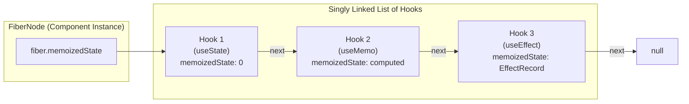
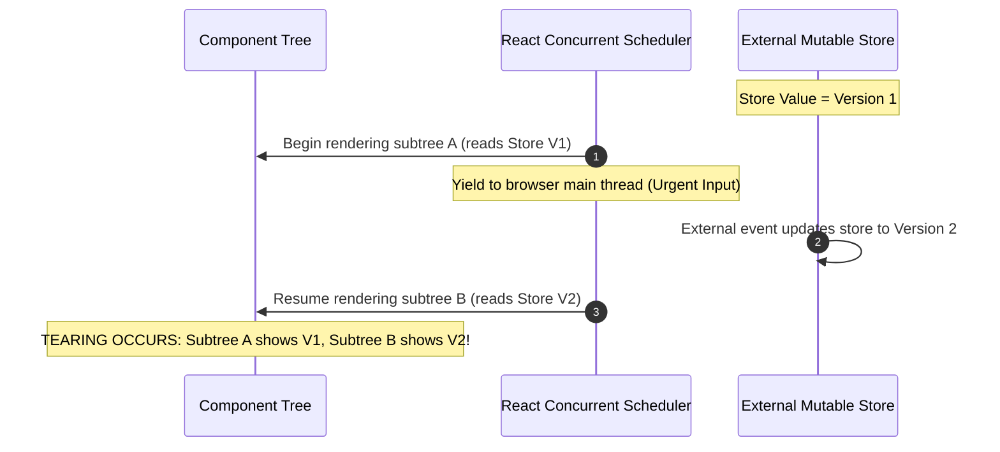
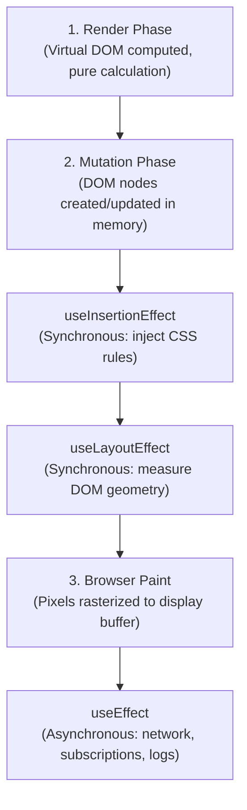

# React Hooks: Understanding the Patterns Behind Them

When React 16.8 introduced Hooks in early 2019, it fundamentally changed how frontend engineers structure applications. Before hooks, stateful logic was inextricably bound to class components and lifecycle methods such as `componentDidMount`, `componentDidUpdate`, and `componentWillUnmount`. Code that belonged to a single logical feature—such as subscribing to an event emitter, updating state, and tearing down the listener—was split across three disparate lifecycle methods. Conversely, unrelated concerns (such as data fetching and analytics logging) were forced into the same lifecycle callback.

Higher-Order Components (HOCs) and Render Props attempted to solve logic reuse across class components, but they introduced wrapper hell, obfuscated prop sources, and deeply nested component trees. Hooks resolved these structural bottlenecks by decoupling stateful logic from the component hierarchy entirely.

However, treating hooks as magical functions leads directly to common production failure modes: stale closures, UI tearing in Concurrent React, unhandled race conditions, and accidental infinite re-render loops. To write robust, concurrent-safe frontend code, engineers must understand the mechanics underlying hooks: the Fiber reconciliation architecture, singly linked list addressing, synchronous versus asynchronous commit phases, and the synchronization model that superseded traditional component lifecycles.

This article provides an in-depth architectural breakdown of React Hooks. We explore how hooks are represented inside Fiber nodes, examine the full taxonomy of primitive hooks, dissect concurrent rendering safety, and implement production-grade custom hooks that survive real-world edge cases.

---

## 1. The Under-the-Hood Mental Model: The Fiber Singly Linked List

The most famous constraint in React development is the **Rules of Hooks**:

1. **Only call hooks at the top level**: Do not call hooks inside loops, conditions, or nested functions.
2. **Only call hooks from React functions**: Call them from React functional components or custom hooks, never regular JavaScript functions.

Why does this restriction exist? Why couldn't the React team pass a unique string key or identifier to hooks (for example, `useState('count', 0)`)?

The answer lies in React's internal architecture. In React's Fiber reconciler, every component instance corresponds to a `FiberNode`. Inside that Fiber node, local state is stored not in a hash map, but as a **singly linked list of `Hook` records** rooted at `fiber.memoizedState`.

### The Internal `Hook` Data Structure

Within the React reconciler (`ReactFiberHooks.js`), each hook invocation allocates or references an object with the following structural layout:

```typescript
type Update<S, A> = {
  lane: number;
  action: A;
  hasEagerState: boolean;
  eagerState: S | null;
  next: Update<S, A>;
};

type UpdateQueue<S, A> = {
  pending: Update<S, A> | null;
  lanes: number;
  dispatch: ((action: A) => void) | null;
  lastRenderedReducer: ((state: S, action: A) => S) | null;
  lastRenderedState: S | null;
};

type Hook = {
  memoizedState: any;          // The cached value (state value, reducer state, memoized result, effect record)
  baseState: any;              // The base state used when computing queued updates
  baseQueue: Update<any, any> | null; // Skipped updates from lower-priority renders
  queue: UpdateQueue<any, any> | null; // Circular linked list of pending dispatches
  next: Hook | null;           // Pointer to the next Hook record in the Fiber's linked list
};
```

When a functional component renders:
- On initial mount (`HooksDispatcherOnMount`), React calls `mountWorkInProgressHook()`. Each hook invocation creates a new `Hook` object, initializes its fields, and appends it to the end of the singly linked list.
- On subsequent re-renders (`HooksDispatcherOnUpdate`), React calls `updateWorkInProgressHook()`. React traverses the existing linked list sequentially using an internal pointer: `workInProgressHook = currentHook.next`.



### What Happens When You Break the Rules of Hooks?

Because hooks do not carry string identifiers, **execution order is their only addressing mechanism**. The component relies strictly on the invariant that hook $N$ on render $T$ corresponds precisely to hook $N$ on render $T+1$.

Consider what occurs if a hook is wrapped in a conditional branch:

```tsx
// ❌ DANGEROUS: Conditional hook shifts the linked list pointer
function ProfileCard({ showBio }: { showBio: boolean }) {
  const [name, setName] = useState("Alex");

  // If showBio is false on re-render, this call is skipped!
  if (showBio) {
    const [bio, setBio] = useState("Frontend Engineer");
  }

  const [theme, setTheme] = useState("dark");
  const [avatar, setAvatar] = useState("/avatar.png");

  return <div>{name}</div>;
}
```

Let us trace the pointer traversal across two consecutive renders:

1. **Render 1 (`showBio = true`)**:
   - Call 1 (`useState("Alex")`): Reads `Hook 1`.
   - Call 2 (`useState("Frontend Engineer")`): Reads `Hook 2`.
   - Call 3 (`useState("dark")`): Reads `Hook 3`.
   - Call 4 (`useState("/avatar.png")`): Reads `Hook 4`.
   The linked list contains 4 sequential nodes: `[Hook1: "Alex"] -> [Hook2: "Frontend Engineer"] -> [Hook3: "dark"] -> [Hook4: "/avatar.png"]`.

2. **Render 2 (`showBio = false`)**:
   - Call 1 (`useState("Alex")`): React advances pointer to head (`Hook 1`). State is `"Alex"`. Correct.
   - Call 2 (`useState("dark")`): The conditional block was skipped, so the 2nd hook call in the component code is now `useState("dark")`. React advances pointer: `currentHook = currentHook.next` (`Hook 2`).
   - React returns the `memoizedState` from `Hook 2` (which is `"Frontend Engineer"`) to `theme`!
   - Call 3 (`useState("/avatar.png")`): React advances pointer to `Hook 3`, returning `"dark"` to `avatar`.
   - Call 4 does not occur. `Hook 4` is orphaned.

The component's state memory has suffered a silent **off-by-one pointer shift**. The variable `theme` now receives a biography string, dispatch queues route updates to the wrong state slice, and subsequent updates trigger catastrophic runtime type errors or corrupted UI state.

By enforcing that hooks execute unconditionally at the top level of the component body, the React runtime guarantees deterministic pointer alignment between the virtual DOM tree and the underlying Fiber node state.

---

## 2. Comprehensive React Hooks Taxonomy across 7 Dimensions

To choose the appropriate primitive for a given engineering challenge, developers must understand when each hook runs, whether it blocks the browser main thread, and its compatibility with Concurrent React.

The following taxonomy classifies modern React hooks across seven architectural dimensions:

| Hook | Execution Phase | Execution Timing | Main-Thread Blocking | Concurrent Safe | Primary Purpose | Common Pitfall |
| :--- | :--- | :--- | :--- | :--- | :--- | :--- |
| `useState` | Render | Synchronous during render | No | Yes | Encapsulate local component state | Mutating state directly or missing functional updater in asynchronous closures |
| `useReducer` | Render | Synchronous during render | No | Yes | Manage complex, multi-action state transitions | Introducing side-effects inside pure reducer functions |
| `useRef` | Render | Synchronous during render | No | Yes | Hold mutable values or DOM node references across renders | Reading or writing `ref.current` during the render phase instead of effects/handlers |
| `useSyncExternalStore` | Render | Synchronous during render | Yes (forces sync update on mutation) | Yes (prevents tearing) | Subscribe to third-party stores or browser APIs with SSR snapshot | Returning a freshly allocated object from `getSnapshot` causing infinite re-render loops |
| `use` (React 19) | Render | Synchronous / Suspends | No (delegates to Suspense) | Yes | Read promises or context conditionally inside loops/branches | Passing non-cached promises that recreate every render, causing continuous suspension loops |
| `useMemo` | Render | Synchronous during render | Yes (evaluates during render) | Yes | Cache computationally expensive calculation results | Premature optimization of cheap calculations whose cache checks exceed recomputation costs |
| `useCallback` | Render | Synchronous during render | No | Yes | Guarantee referential stability of function instances | Omitting dependencies or wrapping handlers passed to unmemoized host elements |
| `useEffect` | Passive / Post-Paint | Asynchronous after browser paint | No (non-blocking) | Yes | Synchronize with external systems (network, DOM subscriptions, telemetry) | Using effects to sync or compute derived state instead of calculating inline |
| `useLayoutEffect` | Layout / Pre-Paint | Synchronous before browser paint | Yes (blocks visual paint) | Caution (blocks screen updates) | Measure DOM geometry and synchronously mutate layout before paint to avoid visual flicker | Performing slow network calls or heavy computations that freeze the browser frame |
| `useInsertionEffect` | Mutation / Pre-DOM | Synchronous before DOM layout reads | Yes (blocks commit) | Yes | Inject dynamic CSS rules into DOM for CSS-in-JS libraries | Reading DOM layout or triggering state updates inside the insertion callback |
| `useTransition` | Render | Concurrent background render | No (interruptible) | Yes | Mark non-urgent state transitions that yield to urgent user interactions | Wrapping controlled input state updates, creating perceptible typing lag |
| `useDeferredValue` | Render | Deferred concurrent render | No (interruptible) | Yes | Defer expensive child subtree re-renders while keeping urgent inputs immediate | Passing non-primitive values without referential stability, invalidating deferred bailouts |

---

## 3. State Management Primitives: `useState` vs. `useReducer`

Local state management in React components centers on two primitives: `useState` and `useReducer`. Under the hood, `useState` is implemented as an abstraction on top of the same update queue architecture as `useReducer`.

### Eliminating Stale Closures with Functional Updates

When state updates depend on previous values, passing a raw value to the setter function creates a vulnerability known as a **stale closure**. In JavaScript, functions close over the variables available in their scope at creation time. If an asynchronous callback (such as a `setTimeout`, `requestAnimationFrame`, or WebSocket message handler) fires several seconds after render, the closed-over variable reflects the state at the time of invocation, not the current state.

```tsx
// ❌ Stale closure hazard: multiple rapid clicks increment from the same stale base
function BrokenCounter() {
  const [count, setCount] = useState(0);

  const handleDelayedIncrement = () => {
    setTimeout(() => {
      // If count was 0 when clicked 3 times rapidly, count + 1 evaluates to 1 three times!
      setCount(count + 1);
    }, 1000);
  };

  return <button onClick={handleDelayedIncrement}>Count: {count}</button>;
}

// ✅ Resilient: Functional update enqueues an update lambda to the Fiber queue
function RobustCounter() {
  const [count, setCount] = useState(0);

  const handleDelayedIncrement = () => {
    setTimeout(() => {
      // React passes the latest pending baseState from hook.queue to the updater lambda
      setCount((prev) => prev + 1);
    }, 1000);
  };

  return <button onClick={handleDelayedIncrement}>Count: {count}</button>;
}
```

### React 18+ Automatic Batching Mechanics

In React 17 and earlier, state updates inside React synthetic event handlers (like `onClick`) were batched into a single render pass, but updates inside native promises, `setTimeout`, or asynchronous event listeners triggered immediate, unbatched re-renders for every setter invocation.

React 18 introduced **automatic batching** across all execution contexts by default:

```tsx
function BatchingDemo() {
  const [user, setUser] = useState<string | null>(null);
  const [isLoading, setIsLoading] = useState(false);
  const [error, setError] = useState<string | null>(null);

  const handleFetch = async () => {
    setIsLoading(true);
    try {
      const response = await fetch("/api/user");
      const data = await response.json();
      // In React 18+, these three updates are automatically batched into ONE render pass
      setUser(data.name);
      setIsLoading(false);
      setError(null);
    } catch (err) {
      setIsLoading(false);
      setError((err as Error).message);
    }
  };

  return <button onClick={handleFetch}>Load User</button>;
}
```

If an edge case strictly demands flushing state updates immediately to the DOM before continuing execution (such as reading layout coordinates immediately following a DOM mutation), React provides `flushSync`:

```tsx
import { flushSync } from "react-dom";

// Forces React to flush the update synchronously to the DOM immediately
flushSync(() => {
  setIsLoading(true);
});
// DOM is now updated in memory; measurements can be taken
```

### When to Graduate to `useReducer`

While `useState` is ideal for independent primitives, real-world components frequently encounter coordinated state transitions. When modifying one piece of state requires updating two others, or when the next state depends on a series of historical events, `useReducer` establishes an explicit, auditable state machine.

Furthermore, `useReducer` provides an essential architectural guarantee: **the `dispatch` function retains strict referential identity across all renders**. Passing `dispatch` down through deep component props or React context never causes memoized child components to re-render, eliminating the need to wrap callback props in `useCallback`.

```typescript
// Formalized Async Request State Machine
type RequestState<T> =
  | { status: "idle"; data: null; error: null }
  | { status: "loading"; data: T | null; error: null }
  | { status: "success"; data: T; error: null }
  | { status: "error"; data: T | null; error: Error };

type RequestAction<T> =
  | { type: "FETCH_START" }
  | { type: "FETCH_SUCCESS"; payload: T }
  | { type: "FETCH_FAILURE"; error: Error }
  | { type: "RESET" };

function requestReducer<T>(
  state: RequestState<T>,
  action: RequestAction<T>
): RequestState<T> {
  switch (action.type) {
    case "FETCH_START":
      return { status: "loading", data: state.data, error: null };
    case "FETCH_SUCCESS":
      return { status: "success", data: action.payload, error: null };
    case "FETCH_FAILURE":
      return { status: "error", data: state.data, error: action.error };
    case "RESET":
      return { status: "idle", data: null, error: null };
    default:
      return state;
  }
}
```

For deeper architectural guidance on managing global, server, and local state boundaries, explore our guide to [React state management patterns](/blog/react-state-management-guide).

---

## 4. Concurrent Safety and External Stores: `useSyncExternalStore`

With the introduction of Concurrent Mode in React 18, rendering became **interruptible**. Rather than locking the main thread until the entire component tree finishes evaluation, React can start rendering a tree, yield control back to the browser event loop to handle user inputs (such as typing or scrolling), and resume rendering later.

While this drastically improves UI responsiveness, it introduces a severe concurrency hazard: **UI Tearing**.



### The Mechanism of UI Tearing

Tearing occurs when a component tree renders with visual inconsistencies because an external data source mutated midway through an interrupted render pass. If Component A reads `store.value` when it is `"red"`, React yields, an external WebSocket event updates `store.value` to `"blue"`, and React resumes to render Component B, the resulting rendered screen will present Component A as `"red"` and Component B as `"blue"`.

Internal React state (`useState`, `useReducer`) is immune to tearing because React tracks state updates inside Fiber queues aligned with specific render lanes. However, external stores—such as Redux, Zustand, browser APIs (`navigator.onLine`, `window.matchMedia`), or micro-frontends—exist outside the Fiber tree.

To eliminate tearing, React 18 introduced `useSyncExternalStore`:

```typescript
function useSyncExternalStore<Snapshot>(
  subscribe: (onStoreChange: () => void) => () => void,
  getSnapshot: () => Snapshot,
  getServerSnapshot?: () => Snapshot
): Snapshot;
```

### How `useSyncExternalStore` Enforces Consistency

1. During render, React calls `getSnapshot()`.
2. If the external store mutates while a concurrent render is paused, React detects that the snapshot returned by `getSnapshot()` no longer matches the snapshot captured at the start of the render pass.
3. React discards the interrupted, inconsistent virtual DOM tree and **restarts the entire render synchronously from the root**, ensuring that all components render against the identical store snapshot.
4. On the server during SSR, `getServerSnapshot` provides the static data payload. When hydrating on the client, React verifies that the client's initial snapshot matches `getServerSnapshot` exactly, preventing hydration mismatch errors.

> [!CAUTION]
> **The `getSnapshot` Referential Identity Rule**: The value returned by `getSnapshot()` must be an immutable primitive or a cached, referentially stable object. If `getSnapshot` returns a new object reference on every invocation (such as `return { width: window.innerWidth }`), React will detect an infinite mutation loop and throw: `Maximum update depth exceeded`.

### Concrete Implementation: Production-Grade `useOnlineStatus`

Below is a complete, concurrent-safe, SSR-ready custom hook subscribing to browser network status:

```typescript
import { useSyncExternalStore } from "react";

// 1. Referential subscribe function that attaches event listeners
function subscribeToOnlineStatus(callback: () => void): () => void {
  window.addEventListener("online", callback);
  window.addEventListener("offline", callback);

  return () => {
    window.removeEventListener("online", callback);
    window.removeEventListener("offline", callback);
  };
}

// 2. Client snapshot reader returning primitive boolean (referentially stable)
function getClientOnlineSnapshot(): boolean {
  return navigator.onLine;
}

// 3. Server snapshot reader providing deterministic hydration fallback
function getServerOnlineSnapshot(): boolean {
  return true; // Assume online for initial SSR HTML payload
}

/**
 * Production-ready online status hook.
 * Resilient against concurrent tearing and SSR hydration mismatches.
 */
export function useOnlineStatus(): boolean {
  return useSyncExternalStore(
    subscribeToOnlineStatus,
    getClientOnlineSnapshot,
    getServerOnlineSnapshot
  );
}
```

### Concrete Implementation: Concurrent-Safe `useMediaQuery`

Similarly, media queries represent external browser store subscriptions that must remain consistent across concurrent passes:

```typescript
import { useSyncExternalStore, useCallback } from "react";

/**
 * SSR-safe, concurrent-safe hook for evaluating CSS media queries.
 */
export function useMediaQuery(query: string): boolean {
  // Memoize subscribe to prevent re-attaching listeners unless the query changes
  const subscribe = useCallback(
    (callback: () => void) => {
      const matchMediaList = window.matchMedia(query);
      matchMediaList.addEventListener("change", callback);

      return () => {
        matchMediaList.removeEventListener("change", callback);
      };
    },
    [query]
  );

  const getSnapshot = useCallback(() => {
    return window.matchMedia(query).matches;
  }, [query]);

  const getServerSnapshot = useCallback(() => {
    return false; // Deterministic default during SSR rendering
  }, []);

  return useSyncExternalStore(subscribe, getSnapshot, getServerSnapshot);
}
```

---

## 5. The Commit Phase & Effect Execution Timing

A recurring source of subtle rendering defects is confusion between React's three effect hooks: `useEffect`, `useLayoutEffect`, and `useInsertionEffect`.

Each hook executes at a distinctly different stage of React's commit phase relative to DOM mutation and the browser's paint pipeline.



### Detailed Lifecycle Comparison

The following table contrasts their execution guarantees:

| Hook | Phase Trigger | Execution Timing | Screen Paint Status | DOM State | Primary Use Case |
| :--- | :--- | :--- | :--- | :--- | :--- |
| `useInsertionEffect` | Pre-Layout Mutation | Synchronous, before DOM layout calculation | Before Paint | DOM elements modified, layout not yet calculated | Inject dynamic `<style>` tags into `<head>` for CSS-in-JS libraries |
| `useLayoutEffect` | Post-Mutation Layout | Synchronous, immediately after DOM mutations | Before Paint (blocks paint) | DOM fully mutated; geometry (`getBoundingClientRect`) available | Measure elements and synchronously apply DOM transforms/state before user sees frame |
| `useEffect` | Passive Effects | Asynchronous, queued on macrotask / post-paint scheduler | After Paint (user already sees frame) | DOM painted and visible on screen | Data fetching, event listeners, WebSocket connections, analytics |

### `useEffect`: Non-Blocking Asynchronous Synchronization

`useEffect` is designed for side effects that should not delay the user from seeing updated pixels on the screen. React schedules passive effects to run asynchronously after the browser paints the current frame. This ensures that expensive operations—such as telemetry dispatch, data fetching, or establishing subscriptions—do not degrade user interaction responsiveness.

### `useLayoutEffect`: Preventing Visual Layout Shift (Flicker)

If an effect must measure a DOM node's dimensions and synchronously reposition an element (such as an auto-aligning tooltip, dropdown popover, or modal), executing inside `useEffect` creates a visible **layout flicker**:

1. React mutates the DOM.
2. The browser paints the tooltip at default coordinates `(0, 0)`.
3. The user sees the tooltip in the incorrect position for one frame.
4. `useEffect` runs asynchronously, measures dimensions, and sets state with real coordinates `(240, 180)`.
5. React re-renders and the browser paints the tooltip in the correct position.

By using `useLayoutEffect`, the measurement and state adjustment occur **synchronously before the browser paints**. React flushes the secondary state update immediately within the same render cycle, ensuring the user only ever sees the tooltip rendered at its final coordinates.

```tsx
import { useState, useLayoutEffect, useRef } from "react";

export function AutoPositionedTooltip({ targetRect }: { targetRect: DOMRect | null }) {
  const tooltipRef = useRef<HTMLDivElement>(null);
  const [coords, setCoords] = useState<{ top: number; left: number }>({ top: 0, left: 0 });

  useLayoutEffect(() => {
    if (!targetRect || !tooltipRef.current) return;

    const tooltipHeight = tooltipRef.current.offsetHeight;
    const tooltipWidth = tooltipRef.current.offsetWidth;

    // Calculate layout coordinates synchronously before browser paint
    const nextTop = targetRect.top - tooltipHeight - 8;
    const nextLeft = targetRect.left + (targetRect.width / 2) - (tooltipWidth / 2);

    setCoords({ top: nextTop, left: nextLeft });
  }, [targetRect]);

  return (
    <div
      ref={tooltipRef}
      style={{
        position: "fixed",
        top: `${coords.top}px`,
        left: `${coords.left}px`,
      }}
      className="rounded bg-slate-900 px-2 py-1 text-xs text-white"
    >
      Tooltip Content
    </div>
  );
}
```

### `useInsertionEffect`: The CSS-in-JS Primitive

Introduced in React 18, `useInsertionEffect` executes before any DOM mutations or layout calculations take place. It exists specifically for runtime CSS-in-JS libraries (such as Emotion or styled-components). If a CSS library injects `<style>` tags during `useLayoutEffect` or `useEffect`, the browser is forced to invalidate its style tree and recalculate layout multiple times within a single frame. `useInsertionEffect` injects dynamic rules before layout calculation begins, maintaining layout calculation performance.

Application engineers should almost never use `useInsertionEffect` directly; it is strictly an infrastructure primitive for styling engine authors.

---

## 6. Performance Primitives: `useMemo`, `useCallback`, and the Real Cost of Memoization

Performance optimization in React often defaults to wrapping every function in `useCallback` and every object in `useMemo`. This cargo-cult approach ignores the fundamental reality that **memoization is not free**.

### The Mechanics of Referential Stability

In JavaScript, objects and functions are compared by memory reference, not structural equality:

```javascript
{} === {} // false
(() => {}) === (() => {}) // false
```

Every time a functional component renders, every function declared in its body is re-allocated as a new function instance in memory, and every object literal is instantiated anew. In the vast majority of cases, this is extremely fast and garbage collection handles short-lived allocations efficiently.

However, referential instability becomes problematic in two specific scenarios:

1. **Memoized Subtrees**: A child component is wrapped in `React.memo(Component)`. If you pass an unmemoized inline function (`onClick={() => doSomething()}`), `React.memo` compares previous and next props using `Object.is`. Because the function reference changed, `React.memo` bails out of optimization and forces a full re-render of the child component tree.
2. **Hook Dependency Arrays**: An object or function is included in the dependency array of a `useEffect`, `useMemo`, or `useCallback`. A new reference triggers the effect on every single render pass.

```tsx
import React, { memo, useState, useCallback } from "react";

type ExpensiveListProps = {
  onItemSelect: (id: string) => void;
};

// React.memo performs a shallow prop comparison before re-rendering
const ExpensiveList = memo(function ExpensiveList({ onItemSelect }: ExpensiveListProps) {
  // Heavy rendering logic...
  return <div>List Items</div>;
});

export function ParentComponent() {
  const [selectedId, setSelectedId] = useState<string | null>(null);

  // ✅ useCallback guarantees identical function reference across renders
  const handleSelect = useCallback((id: string) => {
    setSelectedId(id);
  }, []); // Empty deps: stable forever

  return <ExpensiveList onItemSelect={handleSelect} />;
}
```

### The Real Cost of Memoization

Why shouldn't developers wrap every single value in `useMemo`?

Each invocation of `useMemo` or `useCallback` incurs measurable costs on every render:

1. **Heap Allocations**: React must allocate the callback function passed to `useMemo`, allocate the new dependency array, and preserve the previous value and previous dependency array inside the Fiber `Hook` record in memory.
2. **CPU Comparison Overhead**: On every re-render, React traverses the dependency array and runs `Object.is` against each element. For a dependency array of length $k$, this requires an $O(k)$ comparison pass.

If the operation inside `useMemo` is a simple string concatenation, an arithmetic calculation, or a shallow array filter over a few items, **the cost of allocating the closure, allocating the dependency array, and running the $O(k)$ comparison loop frequently exceeds the cost of simply recomputing the value inline**.

### Profiling Before Memoizing

Instead of guessing where bottlenecks reside, teams should profile production builds using the **React DevTools Profiler**:

- **Flamegraph Chart**: Identifies which components rendered and the exact time spent evaluating their render pass.
- **Ranked Chart**: Orders components by individual render duration, pinpointing the most computationally expensive subtrees.
- **"Why did this render?"**: DevTools explicitly highlights which prop reference changed between renders, revealing whether a missing `useCallback` or an unstable object reference triggered the cascade.

On modern displays operating at standard 60 Hz refresh rates, the browser's visual frame budget is approximately $1000\text{ ms} / 60 \approx 16.67\text{ ms}$. If an unmemoized component renders in $0.1\text{ ms}$, adding `useMemo` introduces complexity and memory pressure without yielding any human-perceptible frame budget improvement. Reserve `useMemo` for operations with measurable computational cost or strict referential identity requirements.

For a comprehensive guide to minimizing unnecessary render passes, read our deep-dive on [React performance optimization](/blog/react-performance-optimization).

---

## 7. Concurrent React & Interruptible Rendering: `useTransition` and `useDeferredValue`

Before React 18, all state updates were treated as equally urgent. If a user typed into an autocomplete search input, updating the input text and rendering a filtered list of 5,000 items occurred synchronously within the same render pass. If rendering the list took 100ms, the user's keystroke froze in the text input, creating perceptible typing latency.

React 18 introduced primitives that divide updates into **urgent** and **non-urgent (transition)** updates.

### `useTransition`: Prioritizing User Responsiveness

`useTransition` provides a way to mark specific state updates as non-urgent transitions:

```tsx
import { useState, useTransition, ChangeEvent } from "react";

export function SearchFilter({ items }: { items: string[] }) {
  const [query, setQuery] = useState("");
  const [filteredResults, setFilteredResults] = useState(items);
  const [isPending, startTransition] = useTransition();

  const handleInputChange = (e: ChangeEvent<HTMLInputElement>) => {
    const nextValue = e.target.value;

    // 1. URGENT: Update input text immediately so typing feels instant
    setQuery(nextValue);

    // 2. NON-URGENT: Mark heavy filtering render as an interruptible transition
    startTransition(() => {
      const results = items.filter((item) =>
        item.toLowerCase().includes(nextValue.toLowerCase())
      );
      setFilteredResults(results);
    });
  };

  return (
    <div>
      <input type="text" value={query} onChange={handleInputChange} />
      {isPending && <span className="text-sm text-slate-400">Filtering...</span>}
      <ul>
        {filteredResults.map((item) => (
          <li key={item}>{item}</li>
        ))}
      </ul>
    </div>
  );
}
```

If the user types `"react"` rapidly, every keystroke updates `query` immediately. If a transition render is halfway through filtering items for `"re"` when the user types `"a"`, **React interrupts the transition render, discards the intermediate work, and starts processing the new transition for `"rea"`**. The main thread never freezes, and the typing experience remains fluid.

### `useDeferredValue`: Deferring Subtree Rendering

While `useTransition` wraps the state-updating dispatcher, `useDeferredValue` wraps a value itself. It is particularly valuable when receiving props from a parent component that you cannot wrap in `startTransition`:

```tsx
import { useState, useDeferredValue, useMemo } from "react";

export function ProductCatalog({ products }: { products: string[] }) {
  const [searchTerm, setSearchTerm] = useState("");
  // deferredTerm lags behind during urgent typing updates
  const deferredSearchTerm = useDeferredValue(searchTerm);

  // Recompute the filtered list using the deferred value
  const filteredProducts = useMemo(() => {
    return products.filter((p) =>
      p.toLowerCase().includes(deferredSearchTerm.toLowerCase())
    );
  }, [products, deferredSearchTerm]);

  return (
    <div>
      <input
        type="text"
        value={searchTerm}
        onChange={(e) => setSearchTerm(e.target.value)}
      />
      <div style={{ opacity: searchTerm !== deferredSearchTerm ? 0.7 : 1 }}>
        <p>Showing results for: {deferredSearchTerm}</p>
        <ProductList items={filteredProducts} />
      </div>
    </div>
  );
}
```

---

## 8. React 19 Primitives: The `use` Hook

React 19 expands the hook model by introducing the `use` primitive. Unlike all standard hooks, `use` breaks the traditional top-level restriction in two specific ways: **it can be called inside conditional statements (`if`) and loops (`for`)**.

`use` accepts either a Promise or a React Context.

### Reading Context Conditionally

Previously, reading context required calling `useContext(MyContext)` unconditionally at the top of the component, even if the context value was only needed under specific prop conditions. With `use`, context consumption can be scoped:

```tsx
import { use, createContext } from "react";

type ThemeContextType = { theme: "light" | "dark" };
const ThemeContext = createContext<ThemeContextType>({ theme: "light" });

export function UserBadge({ useCustomTheme }: { useCustomTheme: boolean }) {
  // ✅ Valid in React 19: Calling `use` conditionally inside an if block
  if (useCustomTheme) {
    const { theme } = use(ThemeContext);
    return <span className={`badge-${theme}`}>Custom User</span>;
  }

  return <span className="badge-default">Standard User</span>;
}
```

### Unwrapping Promises with Suspense Integration

When passed a Promise, `use` integrates directly with React's `<Suspense>` and `<ErrorBoundary>` boundaries. If the promise is still pending, React **suspends component rendering**, handing execution back to the nearest Suspense fallback. When the promise resolves, React resumes rendering the component with the resolved value.

```tsx
import { use, Suspense } from "react";

type UserData = { id: string; name: string };

function UserProfile({ userPromise }: { userPromise: Promise<UserData> }) {
  // Suspends component until userPromise resolves
  const user = use(userPromise);

  return <div>Welcome, {user.name}</div>;
}

export function ProfileContainer({ userPromise }: { userPromise: Promise<UserData> }) {
  return (
    <Suspense fallback={<div>Loading profile data...</div>}>
      <UserProfile userPromise={userPromise} />
    </Suspense>
  );
}
```

> [!IMPORTANT]
> When using `use(promise)`, ensure the Promise is created outside the component render cycle (such as in an external data cache, server component, or data router loader). If you instantiate a new promise directly inside the component body (`use(fetch('/api'))`), a fresh pending promise will be created on every render, locking the component into an infinite suspension loop.

For architectural patterns on integrating client components with Server Components and data loaders, see our [Next.js App Router practical guide](/blog/nextjs-app-router-guide).

---

## 9. High-Severity Anti-Patterns and Refactoring Strategies

Years of production code reviews reveal consistent patterns where hooks are misused. Understanding these anti-patterns allows teams to eliminate entire classes of rendering bugs.

### Anti-Pattern 1: "You Might Not Need an Effect" (Derived State Syncing)

The single most common hook defect is using `useEffect` to synchronize state when props change or to calculate derived data.

```tsx
// ❌ ANTI-PATTERN: Redundant state + extra render cycle + visual flicker
function CartSummary({ items, taxRate }: { items: { price: number }[]; taxRate: number }) {
  const [subtotal, setSubtotal] = useState(0);
  const [total, setTotal] = useState(0);

  useEffect(() => {
    const sum = items.reduce((acc, item) => acc + item.price, 0);
    setSubtotal(sum);
    setTotal(sum * (1 + taxRate));
  }, [items, taxRate]);

  return <div>Total: ${total.toFixed(2)}</div>;
}
```

**Why this fails in production**:
1. **Render 1**: Component renders with stale `subtotal` and `total`.
2. Browser paints stale values to the screen.
3. `useEffect` fires asynchronously after paint, computing sums and calling `setSubtotal` and `setTotal`.
4. **Render 2**: Component re-renders with updated values, causing an extra render pass and visible text flicker.

**The Refactored Solution**: Calculate derived values inline during the render phase:

```tsx
// ✅ REFACTORED: Computed synchronously during render; zero extra render passes
function CartSummary({ items, taxRate }: { items: { price: number }[]; taxRate: number }) {
  // Pure calculation directly in render body
  const subtotal = items.reduce((acc, item) => acc + item.price, 0);
  const total = subtotal * (1 + taxRate);

  return <div>Total: ${total.toFixed(2)}</div>;
}
```

If the calculation is provably expensive across thousands of items, wrap it in `useMemo`:

```tsx
const subtotal = useMemo(() => {
  return items.reduce((acc, item) => acc + item.price, 0);
}, [items]);
```

### Anti-Pattern 2: Resetting State on Prop Changes via Effects

When displaying an editable form for an entity whose ID changes (such as selecting a different user from a sidebar), engineers frequently attempt to reset local input state with an effect:

```tsx
// ❌ ANTI-PATTERN: Stale form data flash
function UserEditor({ userId }: { userId: string }) {
  const [comment, setComment] = useState("");

  useEffect(() => {
    // When userId changes, reset comment text
    setComment("");
  }, [userId]);

  return <textarea value={comment} onChange={(e) => setComment(e.target.value)} />;
}
```

When `userId` changes from `"user-1"` to `"user-2"`, `UserEditor` first renders with the comment text from `"user-1"`. Only after the browser paints does the effect fire and clear the input. If the user is typing, they observe a jarring flash where the previous user's draft content appears momentarily.

**The Refactored Solution**: Use React's built-in component **`key` identity boundary**:

```tsx
// ✅ REFACTORED: Changing key tells React to unmount the old Fiber and mount a fresh one
function UserProfileScreen({ selectedUserId }: { selectedUserId: string }) {
  return <UserEditor key={selectedUserId} userId={selectedUserId} />;
}
```

By providing `key={selectedUserId}`, React treats a changed ID as a completely distinct component instance. It tears down the old Fiber node and mounts a new one with clean initial state, entirely eliminating stale data flashes without writing a single line of effect code. Learn more about component boundaries in our guide to [designing reusable React components](/blog/reusable-react-components).

---

## 10. Resilient Async Data Fetching: `useFetchWithAbort`

A major source of production instability is unhandled asynchronous race conditions in data fetching hooks. If a user clicks between Tab A and Tab B in rapid succession:
1. Request for Tab A is dispatched.
2. Request for Tab B is dispatched.
3. Network latency causes Response B to arrive in 100ms, populating the UI.
4. Response A arrives in 400ms, overwriting state with stale data for Tab A while Tab B remains visibly active.

To prevent this, production hooks must integrate native **`AbortController`** cancellation, discriminate between actual errors and intentional abort signals, and clean up connections on unmount.

Here is a resilient, production-grade custom data fetching hook:

```typescript
import { useState, useEffect } from "react";

type FetchState<T> = {
  data: T | null;
  isLoading: boolean;
  error: Error | null;
};

/**
 * Production-ready async data fetching hook.
 * Guarantees race-condition prevention, AbortController cancellation,
 * and clean state transitions.
 */
export function useFetchWithAbort<T>(url: string | null): FetchState<T> {
  const [state, setState] = useState<FetchState<T>>({
    data: null,
    isLoading: Boolean(url),
    error: null,
  });

  useEffect(() => {
    // If no URL is provided, reset to idle state
    if (!url) {
      setState({ data: null, isLoading: false, error: null });
      return;
    }

    const controller = new AbortController();
    const { signal } = controller;

    // Transition to loading state for new URL
    setState((prev) => ({ ...prev, isLoading: true, error: null }));

    async function executeFetch() {
      try {
        const response = await fetch(url, { signal });

        if (!response.ok) {
          throw new Error(`HTTP error: status ${response.status} (${response.statusText})`);
        }

        const json = (await response.json()) as T;

        // Verify signal has not been aborted before committing state
        if (!signal.aborted) {
          setState({ data: json, isLoading: false, error: null });
        }
      } catch (err) {
        // Discard AbortError since unmount or URL change was intentional
        if (err instanceof Error && err.name === "AbortError") {
          return;
        }

        if (!signal.aborted) {
          setState({
            data: null,
            isLoading: false,
            error: err instanceof Error ? err : new Error(String(err)),
          });
        }
      }
    }

    executeFetch();

    // Cleanup: cancel pending in-flight network request on URL change or component unmount
    return () => {
      controller.abort();
    };
  }, [url]);

  return state;
}
```

For advanced component hierarchy patterns, consult our deep dive on [React component architecture for large applications](/blog/react-component-architecture).

---

## 11. Production React Hooks Engineering Checklist

Before approving pull requests involving custom hooks or complex component state, verify each item against this production checklist:

```text
1. Fiber State & Rules of Hooks
   [ ] All hooks execute unconditionally at the top level of the component or custom hook.
   [ ] Zero hooks are nested within if statements, loops, or early returns.
   [ ] Custom hooks follow standard naming conventions (prefixed with "use").

2. Concurrency & External Stores
   [ ] External mutable stores (browser APIs, global pub/sub, non-React state) use useSyncExternalStore.
   [ ] getSnapshot returns a referentially stable primitive or cached reference (never a newly allocated object literal).
   [ ] getServerSnapshot is defined and returns deterministic initial state for SSR hydration.

3. Effect Hygiene & Lifecycle
   [ ] Derived state is computed inline during the render phase, not synchronized via useEffect.
   [ ] State resets on identity changes utilize React key boundaries rather than effect state wiping.
   [ ] Every useEffect that establishes subscriptions, timers, or network requests returns a cleanup callback.
   [ ] In-flight asynchronous operations utilize AbortController to prevent race conditions and memory leaks.
   [ ] useLayoutEffect is reserved strictly for pre-paint DOM geometry measurement to avoid layout shifts.

4. Performance & Referential Discipline
   [ ] useMemo is applied only after DevTools profiling demonstrates computational necessity.
   [ ] useCallback is reserved for handlers passed to React.memo-wrapped children or effect dependency lists.
   [ ] Dependency arrays are exhaustive and do not disable eslint-plugin-react-hooks/exhaustive-deps.
   [ ] Transitions (useTransition / useDeferredValue) are applied to heavy non-urgent UI updates.
```

---

## Conclusion

React Hooks are not simply an alternative syntax for class lifecycle methods. They represent a fundamental shift from imperative lifecycle callbacks to **declarative synchronization**.

By understanding the Fiber architecture's singly linked list representation, engineers appreciate why the Rules of Hooks exist and how pointer shifts can silently corrupt component memory. By distinguishing the synchronous pre-paint guarantees of `useLayoutEffect` from the asynchronous non-blocking nature of `useEffect`, teams eliminate visual layout flicker without degrading runtime responsiveness. And by employing `useSyncExternalStore` alongside Concurrent React primitives like `useTransition`, applications maintain single-version consistency across complex external state boundaries.

Mastering these underlying patterns transforms hooks from a source of mysterious side effects into a predictable, robust foundation for high-performance React architectures.
