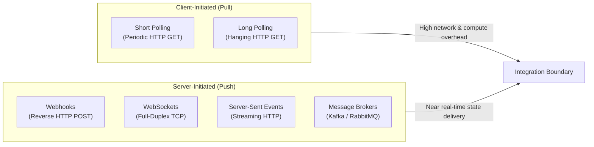
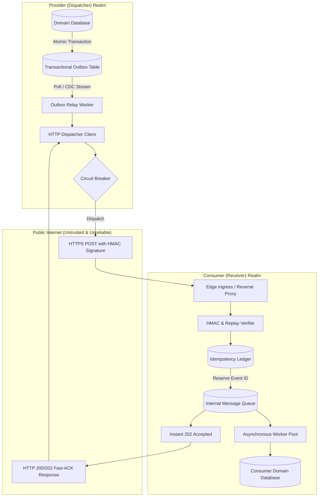
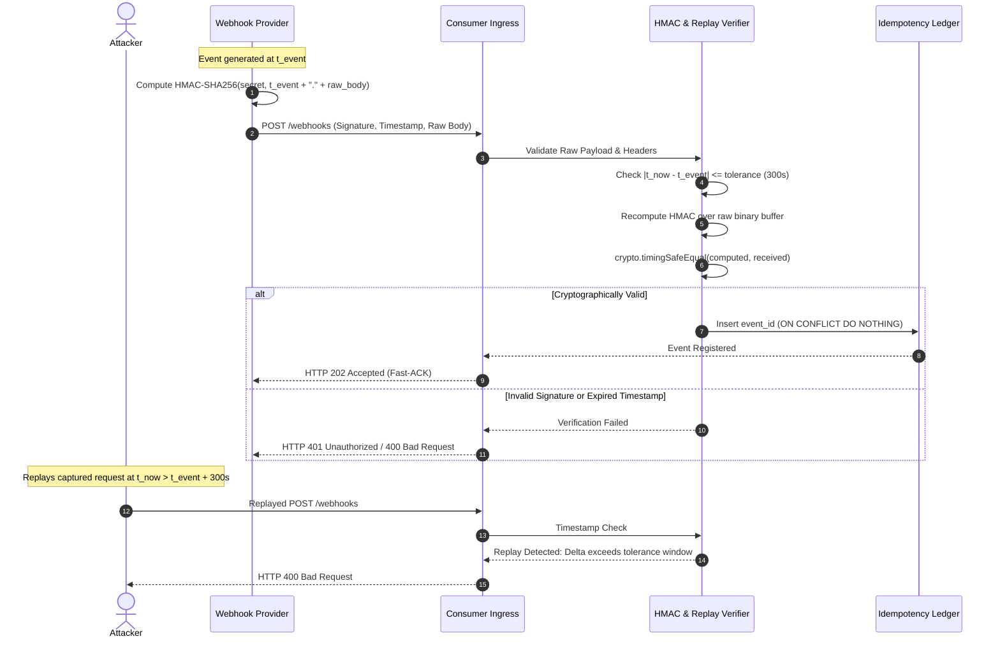
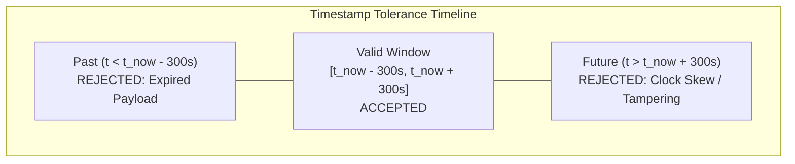
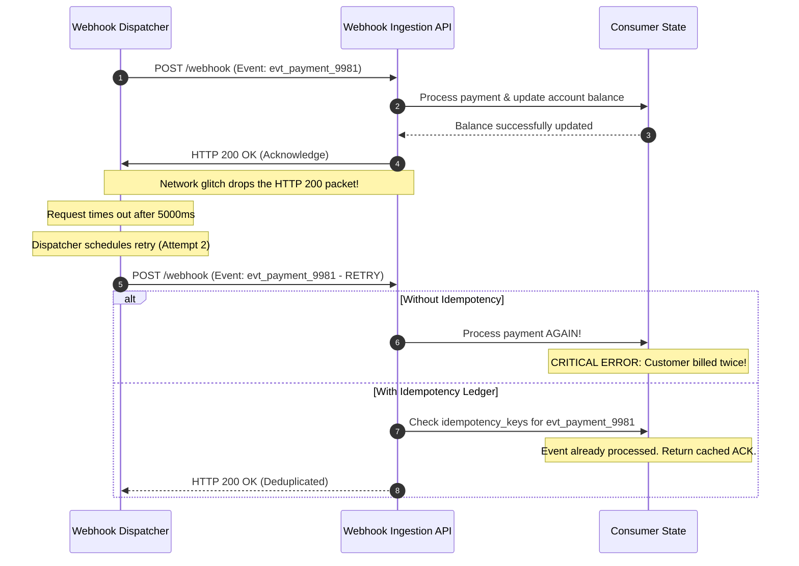
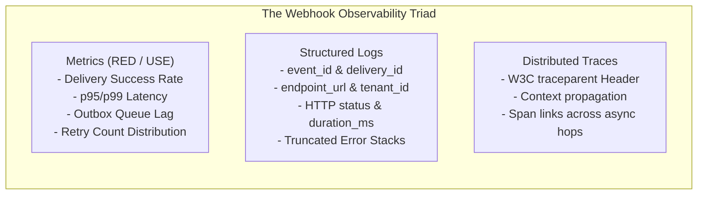

# Designing Reliable Webhooks and Event-Driven Integrations

Modern software architectures increasingly rely on event-driven communication to link disparate systems, microservices, and external third-party software-as-a-service (SaaS) platforms. Within a single private cloud or virtual private cloud (VPC), systems typically coordinate state changes using enterprise message brokers such as Apache Kafka, RabbitMQ, or Amazon SQS. However, across organizational, corporate, or network boundaries, opening direct message broker ports is rarely feasible or secure. 

In these cross-boundary environments, **webhooks**—user-defined HTTP callbacks executed asynchronously in response to system events—have become the standard integration mechanism. From payment processors (e.g., Stripe) and source control platforms (e.g., GitHub) to communication services (e.g., Twilio), webhooks allow a provider system to push near real-time state transitions to consumer applications over standard HTTPS channels.

On the surface, a webhook appears deceptively straightforward: an HTTP POST request carrying a JSON payload. Yet in distributed systems engineering, webhooks represent one of the most fragile, failure-prone boundaries an engineer can design. 

A production webhook system must operate under the realities of distributed computing:
- Networks drop packets, introduce unpredictable latencies, and experience connection timeouts.
- Target endpoints suffer deployment outages, crash under burst traffic, or return unhandled exceptions.
- Malicious third parties attempt to forge events, tamper with payloads, or execute replay attacks.
- Network retries inevitably generate duplicate event deliveries, risking double-billing, duplicate order creation, or corrupted state.

Building a resilient webhook integration requires decoupling transport mechanics from business logic on both sides of the wire. Every webhook system consists of two distinct architectures governed by opposite invariants: the **Provider (Dispatcher)** and the **Consumer (Receiver)**. This article explores the architectural patterns, cryptographic protocols, database schemas, and retry mechanics required to build production-grade, reliable webhook ecosystems.

---

## 1. Integration Mechanisms: Evaluating Push vs. Pull

Before committing to webhooks, systems architects must evaluate whether a push-based HTTP callback model is the correct architectural choice for the problem domain. Software integrations generally fall across several paradigms, each presenting distinct trade-offs in operational complexity, latency, infrastructure overhead, and firewall traversal.



| Dimension | Webhooks | Short Polling | Long Polling | WebSockets | Server-Sent Events (SSE) | Message Brokers (Kafka / SQS) |
| :--- | :--- | :--- | :--- | :--- | :--- | :--- |
| **Communication Paradigm** | Asynchronous Push (Server-to-Server) | Synchronous Pull (Client-to-Server) | Semi-asynchronous Pull (Client-to-Server) | Full-Duplex Bidirectional Streaming | Unidirectional Push (Server-to-Client) | Distributed Queue / Log Streaming |
| **Transport Protocol** | Standard HTTP/1.1 or HTTP/2 POST | HTTP GET requests at fixed intervals | HTTP GET held open until event occurs | TCP connection upgrade (`ws://`, `wss://`) | Persistent HTTP connection (`text/event-stream`) | Custom TCP protocols (AMQP, Kafka Protocol) |
| **Network & Trust Boundary** | Public Internet / Cross-Organizational | Public Internet / Cross-Organizational | Public Internet / Cross-Organizational | Client to Server (Web/Mobile Apps) | Server to Browser / Mobile Client | Private VPC / Internal Microservices |
| **Latency Profile** | Near Real-Time (Milliseconds to Seconds) | High Latency (Bounded by polling interval) | Near Real-Time (Bounded by connection cycle) | Sub-millisecond to Low Millisecond | Low Millisecond | Sub-millisecond to Low Millisecond |
| **Idle Resource Consumption** | Zero idle compute or connection overhead | High compute, network egress, and log volume | Moderate connection socket holding | High persistent memory and socket overhead | Moderate persistent socket overhead | Broker cluster memory and disk overhead |
| **Firewall / Ingress Constraint** | Requires public HTTPS ingress on consumer | Outbound client connectivity only | Outbound client connectivity only | Outbound client connection with upgrade support | Outbound client connection only | Requires internal VPC peering or private VPN |
| **Delivery Guarantees** | At-least-once (with explicit retries) | Client queries current state snapshot | Client queries current state snapshot | In-session delivery (lost if connection drops) | In-session delivery (built-in browser reconnect) | At-least-once, at-most-once, or partitioned log order |
| **Primary Production Fit** | B2B SaaS notifications, payment state updates | Simple legacy systems without push capabilities | Chat notifications prior to modern WebSocket adoption | Interactive multi-user UIs, trading dashboards, gaming | Unidirectional live news feeds, LLM text streaming | High-throughput internal microservice data pipelines |

### Architectural Trade-Offs

1. **Webhooks vs. Message Brokers**: Message brokers provide higher throughput, partitioned FIFO ordering, and advanced consumer group management. However, exposing an internal Kafka or RabbitMQ cluster to external clients requires complex mTLS certificate provisioning, custom firewall configurations, and exposure of internal infrastructure. Webhooks leverage the universal lingua franca of the Internet: HTTPS over port 443.
2. **Webhooks vs. Polling**: Polling creates an inverse relationship between latency and infrastructure cost. To receive state changes within 500 milliseconds via polling, clients must hammer the provider with millions of empty requests daily, consuming egress bandwidth and database query capacity. Webhooks invert this relationship: compute and network resources are consumed only when an actual domain state transition occurs.
3. **Ingress Vulnerability Trade-Off**: The primary trade-off of webhooks for the consumer is the requirement of an exposed public HTTP endpoint. The consumer must secure this endpoint against denial-of-service (DoS) attacks, payload tampering, and replay attempts.

---

## 2. The Dual Perspectives of Webhook Architecture

Every webhook implementation spans two independent systems operating under fundamentally conflicting constraints:



| Architectural Attribute | Provider (Dispatcher) Architecture | Consumer (Receiver) Architecture |
| :--- | :--- | :--- |
| **Core Invariant** | **Decouple dispatch from domain transactions.** Never issue an HTTP network call inside a database transaction. | **Fast-ACK.** Acknowledge receipt within milliseconds; defer all business logic to asynchronous workers. |
| **Primary Failure Hazard** | Database connection pool exhaustion and phantom event dispatching caused by synchronous network calls. | HTTP worker starvation and cascading provider retry storms caused by synchronous domain processing. |
| **Delivery Model** | At-least-once delivery with exponential backoff, jitter, and dead-letter queuing. | Idempotent consumer processing with atomic deduplication storage. |
| **Security Duty** | Generate cryptographic HMAC signatures over raw payloads with secure timestamps. | Capture raw byte stream, verify HMAC in constant time, and validate timestamp tolerance windows. |
| **State Persistence** | Transactional Outbox table and Delivery Attempt audit ledger. | Processed event ledger and durable internal processing queue. |
| **Concurrency Model** | Controlled outbound connection pools with per-endpoint rate limiting and circuit breaking. | High-concurrency edge ingestion feeding into buffered, worker-pool consumers. |

### The Provider Invariant: The Transactional Outbox Pattern

The most dangerous anti-pattern in webhook dispatching is invoking an external HTTP call directly within a database transaction:

```typescript
// DANGEROUS ANTI-PATTERN: DO NOT USE IN PRODUCTION
async function updateOrderBad(orderId: string, status: string) {
  const client = await pool.connect();
  try {
    await client.query("BEGIN");
    
    // 1. Mutate local domain entity
    await client.query("UPDATE orders SET status = $1 WHERE id = $2", [status, orderId]);
    
    // 2. Catastrophic: External HTTP network call inside the active DB transaction
    await fetch("https://consumer.example.com/webhooks", {
      method: "POST",
      body: JSON.stringify({ event: "order.updated", orderId, status }),
      headers: { "Content-Type": "application/json" },
    });
    
    await client.query("COMMIT");
  } catch (error) {
    await client.query("ROLLBACK");
    throw error;
  } finally {
    client.release();
  }
}
```

This anti-pattern introduces severe production failure modes:
1. **Connection Pool Starvation**: A slow or unresponsive consumer endpoint holds the PostgreSQL connection open for seconds. Under modest concurrency, the database connection pool exhausts completely, stalling unrelated core application queries.
2. **The Phantom Event Hazard**: If the external HTTP call succeeds, but the database transaction subsequently fails during `COMMIT` (e.g., due to serialization conflicts, constraints, or connection drops), the consumer receives an event for a state transition that never persisted.
3. **The Silent Loss Hazard**: If the database transaction commits, but the network drops right before or during the HTTP call, the event is permanently lost unless tracked by a durable outbox.

**The Solution: The Transactional Outbox Pattern**. The domain entity mutation and the creation of a webhook event record must occur within the **same local database transaction**. A separate, background relay process then reads uncommitted events, dispatches the HTTP requests, and records delivery attempts.

### The Consumer Invariant: The Fast-ACK Mandate

On the receiving end, the consumer must adhere to the **Fast-ACK Invariant**:
> A webhook receiver must complete cryptographic verification, persist or enqueue the raw event, and return an HTTP `200 OK` or `202 Accepted` response within milliseconds. Under no circumstances should synchronous business logic execute inside the HTTP request lifecycle.

If a consumer executes heavy database writes, PDF rendering, or third-party API calls inside the HTTP handler:
- The HTTP worker thread or event loop remains blocked.
- The provider's client-side timeout (typically between 2 and 10 seconds) triggers.
- The provider flags the attempt as a failure and schedules an automated retry.
- When the retry arrives, the consumer is still processing the original request, causing a **cascading retry storm** that amplifies server load and leads to complete service collapse.

---

## 3. Cryptographic Verification & Boundary Security

Because webhook endpoints are exposed to the public Internet, any entity capable of routing TCP packets to the URL can issue HTTP POST requests. Without robust cryptographic validation, attackers can forge fake payment completions, inject corrupted payloads, or replay previous valid transactions.



### The HMAC-SHA256 Signature Standard

The industry standard for webhook authentication relies on Hash-based Message Authentication Codes (HMAC) utilizing SHA-256. During endpoint registration, the provider and consumer establish a shared cryptographic secret ($K$).

When dispatching an event, the provider signs a structured string containing both the dispatch timestamp ($t$) and the raw payload body ($B$):

$$\text{SigningString} = t \parallel "." \parallel B$$

$$\text{Signature} = \text{HMAC-SHA256}(K, \text{SigningString})$$

The signature and timestamp are transmitted via HTTP headers:
```http
POST /api/webhooks/incoming HTTP/1.1
Host: consumer.example.com
Content-Type: application/json
OpenStair-Signature: t=1758526200,v1=a35f79c2980bc463e26f8d388c42b8217d0b3c675908b8b0e7a25a07c1265db2
```

### The Raw Body Invariant

A pervasive bug in webhook consumer implementations occurs when the raw HTTP request stream is parsed into an in-memory JSON object before signature verification:

```typescript
// FLAWED IMPLEMENTATION: DO NOT DO THIS
app.post("/webhooks", express.json(), (req, res) => {
  // Re-stringifying parses keys differently, alters whitespace, and strips formatting!
  const reStringified = JSON.stringify(req.body); 
  const signature = crypto.createHmac("sha256", secret).update(reStringified).digest("hex");
  // Verification fails intermittently!
});
```

**Why this breaks**: ECMAScript specifications do not guarantee deterministic key serialization ordering for arbitrary JSON objects. Furthermore, JSON parsers normalize whitespace, discard optional formatting indentation, and may mutate large floating-point numbers or unicode escape characters. 

The cryptographic signature was computed over the **exact byte sequence** sent across the wire. The consumer MUST capture and preserve the pristine, unparsed raw `Buffer` or string directly from the underlying network stream before any JSON parsing occurs.

### Timing Attack Defenses

When comparing the received signature with the locally computed signature, using standard language equality operators (`===` or `==`) introduces a critical security vulnerability: **timing side-channels**.

Standard string comparison operators evaluate characters sequentially from left to right and terminate immediately upon encountering the first mismatching character (an early-exit optimization). An attacker measuring network response latency with microsecond precision over thousands of requests can systematically determine the signature byte by byte:

```typescript
// VULNERABLE TO TIMING SIDE-CHANNELS:
if (computedSignature === receivedSignature) { ... } // Early exit leaks timing data!
```

To eliminate this vulnerability, engineers must use **constant-time comparison** via Node.js's native `crypto.timingSafeEqual`. This function executes in constant time regardless of whether or where differences exist in the memory buffers.

> [!IMPORTANT]
> `crypto.timingSafeEqual(bufA, bufB)` throws a runtime `RangeError` if the two input buffers have differing byte lengths. To ensure robustness, compare the SHA-256 digests of both signatures or explicitly verify matching buffer lengths before invoking `timingSafeEqual`.

### Replay Attack Prevention

If an attacker intercepts a valid signed webhook request (via compromised proxy logs, insecure network hops, or debugging proxies), possessing the signature allows them to transmit the exact same request repeatedly to the consumer endpoint. Because the signature remains cryptographically valid for that body, the consumer would accept it.

To prevent replay attacks:
1. The provider includes a Unix epoch timestamp ($t$) in the signature header.
2. The timestamp is prepended to the payload body prior to computing the HMAC, making it impossible for an attacker to modify the timestamp without invalidating the cryptographic digest.
3. The consumer extracts $t$, computes the absolute differential against the current server time ($\Delta t = |t_{\text{now}} - t|$), and verifies that $\Delta t \le \tau$, where $\tau$ is a strict tolerance threshold (e.g., 300 seconds / 5 minutes).
4. If the timestamp is older than 5 minutes, or drifted into the future beyond acceptable NTP clock skew, the request is immediately rejected.



---

## 4. Delivery Semantics, Idempotency & Deduplication

In distributed networks, achieving **exactly-once delivery** over an asynchronous transport is theoretically impossible without distributed two-phase commit consensus protocols, which cannot span public HTTP connections. Consequently, webhook providers operate under **at-least-once delivery semantics**.

### The Return-Path Drop Scenario

Consider the classic distributed systems failure scenario illustrated below:



Because the network dropped the return acknowledgment, the provider cannot know whether the failure occurred prior to execution or during response transit. The provider must retry. If the consumer lacks idempotency protections, the business mutation executes twice.

### The Idempotent Consumer Pattern

To guarantee that duplicate deliveries produce identical system state, consumers must implement the **Idempotent Consumer Pattern**.

1. **Globally Unique Event Identifier**: Every webhook payload emitted by the provider must contain a globally immutable identifier (e.g., `id: "evt_1048576"`).
2. **Atomic Deduplication Registry**: Before processing an event or routing it to an asynchronous worker queue, the consumer attempts to insert the event ID into a dedicated database ledger protected by a primary key or unique constraint.
3. **Payload Fingerprinting**: For providers that do not supply unique event IDs, the consumer must compute a deterministic SHA-256 digest over the raw payload and use the resulting hash as a synthetic idempotency key.

In PostgreSQL, atomic registration is achieved using `ON CONFLICT DO NOTHING`:

```sql
-- Atomically reserve processing rights for an incoming webhook
INSERT INTO webhook_consumer_events (
    event_id, 
    provider, 
    event_type, 
    payload_hash, 
    status, 
    created_at
) VALUES (
    'evt_01J8F2A6N0B1C2D3E4F5G6H7J8', 
    'stripe', 
    'payment_intent.succeeded', 
    'e3b0c44298fc1c149afbf4c8996fb92427ae41e4649b934ca495991b7852b855', 
    'PENDING', 
    NOW()
)
ON CONFLICT (provider, event_id) DO NOTHING
RETURNING id;
```

If the query returns zero rows, the event has already been received. The consumer returns an immediate `200 OK` or `202 Accepted` to silence further provider retries without re-executing downstream operations.

---

## 5. Retry Strategies, Backoff & Dead-Letter Queues (DLQ)

When an external consumer endpoint fails to return a 2xx status code, or the TCP socket times out, the provider must execute an automated retry strategy.

### The Thundering Herd Hazard

A naive retry policy—such as retrying every 60 seconds—can destabilize downstream infrastructure. If a major consumer service goes down for 30 minutes, thousands of unacknowledged events accumulate in the provider's dispatch queue. When the consumer comes back online, all accumulated retries fire simultaneously at fixed 60-second boundaries, immediately crashing the recovering server under an artificial traffic spike.

### Truncated Exponential Backoff with Full Jitter

To prevent synchronization waves and smooth outbound traffic, providers must implement **truncated exponential backoff with full jitter**, based on foundational distributed systems research.

The mathematical model for full jitter computes the delay for retry attempt $c \ge 1$ as follows:

$$\text{exponential\_delay}(c) = \min\left(\text{max\_backoff},\, \text{base\_delay} \times 2^{c-1}\right)$$

$$\text{sleep\_duration} = \text{random\_uniform}\left(0,\, \text{exponential\_delay}(c)\right)$$

Where:
- $\text{base\_delay}$ is the initial backoff interval (e.g., 5 seconds).
- $\text{max\_backoff}$ is the upper truncation boundary (e.g., 86,400 seconds / 24 hours).
- $\text{random\_uniform}(0, X)$ distributes retry executions uniformly across the entire backoff spectrum.

Full jitter completely breaks lockstep retry cycles across independent worker threads, transforming sharp traffic spikes into an evenly distributed stream of requests.

```mermaid
flowchart TD
    StartAttempt["Dispatch Webhook Delivery Attempt"] --> CheckHTTP{"HTTP Response Code?"}
    
    CheckHTTP -->|2xx Success| MarkDelivered["Mark Outbox as DELIVERED<br/>Log Latency & Status"]
    CheckHTTP -->|429 Too Many Requests<br/>or 5xx Server Error<br/>or Socket Timeout| CheckRetries{"Attempt Count < Max Retries?"}
    CheckHTTP -->|4xx Unprocessable Entity<br/>or 404 Not Found<br/>(Non-retryable)| QuarantineDLQ["Quarantine Directly to DLQ<br/>Mark as POISON_PILL"]

    CheckRetries -->|Yes| CalcJitter["Compute Delay:<br/>sleep = random(0, min(max_cap, base * 2^c))"]
    CalcJitter --> ScheduleRetry["Update scheduled_for<br/>Status = RETRY_PENDING"]
    
    CheckRetries -->|No: Max Attempts Exceeded| QuarantineDLQ
    QuarantineDLQ --> AlertOps["Notify Integration Admin<br/>Trigger Circuit Breaker Metrics"]
```

### Poison Pills and Dead-Letter Queues (DLQ)

Not all failures can be resolved through retries. If a provider transmits a payload containing a schema violation or syntax error that causes the consumer application code to throw an unhandled exception (e.g., `422 Unprocessable Entity` or `400 Bad Request`), retrying 25 times over three days will never succeed. Such a payload is a **poison pill**.

1. **Failure Classification**:
   - **Transient Failures (Retryable)**: Network timeouts, DNS resolution blips, HTTP `429 Too Many Requests`, HTTP `502 Bad Gateway`, HTTP `503 Service Unavailable`, and HTTP `504 Gateway Timeout`.
   - **Permanent Failures (Quarantined)**: HTTP `400 Bad Request`, `401 Unauthorized` (invalid signature), `403 Forbidden`, `404 Not Found`, and `422 Unprocessable Entity`.
2. **Dead-Letter Queue Isolation**: When an event exceeds the maximum retry limit (e.g., 10 attempts over 48 hours), or receives an explicit non-retryable 4xx client error, the dispatcher transitions the record to `FAILED` and archives it into a Dead-Letter Queue (DLQ).
3. **Operational Replay**: The provider should expose an administrative interface allowing developers to inspect the failed request headers, raw body, consumer response body, and execution stack trace. Once the consumer team fixes their bug, the operator can trigger a manual redelivery.

### Provider-Side Circuit Breaking

If a consumer's endpoint fails 100% of delivery attempts consecutively over a prolonged window (e.g., continuous connection refused errors for 12 hours), the provider's dispatch workers waste substantial egress sockets, connection pools, and thread capacity attempting doomed deliveries.

A production provider implements an endpoint-level **circuit breaker**:
- If the consecutive failure count exceeds a threshold (e.g., 50 consecutive failures), the circuit trips to `OPEN`.
- While `OPEN`, new events for that endpoint are inserted into the outbox in a `PAUSED` state without scheduling network execution.
- The provider automatically sends an email or operational webhook to the customer's technical contact.
- When the customer resolves the incident and clicks "Verify Endpoint" in their dashboard, a test ping is sent. If successful, the circuit resets to `CLOSED`, and pending outbox events are drained sequentially.

---

## 6. Production Reference Implementations

The following sections provide concrete, syntactically valid TypeScript and PostgreSQL implementations demonstrating the Transactional Outbox pattern, cryptographic verification, and idempotent ingestion.

### Production PostgreSQL Outbox & Delivery Schema

This schema implements the Transactional Outbox, the delivery attempt audit trail, and the consumer-side deduplication ledger:

```sql
-- Enable UUID generation extension
CREATE EXTENSION IF NOT EXISTS "pgcrypto";

-- ============================================================================
-- 1. PROVIDER SIDE: Transactional Outbox Table
-- ============================================================================
CREATE TABLE webhook_outbox (
    id UUID PRIMARY KEY DEFAULT gen_random_uuid(),
    event_type VARCHAR(128) NOT NULL,
    aggregate_type VARCHAR(64) NOT NULL,
    aggregate_id VARCHAR(128) NOT NULL,
    payload JSONB NOT NULL,
    status VARCHAR(32) NOT NULL DEFAULT 'PENDING', -- PENDING, PROCESSING, DELIVERED, FAILED
    retry_count INT NOT NULL DEFAULT 0,
    max_retries INT NOT NULL DEFAULT 10,
    scheduled_for TIMESTAMPTZ NOT NULL DEFAULT NOW(),
    created_at TIMESTAMPTZ NOT NULL DEFAULT NOW(),
    updated_at TIMESTAMPTZ NOT NULL DEFAULT NOW()
);

-- Index for concurrency-safe polling via FOR UPDATE SKIP LOCKED
CREATE INDEX idx_webhook_outbox_queue 
ON webhook_outbox (scheduled_for ASC) 
WHERE status IN ('PENDING', 'RETRY_PENDING');

-- ============================================================================
-- 2. PROVIDER SIDE: Delivery Attempt Audit Ledger
-- ============================================================================
CREATE TABLE webhook_delivery_attempts (
    id UUID PRIMARY KEY DEFAULT gen_random_uuid(),
    outbox_id UUID NOT NULL REFERENCES webhook_outbox(id) ON DELETE CASCADE,
    endpoint_url TEXT NOT NULL,
    attempt_number INT NOT NULL,
    http_status_code INT,
    response_headers JSONB,
    response_body TEXT,
    execution_duration_ms INT NOT NULL,
    error_message TEXT,
    attempted_at TIMESTAMPTZ NOT NULL DEFAULT NOW()
);

CREATE INDEX idx_delivery_attempts_outbox 
ON webhook_delivery_attempts (outbox_id, attempted_at DESC);

-- ============================================================================
-- 3. CONSUMER SIDE: Idempotency & Deduplication Registry
-- ============================================================================
CREATE TABLE webhook_consumer_events (
    id UUID PRIMARY KEY DEFAULT gen_random_uuid(),
    provider VARCHAR(64) NOT NULL,
    event_id VARCHAR(128) NOT NULL,
    event_type VARCHAR(128) NOT NULL,
    payload_hash CHAR(64) NOT NULL,
    status VARCHAR(32) NOT NULL DEFAULT 'RECEIVED', -- RECEIVED, PROCESSING, COMPLETED, FAILED
    created_at TIMESTAMPTZ NOT NULL DEFAULT NOW(),
    processed_at TIMESTAMPTZ,
    error_details TEXT,
    CONSTRAINT uq_consumer_provider_event UNIQUE (provider, event_id)
);

CREATE INDEX idx_consumer_events_status 
ON webhook_consumer_events (status, created_at);
```

### High-Throughput Concurrency: Pulling Outbox Events with `SKIP LOCKED`

To allow multiple outbox dispatcher workers to poll the queue concurrently without lock contention or duplicate dispatches, use PostgreSQL's `FOR UPDATE SKIP LOCKED`:

```sql
-- Safely claim a batch of 50 pending events across concurrent worker processes
WITH claimed_batch AS (
    SELECT id
    FROM webhook_outbox
    WHERE (status = 'PENDING' OR status = 'RETRY_PENDING')
      AND scheduled_for <= NOW()
    ORDER BY scheduled_for ASC
    LIMIT 50
    FOR UPDATE SKIP LOCKED
)
UPDATE webhook_outbox
SET status = 'PROCESSING',
    updated_at = NOW()
FROM claimed_batch
WHERE webhook_outbox.id = claimed_batch.id
RETURNING webhook_outbox.*;
```

### Production TypeScript Implementation: `WebhookVerifier` & Fast-ACK Handler

The following TypeScript code demonstrates an end-to-end webhook receiver adhering to the Raw Body Invariant, constant-time comparison, replay attack defense, and asynchronous queue handoff.

```typescript
import * as crypto from "node:crypto";
import type { IncomingMessage, ServerResponse } from "node:http";

export interface WebhookVerificationOptions {
  secret: string;
  toleranceSeconds?: number; // Default: 300 seconds (5 minutes)
}

export interface VerificationResult {
  isValid: boolean;
  timestamp?: number;
  error?: string;
}

export class WebhookVerifier {
  private readonly secret: string;
  private readonly toleranceSeconds: number;

  constructor(options: WebhookVerificationOptions) {
    if (!options.secret || options.secret.length < 16) {
      throw new Error("Webhook secret must be at least 16 characters long.");
    }
    this.secret = options.secret;
    this.toleranceSeconds = options.toleranceSeconds ?? 300;
  }

  /**
   * Verifies the cryptographic HMAC-SHA256 signature and validates timestamp freshness.
   *
   * @param rawBody - The unparsed, byte-for-byte raw body Buffer or string.
   * @param signatureHeader - The contents of the signature header (e.g. "t=1758526200,v1=abcdef...")
   */
  public verify(rawBody: Buffer | string, signatureHeader: string | undefined): VerificationResult {
    if (!signatureHeader) {
      return { isValid: false, error: "Missing signature header." };
    }

    // 1. Parse signature header components: t={timestamp},v1={hash}
    const elements = signatureHeader.split(",").reduce<Record<string, string>>((acc, item) => {
      const [key, value] = item.split("=");
      if (key && value) {
        acc[key.trim()] = value.trim();
      }
      return acc;
    }, {});

    const timestampStr = elements["t"];
    const receivedSignature = elements["v1"];

    if (!timestampStr || !receivedSignature) {
      return { isValid: false, error: "Malformed signature header components." };
    }

    const timestamp = Number.parseInt(timestampStr, 10);
    if (Number.isNaN(timestamp)) {
      return { isValid: false, error: "Invalid timestamp format in header." };
    }

    // 2. Replay Attack Defense: Validate timestamp against tolerance window
    const nowSeconds = Math.floor(Date.now() / 1000);
    const delta = Math.abs(nowSeconds - timestamp);

    if (delta > this.toleranceSeconds) {
      return {
        isValid: false,
        timestamp,
        error: `Timestamp outside tolerance window. Delta: ${delta}s, Tolerance: ${this.toleranceSeconds}s.`,
      };
    }

    // 3. Construct signing string: timestamp + "." + rawBody
    const bodyBuffer = typeof rawBody === "string" ? Buffer.from(rawBody, "utf8") : rawBody;
    const prefixBuffer = Buffer.from(`${timestamp}.`, "utf8");
    const payloadToSign = Buffer.concat([prefixBuffer, bodyBuffer]);

    // 4. Compute expected HMAC-SHA256 digest
    const expectedSignature = crypto
      .createHmac("sha256", this.secret)
      .update(payloadToSign)
      .digest("hex");

    // 5. Constant-time comparison to prevent timing side-channels
    const expectedBuffer = Buffer.from(expectedSignature, "utf8");
    const receivedBuffer = Buffer.from(receivedSignature, "utf8");

    // crypto.timingSafeEqual throws if buffer lengths do not match
    if (expectedBuffer.length !== receivedBuffer.length) {
      return { isValid: false, timestamp, error: "Signature length mismatch." };
    }

    const matches = crypto.timingSafeEqual(expectedBuffer, receivedBuffer);
    if (!matches) {
      return { isValid: false, timestamp, error: "Cryptographic signature mismatch." };
    }

    return { isValid: true, timestamp };
  }
}

/**
 * Interface representing a durable internal worker queue.
 */
export interface IngestionQueue {
  enqueue(job: { eventId: string; eventType: string; payload: unknown }): Promise<void>;
}

/**
 * Interface representing consumer deduplication storage.
 */
export interface IdempotencyStore {
  reserveEvent(eventId: string, provider: string, payloadHash: string): Promise<boolean>;
}

/**
 * Production-ready Fast-ACK Webhook Ingestion Controller.
 */
export class WebhookReceiverController {
  constructor(
    private readonly verifier: WebhookVerifier,
    private readonly idempotencyStore: IdempotencyStore,
    private readonly queue: IngestionQueue
  ) {}

  public async handleRequest(req: IncomingMessage, res: ServerResponse): Promise<void> {
    if (req.method !== "POST") {
      res.writeHead(405, { "Content-Type": "application/json" });
      res.end(JSON.stringify({ error: "Method Not Allowed" }));
      return;
    }

    // Step 1: Capture pristine raw body Buffer from network stream
    let rawBodyBuffer: Buffer;
    try {
      rawBodyBuffer = await this.readRawStream(req);
    } catch {
      res.writeHead(400, { "Content-Type": "application/json" });
      res.end(JSON.stringify({ error: "Unable to read request payload stream" }));
      return;
    }

    const signatureHeader = req.headers["openstair-signature"] as string | undefined;

    // Step 2: Perform cryptographic and replay validation
    const verification = this.verifier.verify(rawBodyBuffer, signatureHeader);
    if (!verification.isValid) {
      res.writeHead(401, { "Content-Type": "application/json" });
      res.end(JSON.stringify({ error: "Unauthorized", details: verification.error }));
      return;
    }

    // Step 3: Parse validated JSON body
    let parsedPayload: { id?: string; type?: string; [key: string]: unknown };
    try {
      parsedPayload = JSON.parse(rawBodyBuffer.toString("utf8"));
    } catch {
      res.writeHead(400, { "Content-Type": "application/json" });
      res.end(JSON.stringify({ error: "Invalid JSON format" }));
      return;
    }

    const eventId = parsedPayload.id;
    const eventType = parsedPayload.type ?? "unknown";

    if (!eventId) {
      res.writeHead(400, { "Content-Type": "application/json" });
      res.end(JSON.stringify({ error: "Missing required event 'id' property" }));
      return;
    }

    // Step 4: Atomic Idempotency Check
    const payloadHash = crypto.createHash("sha256").update(rawBodyBuffer).digest("hex");
    const isNewEvent = await this.idempotencyStore.reserveEvent(eventId, "openstair", payloadHash);

    if (!isNewEvent) {
      // Event has already been received or processed. Return instant 200 OK without re-queuing.
      res.writeHead(200, { "Content-Type": "application/json" });
      res.end(JSON.stringify({ status: "acknowledged", duplicate: true }));
      return;
    }

    // Step 5: Enqueue payload into internal queue for background processing
    await this.queue.enqueue({
      eventId,
      eventType,
      payload: parsedPayload,
    });

    // Step 6: Fast-ACK - Immediate HTTP 202 Accepted response
    res.writeHead(202, { "Content-Type": "application/json" });
    res.end(JSON.stringify({ status: "accepted", eventId }));
  }

  private readRawStream(req: IncomingMessage): Promise<Buffer> {
    return new Promise((resolve, reject) => {
      const chunks: Buffer[] = [];
      req.on("data", (chunk: Buffer) => chunks.push(chunk));
      req.on("end", () => resolve(Buffer.concat(chunks)));
      req.on("error", (err) => reject(err));
    });
  }
}
```

---

## 7. Observability, Telemetry & Operational Runbooks

Because webhooks execute asynchronously across separate organizational networks, debugging delivery failures requires distributed observability.



### Essential Telemetry Metrics

A production webhook platform must instrument the following primary metrics:

1. **`webhook_outbox_queue_depth`**: The number of pending events waiting for dispatch in the database. An escalating queue depth signals outbox worker pool exhaustion or database lock contention.
2. **`webhook_delivery_attempts_total`**: Counter tagged by `status_code` (e.g., `200`, `429`, `500`, `timeout`), `provider`, and `event_type`.
3. **`webhook_delivery_latency_ms`**: Histogram tracking execution duration from HTTP request dispatch to response receipt. Elevated p95/p99 latency indicates that downstream consumers are violating the Fast-ACK invariant.
4. **`webhook_circuit_breaker_state`**: Gauge indicating whether an endpoint's circuit breaker is `CLOSED` (0) or `OPEN` (1).

### Distributed Tracing Across Asynchronous Boundaries

When a domain state change in Service A triggers a webhook consumed by Service B, traditional synchronous HTTP distributed traces break. To maintain end-to-end tracing visibility:
- The provider injects standard [W3C Trace Context](https://www.w3.org/TR/trace-context/) headers (`traceparent` and `tracestate`) into the outbound webhook request.
- The consumer's HTTP edge reads `traceparent` and links the asynchronous internal queue job to the upstream trace span.

### Incident Runbooks

#### Runbook 1: Consumer Database Brownout & Queue Backpressure
- **Symptom**: Consumer database CPU spikes to 100%, causing webhook endpoints to time out and triggering widespread provider retries.
- **Immediate Mitigation**:
  1. Verify the Fast-ACK boundary. Ensure the HTTP ingestion route writes payloads exclusively to an in-memory or decoupled queue (e.g., Redis Streams or SQS) rather than performing transactional database mutations synchronously.
  2. Throttle background queue consumers. Slow down queue consumption workers to relieve database load while continuing to accept and buffer incoming webhooks at the edge.
  3. If ingress capacity is saturated, return an explicit HTTP `429 Too Many Requests` with a `Retry-After: 300` header to instruct providers to back off cleanly.

#### Runbook 2: Schema Drift & Poison Pill Quarantine
- **Symptom**: Consumer deployments fail with unhandled `TypeError` exceptions during JSON parsing, resulting in consecutive HTTP 500 errors and filling provider retry queues.
- **Immediate Mitigation**:
  1. Update consumer edge routing to intercept failing payloads and route them directly to a persistent Dead-Letter Queue (DLQ) after logging the payload structure.
  2. Return HTTP `202 Accepted` once quarantined to silence provider retry storms.
  3. Deploy a schema patch to accommodate the modified payload fields, then replay the quarantined DLQ events using an internal batch script.

#### Runbook 3: Emergency Secret Rotation Playbook
- **Symptom**: A webhook signing secret is accidentally committed to a public repository or exposed in application logs.
- **Immediate Mitigation**:
  1. Providers must support **dual-secret verification periods**. Generate a new secondary secret while keeping the primary secret active.
  2. Sign outbound requests using the new secret, but configure consumer verifiers to test against both the primary and secondary secrets during a 48-hour migration window.
  3. Once all consumer endpoints report successful verification under the new secret, revoke and deprecate the old compromised secret.

---

## 8. Production Webhook Reliability Checklist

Before deploying a webhook integration to production, verify that both the provider and consumer systems satisfy this comprehensive engineering checklist:

### Provider (Dispatcher) Architecture
- [ ] **Transactional Outbox Implemented**: Event emission is committed atomically with the domain state mutation within the same database transaction.
- [ ] **No Synchronous Outbound Calls in Transactions**: Zero outbound HTTP calls are made while holding database locks or connection pool leases.
- [ ] **Concurrency-Safe Polling**: Outbox relay workers poll using `SELECT ... FOR UPDATE SKIP LOCKED` or Change Data Capture (CDC) streams.
- [ ] **Truncated Exponential Backoff with Jitter**: Retries apply exponential backoff with full jitter to avoid thundering herds.
- [ ] **Dead-Letter Queue Isolation**: Events exceeding maximum retry thresholds or receiving non-retryable 4xx errors are quarantined to a DLQ.
- [ ] **Provider Circuit Breaking**: Endpoints with 100% consecutive failure rates are automatically paused to preserve egress capacity.

### Consumer (Receiver) Architecture
- [ ] **Fast-ACK Invariant Preserved**: The HTTP handler returns `200 OK` or `202 Accepted` within milliseconds; zero synchronous domain processing occurs in the HTTP request cycle.
- [ ] **The Raw Body Invariant Enforced**: Cryptographic signatures are calculated against the exact raw binary/text buffer, never against re-serialized JSON.
- [ ] **Constant-Time Comparison**: Signatures are evaluated using `crypto.timingSafeEqual` with buffer length validation to prevent timing side-channel attacks.
- [ ] **Replay Attack Defense Active**: Header timestamps are verified against a strict tolerance window (e.g., 300 seconds).
- [ ] **Atomic Deduplication Registry**: Incoming `event_id` values are registered in a database ledger (`ON CONFLICT DO NOTHING`) to prevent double-processing under at-least-once delivery.
- [ ] **Durable Queue Buffering**: Validated payloads are enqueued to a persistent worker queue before completing the HTTP response.

### Observability & Security
- [ ] **W3C Trace Context Propagated**: `traceparent` headers are injected and parsed across the boundary.
- [ ] **Alerting on Outbox Queue Lag**: Alerts fire if outbox pending depth or consumer queue latency exceeds operational targets.
- [ ] **Dual-Secret Rotation Support**: Verification logic allows graceful zero-downtime secret rollover.

---

## 9. Conclusion

Designing reliable webhooks requires recognizing that webhooks are not ordinary REST API endpoints. They are reverse APIs operating across an untrusted, asynchronous boundary where network failures, server crashes, and duplicate messages are inevitable operating conditions.

A resilient webhook architecture succeeds by enforcing strict boundaries:
- **Providers** must guarantee that domain state changes and event dispatch records are bound atomically through the Transactional Outbox pattern, ensuring no event is lost or dispatched as a phantom.
- **Consumers** must honor the Fast-ACK mandate, acknowledging payloads instantaneously while offloading heavy business logic to asynchronous, durable queues.
- **Security** must be treated as a foundational requirement: raw payload buffers must be cryptographically verified using constant-time comparisons, and timestamp tolerance windows must eliminate replay attacks.
- **Idempotency** is non-negotiable: because at-least-once delivery guarantees duplicate requests, consumer business operations must converge deterministically regardless of how many times an event is delivered.

By implementing these patterns, engineering teams can transform fragile HTTP callbacks into durable, self-healing event-driven integrations capable of scaling reliably under real-world production constraints.
