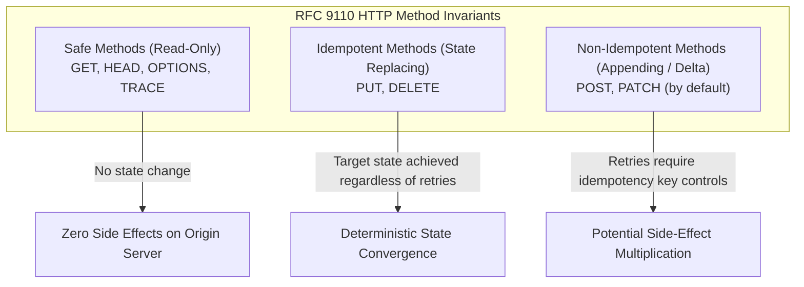

# REST API Design: Principles for Maintainable APIs

Application Programming Interfaces (APIs) represent the primary boundary through which distributed systems interact. While internal implementation details—such as database schemas, queuing systems, and internal service boundaries—can be refactored behind closed doors, a public or shared API constitutes an external contract. Once client applications, third-party developers, and automated background jobs integrate with an endpoint, every behavioral quirk, naming irregularity, and serialization flaw becomes frozen in time.

Designing maintainable APIs is fundamentally an exercise in systems architecture. It requires balancing developer ergonomics with strict operational invariants: deterministic resource naming, protocol-level caching, predictable failure semantics, atomic concurrency control, and scalable pagination.

This article provides an in-depth, production-oriented guide to designing maintainable REST APIs. We examine Roy Fielding's architectural foundations, evaluate the Richardson Maturity Model, analyze RFC 9110 HTTP method semantics, contrast modern API paradigms, implement RFC 9457 Problem Details error serialization, evaluate pagination performance, prevent the Lost Update Problem via HTTP conditional headers, and provide a production-ready TypeScript controller.

---

## 1. Architectural Foundations: Roy Fielding's Constraints and REST Theory

The term **REST** (Representational State Transfer) was introduced in 2000 by Roy Thomas Fielding in his doctoral dissertation, *Architectural Styles and the Design of Network-based Software Architectures*. Fielding did not define a protocol or a library; rather, he formalized a set of architectural constraints that govern how distributed hypermedia systems achieve scalability, performance, and long-term evolvability.

```text
+-------------------------------------------------------------------------------+
|                       Roy Fielding's REST Architectural Style                 |
+-------------------------------------------------------------------------------+
| 1. Client-Server        Separation of UI concerns from data storage           |
| 2. Statelessness        Each request contains all context needed by server    |
| 3. Cacheability         Responses declare cache directives (Cache-Control)    |
| 4. Layered System       Intermediaries (proxies, CDNs, gateways) are invisible|
| 5. Uniform Interface    Resources, representations, self-descriptive messages |
| 6. Code-on-Demand       Optional: Executable code transferred to client       |
+-------------------------------------------------------------------------------+
```

### The Six Guiding Architectural Constraints

1. **Client-Server Separation**:
   Separating user interface concerns from data storage concerns enables user agents (web browsers, mobile apps, command-line interfaces) and server platforms to evolve independently. Server implementations can undergo substantial refactoring, language migrations, or database upgrades without forcing changes onto client clients, provided the network interface contract remains stable.

2. **Statelessness**:
   Every request from a client to a server must contain all the contextual information required for the server to interpret and execute the request. The server must not store session context regarding the client's conversational progress between requests. Session state is retained exclusively on the client. Statelessness simplifies server design, eliminates cross-node session replication overhead, enhances reliability in the event of partial failures, and allows load balancers to route subsequent requests across arbitrary worker nodes without affinity constraints. The architectural tradeoff is that per-request overhead increases because authentication credentials and operational context must be transmitted with every call.

3. **Cacheability**:
   Data within a response must be implicitly or explicitly labeled as cacheable or non-cacheable. When a response is cacheable, client caches or intermediate network proxies (reverse proxies, CDNs) are granted permission to reuse that response data for equivalent subsequent requests within the defined time-to-live (TTL). Effective caching reduces network latency, minimizes server compute load, and improves perceived availability.

4. **Layered System**:
   The layered system constraint restricts component behavior such that each architectural layer cannot "see" beyond the immediate interface with which it is interacting. A client cannot determine whether it is communicating directly with the end-origin server or with an intermediary such as a reverse proxy, an API gateway, a rate limiter, or a content delivery network. Intermediaries can enforce security policies, balance traffic, and terminate TLS without requiring client awareness.

5. **Uniform Interface**:
   The uniform interface is the defining constraint of the REST architectural style. It simplifies and decouples the system architecture by establishing four sub-constraints:
   - *Identification of resources*: Individual resources are identified in requests using uniform resource identifiers (URIs).
   - *Manipulation of resources through representations*: Clients hold representations of resources (such as JSON or XML documents) containing enough metadata to modify or delete the resource on the server.
   - *Self-descriptive messages*: Each message includes enough metadata (such as media types and caching headers) to describe how to process it.
   - *Hypermedia as the Engine of Application State (HATEOAS)*: Clients discover allowable actions and state transitions dynamically through hypermedia controls (links) embedded within representations.

6. **Code-on-Demand (Optional)**:
   Servers may temporarily extend or customize client functionality by transferring executable code (such as compiled WebAssembly modules or JavaScript scripts). Because this constraint couples the client environment to a specific runtime execution engine, it remains the only optional constraint in the REST specification.

---

## 2. The Richardson Maturity Model

In 2008, Leonard Richardson formulated a model to categorize the degree to which an HTTP API adheres to the principles of REST. Popularized by Martin Fowler, the **Richardson Maturity Model** divides API designs into four progressive tiers (Levels 0 through 3).

```text
  Level 3: Hypermedia Controls (HATEOAS)
  ▲        Responses embed navigable URIs driving state transitions
  │
  Level 2: HTTP Verbs & Status Codes
  ▲        RFC 9110 semantics: GET/POST/PUT/PATCH/DELETE, 200/201/204/404/409
  │
  Level 1: Discrete Resources
  ▲        Individual URIs for entities (/orders/123), but uniform verbs ignored
  │
  Level 0: The Swamp of POX (Plain Old XML / JSON-RPC over HTTP)
           Single URI (/api), single verb (POST), operations in payload
```

### Level 0: The Swamp of POX (Remote Procedure Calls over HTTP)
At Level 0, HTTP is treated merely as a transport protocol for tunneling remote procedure calls (RPC). The API exposes a single endpoint (for example, `POST /api/service` or `/rpc`), accepts generic payloads (XML or JSON), and embeds the operation name and arguments directly in the request body. Protocols such as XML-RPC, SOAP, and JSON-RPC 2.0 operate at Level 0. Network intermediaries cannot distinguish read operations from write mutations because every request uses the same URI and HTTP method.

### Level 1: Resources
Level 1 introduces the concept of discrete resources. Instead of dispatching all commands to a singular endpoint, the API decomposes its problem domain into individual URIs representing distinct entities:
- `/api/orders`
- `/api/orders/1024`
- `/api/customers/42`

While Level 1 models addressable resources, it frequently misuses HTTP verbs—such as using `POST /api/orders/1024/delete` or `GET /api/orders/1024/cancel`.

### Level 2: HTTP Verbs and Status Codes
Level 2 represents the practical foundation of modern production REST engineering. APIs at this level use standard HTTP methods in accordance with their defined protocol semantics:
- `GET` to retrieve representations without side effects.
- `POST` to create subordinate resources.
- `PUT` to replace representations idempotently.
- `PATCH` to perform partial mutations.
- `DELETE` to remove resources.

Furthermore, Level 2 APIs return standard HTTP status codes (`200 OK`, `201 Created`, `204 No Content`, `400 Bad Request`, `404 Not Found`, `409 Conflict`, `422 Unprocessable Content`) to communicate execution outcomes, enabling caching proxies and client networking layers to handle failures and caching natively.

### Level 3: Hypermedia Controls (HATEOAS)
At Level 3, representations include hypermedia controls (links and relation types) that inform clients what state transitions are legally permitted from their current state. For instance, an order in a `pending_payment` state might return:

```json
{
  "id": "ord_1024",
  "status": "pending_payment",
  "total_cents": 4900,
  "_links": {
    "self": { "href": "/api/v1/orders/ord_1024" },
    "payment": { "href": "/api/v1/orders/ord_1024/payments", "method": "POST" },
    "cancel": { "href": "/api/v1/orders/ord_1024/cancellations", "method": "POST" }
  }
}
```

Once the payment is processed, the representation changes: the `payment` and `cancel` links are omitted, and a `ship` link appears. The client does not hardcode workflow rules; it follows links.

#### Pragmatic Evaluation of HATEOAS in Production
While Level 3 is theoretically elegant, pure HATEOAS has seen limited adoption in modern client-facing applications. Strongly typed frontend and mobile codebases (written in TypeScript, Swift, or Kotlin) generally prefer statically typed contracts generated from OpenAPI (Swagger) specifications rather than dynamically discovering state transitions at runtime. In practice, the industry standard for production systems is **Level 2 supplemented with pragmatic link relations** (such as RFC 8288 Web Linking or structured pagination links).

---

## 3. Resource Modeling and URI Architecture

A well-architected URI structure reflects the domain model rather than the underlying database schema or storage engine. URIs should remain clean, stable, and predictable.

### Nouns Over Verbs
Because HTTP methods specify the action to be performed, URIs must identify the *resource* (the noun) rather than the operation (the verb):

| Anti-Pattern (RPC Style) | Production REST Standard | Explanation |
| :--- | :--- | :--- |
| `POST /api/createUser` | `POST /api/v1/users` | The verb `POST` implies creation; URI identifies collection |
| `GET /api/getUserById?id=42` | `GET /api/v1/users/42` | The verb `GET` retrieves; path parameter specifies resource identity |
| `POST /api/updateOrder` | `PATCH /api/v1/orders/1024` | The verb `PATCH` mutates; URI specifies target order |
| `GET /api/deleteItem/88` | `DELETE /api/v1/items/88` | `GET` must remain safe; `DELETE` conveys removal |

### Plural Collection Conventions
Standardize on plural nouns for collections (`/users`, `/orders`, `/organizations`). Plural collections establish conceptual consistency between collection endpoints and member resources:
- `GET /api/v1/orders` (retrieves a list of order resources)
- `POST /api/v1/orders` (creates a new order within the orders collection)
- `GET /api/v1/orders/1024` (retrieves order resource `1024` from the collection)
- `DELETE /api/v1/orders/1024` (removes order resource `1024` from the collection)

### Hierarchical Nesting Limits
Nesting resources indicates strict structural ownership and lifecycle dependency. For example, order line items generally cannot exist independently of an order:

```text
/api/v1/orders/{order_id}/items/{item_id}
```

However, deeply nested URIs create brittle routing hierarchies and tight coupling:

```text
# Anti-Pattern: Deep, brittle nesting
/api/v1/organizations/org_1/departments/dept_2/teams/team_3/projects/proj_4/tasks/task_5
```

Deep nesting introduces severe architectural drawbacks:
1. **URL Brittleness**: If an entity moves to another container (e.g., a project moves to another team), all canonical URLs and bookmarks break.
2. **Authorization Overhead**: The routing middleware must validate ownership and permissions at every intermediary segment of the hierarchy.
3. **Query Inflexibility**: Querying tasks across multiple projects or teams becomes unnecessarily complex.

**The Two-Level Guideline**:
Limit URI path nesting to a maximum of two levels (collection/item/sub-collection). For operations spanning deep relationships or cross-cutting queries, promote the entity to a top-level collection and scope access using query parameters:

```text
# Preferred: Top-level collection with filtering query parameters
GET /api/v1/tasks?project_id=proj_4&status=in_progress&assignee_id=usr_92
```

### Action and Controller Resources (When CRUD Is Insufficient)
Real-world software engineering encompasses business operations that do not map cleanly to standard CRUD verbs: cancelling an order, approving an expense report, locking a user account, or dispatching a notification. 

When CRUD is insufficient, three production patterns maintain RESTful discipline:

#### Pattern 1: State Transition Sub-Resources
Treat the business event or state transition as a subordinate resource that is created via `POST`:
- `POST /api/v1/orders/ord_1024/cancellations`
- `POST /api/v1/expense-reports/exp_502/approvals`

This approach preserves standard REST semantics: creating a cancellation resource updates the parent order's status, captures audit metadata (who performed the cancellation, at what timestamp, and with what reason code), and allows retrieving the cancellation event via `GET /api/v1/orders/ord_1024/cancellations`.

#### Pattern 2: Action Sub-Paths with Clear Delimiters
Adopt the Google Cloud API design pattern using an explicit action keyword or colon separator:
- `POST /api/v1/orders/ord_1024:cancel`
- `POST /api/v1/orders/ord_1024/actions/cancel`

This pattern explicitly separates standard resource endpoints from remote business commands, avoiding ambiguity about whether `/cancel` is an entity identifier.

#### Pattern 3: Atomic State Mutations via PATCH
Submit a partial update containing the target status, allowing the server's business logic to evaluate state machine transitions:
- `PATCH /api/v1/orders/ord_1024` with payload `{ "status": "canceled" }`

If the order is already in a state that precludes cancellation (e.g., `shipped`), the server rejects the request with a `409 Conflict` or `422 Unprocessable Content` response.

---

## 4. HTTP Verb Semantics and Idempotency Invariants (RFC 9110)

The Internet Engineering Task Force (IETF) defines the authoritative semantics for HTTP methods in [RFC 9110 (HTTP Semantics)](https://www.rfc-editor.org/rfc/rfc9110.html). Designing durable APIs requires strict adherence to two core mathematical invariants: **Safety** and **Idempotency**.

### Mathematical Invariants

#### Safety
A request method is **safe** if its defined semantics are essentially read-only; executing the method alters no server state:

$$f(S) = S$$

Because safe methods do not produce side effects, user agents, search engine web crawlers, and caching intermediaries can prefetch, cache, and aggressively retry them without introducing risk.

#### Idempotency
A request method is **idempotent** if executing the identical request $N$ times yields the exact same persistent system state as executing it once:

$$f(f(S)) = f(S) \quad \implies \quad f^N(S) = f(S) \quad \forall N \ge 1$$

When a network connection drops mid-flight and the client cannot determine whether the server processed the request, the client can safely retry an idempotent operation without creating duplicate resources or corrupting data. For a deeper look at idempotency keys and distributed locking, refer to our guide on [building idempotent APIs](/blog/idempotent-api-design).

### Verb-by-Verb Semantic Analysis



#### GET
- **Safety**: Safe.
- **Idempotency**: Idempotent.
- **Semantics**: Retrieves a representation of the resource identified by the Request-URI. The server must never mutate persistent state in response to a `GET` request. 
- **Status Codes**: `200 OK` (with representation) or `304 Not Modified` (for conditional caching validation).

#### HEAD
- **Safety**: Safe.
- **Idempotency**: Idempotent.
- **Semantics**: Identical to `GET`, except the server MUST NOT transmit a response body. Used to check resource existence, verify `Content-Length`, or inspect caching headers (`ETag`, `Last-Modified`) without incurring bandwidth overhead.

#### OPTIONS
- **Safety**: Safe.
- **Idempotency**: Idempotent.
- **Semantics**: Inquires about the communication options supported by the target resource. Primarily utilized in Cross-Origin Resource Sharing (CORS) preflight exchanges, returning the `Allow` header (e.g., `Allow: GET, POST, OPTIONS`).

#### POST
- **Safety**: Non-safe.
- **Idempotency**: Non-idempotent.
- **Semantics**: Requests that the target resource process the representation enclosed in the request body according to the resource's own specific semantics. Typically used to create subordinate resources or process arbitrary domain commands.
- **Status Codes**: `201 Created` with a `Location` header pointing to the newly created resource, `202 Accepted` for asynchronous background processing, or `200 OK` when returning execution results directly.

#### PUT
- **Safety**: Non-safe.
- **Idempotency**: Idempotent.
- **Semantics**: Requests that the state of the target resource be completely created or replaced with the state defined by the enclosed representation. If the resource exists, the server replaces all mutable fields; omitted optional fields revert to their default or null state. If the resource does not exist and client-specified IDs are permitted, the server creates it and returns `201 Created`. If the resource existed and was replaced, returns `200 OK` or `204 No Content`.

#### PATCH
- **Safety**: Non-safe.
- **Idempotency**: Non-idempotent by default.
- **Semantics**: Applies partial modifications to a resource. Two standard IETF media types define patch payloads:
  1. **RFC 7396 (JSON Merge Patch - `application/merge-patch+json`)**: Merges the supplied JSON dictionary into the target resource. Fields specified with a value are updated; fields set to `null` are deleted; omitted fields remain untouched. *Limitation*: Cannot delete an element from an array without transmitting the entire modified array, and cannot assign a literal JSON `null` to a field.
  2. **RFC 6902 (JSON Patch - `application/json-patch+json`)**: An array of explicit operations (`add`, `remove`, `replace`, `move`, `copy`, `test`). While operations like `replace` are idempotent, operations like `add` appending to an array without an explicit index are non-idempotent.

#### DELETE
- **Safety**: Non-safe.
- **Idempotency**: Idempotent.
- **Semantics**: Removes the association between the target URI and the resource.
- **Status Codes**: Returns `204 No Content` when the resource is deleted without returning a response payload, or `200 OK` if returning a tombstone representation. Subsequent `DELETE` calls yield the same final server state (the resource is absent), even if the returned status code shifts from `204 No Content` to `404 Not Found`.

### HTTP Verbs Semantics & Idempotency Matrix

| Method | Safe? | Idempotent? | Request Body | Success Status Codes | Semantic Invariant |
| :--- | :--- | :--- | :--- | :--- | :--- |
| **`GET`** | **Yes** | **Yes** | No | `200 OK`, `304 Not Modified` | Read-only; representation retrieval; zero server state changes |
| **`HEAD`** | **Yes** | **Yes** | No | `200 OK`, `304 Not Modified` | Identical to `GET` but response body is omitted |
| **`OPTIONS`**| **Yes** | **Yes** | Optional | `200 OK`, `204 No Content` | Discovers allowed HTTP methods; CORS preflight validation |
| **`POST`** | **No** | **No** | Yes | `201 Created`, `202 Accepted` | Subordinate creation; command dispatch; blind retries risk duplicate records |
| **`PUT`** | **No** | **Yes** | Yes | `200 OK`, `204 No Content`, `201 Created` | Complete resource replacement; repeating produces identical state |
| **`PATCH`** | **No** | **Varies** | Yes | `200 OK`, `204 No Content` | Partial modification; idempotency depends on patch format (RFC 7396 vs RFC 6902) |
| **`DELETE`**| **No** | **Yes** | Optional | `204 No Content`, `200 OK` | Resource dissociation; repeated calls leave resource absent |

---

## 5. Architectural Comparison: REST vs GraphQL vs gRPC

Choosing an API architectural style requires understanding how network constraints, client diversity, and performance requirements intersect. No single technology fits every production workload.

| Dimension | REST (Representational State Transfer) | GraphQL | gRPC (Google Remote Procedure Call) |
| :--- | :--- | :--- | :--- |
| **Underlying Protocol** | HTTP/1.1, HTTP/2, or HTTP/3 | Typically HTTP/1.1 or HTTP/2 | Strictly HTTP/2 or HTTP/3 (framing & multiplexing) |
| **Data Modeling Paradigm** | Resource-oriented; nouns identified by URIs with uniform HTTP verbs | Graph-oriented; hierarchical nodes and edges queried via a single endpoint | Procedural RPC; methods invoked directly on remote service stubs |
| **Over/Under-Fetching** | Fixed representation per URI; mitigated via sparse fieldsets (`?fields=id,title`) | High precision; clients define the exact attributes returned in each query | Strict contract defined by Protocol Buffers (`.proto`) messages |
| **Network & Edge Caching** | **First-class native caching** via standard HTTP headers (`Cache-Control`, `ETag`, CDNs) | Complex at the network edge because queries are HTTP `POST` payloads; requires client-side normalization | Application-level caching only; standard HTTP edge proxies cannot cache binary streams |
| **Contract & Schema Typing** | External schema definitions via OpenAPI (Swagger) or JSON Schema | Native, strongly typed Schema Definition Language (SDL) with introspection | Native, binary-encoded Protocol Buffers (`.proto`) with compile-time code generation |
| **Streaming & Real-Time** | Server-Sent Events (SSE) for unidirectional streams; WebSockets as supplementary protocol | Subscriptions natively defined in schema, transported over WebSockets or SSE | **Native bidirectional streaming** built directly into HTTP/2 transport frames |
| **Tooling & Ecosystem** | Universal browser, cURL, and proxy compatibility; zero client SDK requirements | Rich frontend developer tooling (Apollo, Relay), gateway aggregators, schema stitching | High-performance polyglot code generation across Go, Rust, Java, C++, TypeScript |
| **Optimal Use Cases** | Public APIs, third-party partner integrations, microservices needing edge caching | Complex web/mobile applications with heterogeneous screens aggregating data | High-throughput, low-latency inter-service communication within microservices architectures |

### Decision Criteria for Production Systems
- **Choose REST** when building public developer platforms, partner APIs, or systems where intermediate caching (via CDNs or reverse proxies) is critical for performance and cost management. REST's universal tooling compatibility ensures any programming language or command-line utility can consume the interface without specialized client libraries.
- **Choose GraphQL** when building consumer-facing web or mobile applications where frontend screens require deeply nested data from multiple disparate backends, and where minimizing over-fetching across constrained mobile cellular networks justifies the operational overhead of a GraphQL gateway.
- **Choose gRPC** for east-west inter-service communication within microservices environments. The binary serialization of Protocol Buffers, strict contract enforcement, and HTTP/2 multiplexing deliver substantially higher throughput and lower CPU serialization overhead than text-based JSON.

---

## 6. Modern Error Handling: RFC 9457 Problem Details

Historically, engineering teams invented bespoke JSON error formats:

```json
// Anti-Pattern: Bespoke, non-standard error structures
{ "error": "Invalid input", "code": 4001 }
// or
{ "status": "fail", "errorMessage": "User not found" }
```

These ad-hoc schemas fragment client error handling. Client networking libraries are forced to write custom parsers for every upstream API.

In 2023, the IETF published **RFC 9457 (Problem Details for HTTP APIs)**, which obsoletes RFC 7807. RFC 9457 defines a standardized JSON format (`application/problem+json`) for conveying machine-readable failure details.

### Standard Problem Details Structure

```json
{
  "type": "https://api.example.com/errors/insufficient-funds",
  "title": "Insufficient Account Balance",
  "status": 422,
  "detail": "Your account balance of $14.20 is insufficient to complete the transaction of $50.00.",
  "instance": "/api/v1/transfers/txn_98741",
  "invalid_params": [
    {
      "name": "amount_cents",
      "reason": "Requested transfer amount exceeds available funds"
    }
  ],
  "trace_id": "c83b9e12-45a1-4d3e-9087-123456789abc"
}
```

### Core Members Defined by RFC 9457
- `type` (string URI reference): Identifies the problem type. When dereferenced in a browser, it should ideally provide human-readable documentation for the error. If no specific URI is defined, it defaults to `about:blank`.
- `title` (string): A short, human-readable summary of the problem type. It should remain constant across occurrences of the same error type.
- `status` (integer): The HTTP status code generated by the origin server for this occurrence. It must match the actual HTTP response status.
- `detail` (string): A human-readable explanation specific to this specific occurrence of the problem, containing context to help developers diagnose the failure.
- `instance` (string URI reference): Identifies the specific occurrence of the problem. Often references the request URI or a unique audit trail resource.
- *Extension Members*: RFC 9457 permits origin servers to define custom properties, such as `invalid_params` for validation errors or `trace_id` for distributed tracing correlation.

### HTTP Status Code Precision

Selecting accurate HTTP status codes ensures that client networking stacks and observability platforms can react appropriately without parsing response bodies. For deep architectural guidance on observability, consult our guide on [backend observability](/blog/backend-observability).

```text
+-------------------+-----------------------------------------------------------+
| Status Code Pair  | Architectural Distinction                                 |
+-------------------+-----------------------------------------------------------+
| 400 Bad Request   | Malformed syntax, invalid JSON syntax, unparseable headers|
| vs 422 Unproc.    | Syntactically valid JSON that violates domain invariants  |
+-------------------+-----------------------------------------------------------+
| 401 Unauthorized  | Unauthenticated: Caller has missing or invalid credentials|
| vs 403 Forbidden  | Unauthorized: Identity confirmed, but permissions denied  |
+-------------------+-----------------------------------------------------------+
| 404 Not Found     | Target resource does not exist (or hidden for security)   |
| vs 410 Gone       | Permanently removed; caches & search indexers must purge  |
+-------------------+-----------------------------------------------------------+
| 409 Conflict      | Resource state conflict (e.g. duplicate key, state machine|
| vs 412 Precond.   | Conditional header check (If-Match) failed during mutation|
+-------------------+-----------------------------------------------------------+
```

#### 400 Bad Request vs 422 Unprocessable Content
- `400 Bad Request`: The server cannot process the request due to malformed syntax. Examples include broken JSON formatting, illegal characters in query parameters, or missing required HTTP headers.
- `422 Unprocessable Content` (RFC 9110 §15.5.21): The request is syntactically well-formed, but semantic or business rule validation failed. Examples include providing a negative transaction amount, an improperly formatted email address, or an end date that precedes a start date.

#### 401 Unauthorized vs 403 Forbidden
- `401 Unauthorized`: Specifically denotes **Unauthenticated**. The client has not provided valid authentication credentials, or the provided bearer token has expired. The server MUST include a `WWW-Authenticate` header describing supported authentication schemes.
- `403 Forbidden`: Denotes **Unauthorized**. The caller's identity is authenticated, but their assigned roles, scopes, or Access Control Lists (ACLs) do not grant permission to perform the requested operation on the target resource. Retrying the request with the same credentials will not succeed. For further architectural breakdown, see our article on [authentication vs authorization](/blog/authentication-vs-authorization).

#### 404 Not Found vs 410 Gone
- `404 Not Found`: The origin server did not find a current representation for the target resource.
- `410 Gone`: The target resource is no longer available at the origin server and no forwarding address is known. Unlike 404, `410` is intended to be permanent, instructing caching intermediaries, search engines, and client applications to remove references to the URI immediately.

#### 409 Conflict vs 412 Precondition Failed
- `409 Conflict`: The request cannot be completed due to a conflict with the current state of the resource. Examples include unique constraint violations in a database (such as attempting to register a username that is already taken) or attempting to delete a team that still contains active user memberships.
- `412 Precondition Failed`: The server evaluated one or more conditional request headers (`If-Match`, `If-None-Match`, `If-Unmodified-Since`) supplied by the client, and the condition evaluated to false. This status code is specifically reserved for optimistic concurrency control failures.

---

## 7. Pagination Mechanisms: Offset vs Keyset/Cursor Pagination

When an API exposes collections containing thousands or millions of records, returning the entire dataset in a single response introduces prohibitive memory consumption, network latency, and database serialization overhead. APIs must paginate collection queries.

### Offset Pagination (`?limit=50&offset=50000`)
Offset pagination allows clients to request data by specifying a page size (`limit`) and a starting row index (`offset` or `page`).

```sql
-- Database Query for Offset Pagination
SELECT id, customer_email, total_cents, created_at
FROM orders
ORDER BY created_at DESC
LIMIT 50 OFFSET 50000;
```

#### The Performance Bottleneck: $O(N)$ Scanning Cost
In a relational database (such as PostgreSQL or MySQL), executing `OFFSET 50000` does not magically jump to row 50,000. Even with a B-Tree index on `created_at`, the database engine must traverse the index tree to locate the starting entry, read and discard the first 50,000 index tuples, and then retrieve the 50 requested rows from the heap:

$$\text{Time Complexity} = O(N + M)$$

where $N$ is the offset value and $M$ is the page size. As $N$ increases, query latency degrades linearly, causing CPU utilization and disk I/O to spike.

#### The Window Drift / Duplicate Record Hazard
Offset pagination assumes the underlying dataset remains static while the user paginates. If a new order is inserted at the top of the table while a client is browsing page 1, all existing rows shift down by one position. When the client requests page 2 (`OFFSET 50`), the row that was originally at position 50 on page 1 has moved to position 51, causing the client to see that record a second time. Conversely, if a record is deleted from page 1, an item slips from page 2 to page 1 unnoticed, causing the client to miss it entirely.

```text
Initial State:
  Page 1 (Rows 1-3): [Order A, Order B, Order C]
  Page 2 (Rows 4-6): [Order D, Order E, Order F]

Concurrent Write Occurs:
  New Order Z inserted at Top!

Client Requests Page 2 (Offset 3, Limit 3):
  Shifted Table:     [Order Z, Order A, Order B, Order C, Order D, Order E]
  Page 2 Returned:   [Order C, Order D, Order E]
                      ^^^^^^^ DUPLICATE RECORD SEEN!
```

### Keyset / Cursor Pagination (`?limit=50&cursor=eyJjcmVhd...`)
Keyset (or cursor-based) pagination resolves both the performance bottleneck and the window drift hazard. Instead of referencing an arbitrary row offset, the client provides an opaque cursor pointing to the exact last item received.

```sql
-- Database Query for Keyset Pagination (using composite index on created_at, id)
SELECT id, customer_email, total_cents, created_at
FROM orders
WHERE (created_at, id) < (:cursor_created_at, :cursor_id)
ORDER BY created_at DESC, id DESC
LIMIT 51;
```

#### The Index Seek Advantage: $O(1)$ Page Fetching
Because the query filters using a strict inequality against a composite B-Tree index on `(created_at, id)`, the database engine performs a binary search directly to the index entry matching the cursor in $O(\log T)$ time (where $T$ is total table rows), and then reads exactly 51 rows:

$$\text{Execution Cost} = O(\log T + M) \approx O(1) \text{ relative to page depth}$$

The cost to fetch page 1,000 is identical to the cost to fetch page 1. Furthermore, because page boundaries are anchored to immutable record identifiers, concurrent inserts or deletes never cause duplicate records or skipped items.

#### Tradeoffs and Comparison Matrix

| Dimension | Offset Pagination (`OFFSET N LIMIT M`) | Keyset / Cursor Pagination (`WHERE key < cursor`) |
| :--- | :--- | :--- |
| **Performance at Scale** | Degrades linearly ($O(N)$ execution time); high offset kills DB | **Constant performance** ($O(1)$ relative to pagination depth) |
| **Concurrent Write Resilience** | Vulnerable to window drift (duplicate/skipped records) | **Immune to window drift**; page boundaries remain deterministic |
| **Random Page Access** | Supported directly (`?page=42`) | Not supported; navigation is sequential (next/prev only) |
| **Implementation Complexity** | Trivial to implement in SQL and UI | Requires composite index design, opaque token encoding/decoding |
| **Database Index Requirements** | Simple index on sort column | **Mandatory composite index** matching sort columns + unique tiebreaker |

---

## 8. Concurrency Control and the Lost Update Problem

When multiple clients interact with a shared resource concurrently, they risk encountering the **Lost Update Problem**.

```text
  Client A                        API Server                       Client B
     │                                │                                │
     │── GET /orders/1024 ───────────>│                                │
     │<── 200 OK (Version 1) ─────────│                                │
     │                                │<── GET /orders/1024 ───────────│
     │                                │─── 200 OK (Version 1) ────────>│
     │                                │                                │
     │   [Client A edits address]     │    [Client B cancels order]    │
     │                                │                                │
     │── PATCH /orders/1024 ─────────>│                                │
     │   (Updates address)            │                                │
     │<── 200 OK (Version 2) ─────────│                                │
     │                                │                                │
     │                                │── PATCH /orders/1024 ─────────>│
     │                                │   (Updates status to canceled) │
     │                                │   [Without concurrency control:│
     │                                │    Overwrites Client A's edit!]│
     │                                │<── 200 OK (Version 3) ─────────│
```

Without optimistic concurrency control, Client B's update—which was formulated against stale Version 1 data—silently overwrites the address modification applied by Client A.

### HTTP Optimistic Concurrency Control (RFC 9110 §13)
The HTTP specification provides built-in headers for optimistic concurrency control using **Entity Tags (`ETag`)** and the conditional header **`If-Match`**:

```text
  Client A                        API Server                       Client B
     │                                │                                │
     │── GET /orders/1024 ───────────>│                                │
     │<── 200 OK (ETag: "v1") ────────│                                │
     │                                │<── GET /orders/1024 ───────────│
     │                                │─── 200 OK (ETag: "v1") ───────>│
     │                                │                                │
     │── PATCH /orders/1024 ─────────>│                                │
     │   If-Match: "v1"               │                                │
     │   [ETag matches current state] │                                │
     │   [Applies edit; version -> v2]│                                │
     │<── 200 OK (ETag: "v2") ────────│                                │
     │                                │                                │
     │                                │── PATCH /orders/1024 ─────────>│
     │                                │   If-Match: "v1"               │
     │                                │   [ETag mismatch! Server is v2]│
     │                                │<── 412 Precondition Failed ────│
     │                                │   (RFC 9457 Problem Details)   │
```

1. When a client performs a `GET /api/v1/orders/1024`, the server computes an entity tag representing the resource's current state and returns it in the `ETag` header:
   ```http
   HTTP/1.1 200 OK
   Content-Type: application/json
   ETag: "a1b2c3d4e5f6"
   ```
2. When submitting a mutating request (`PUT` or `PATCH`), the client includes the conditional header:
   ```http
   PATCH /api/v1/orders/1024 HTTP/1.1
   Content-Type: application/json
   If-Match: "a1b2c3d4e5f6"
   ```
3. The server compares the `If-Match` value against the current resource's ETag:
   - **Match**: The resource has not changed since the client fetched it. The server executes the mutation and returns `200 OK` with a newly generated `ETag`.
   - **Mismatch**: Another client modified the resource in the interim. The server immediately halts execution and returns `412 Precondition Failed`, returning an RFC 9457 error payload. Client B can reload the updated representation, resolve field conflicts, and re-attempt the mutation safely.

### Strong vs. Weak ETags
- **Strong ETag (`"a1b2c3d4"`)**: Guarantees byte-for-byte representation equality. If even a single whitespace or attribute ordering changes, the ETag changes.
- **Weak ETag (`W/"a1b2c3d4"`)**: Guarantees semantic equivalence. Two representations share a weak ETag if they are functionally interchangeable, even if internal formatting or compression differs.

---

## 9. Production-Grade TypeScript Implementation

Below is a self-contained, production-grade TypeScript API controller. It illustrates:
1. Standardized **RFC 9457 Problem Details** serialization with typed responses.
2. Opaque base64url **keyset/cursor pagination** with `Link` header generation.
3. Optimistic locking concurrency validation utilizing **`ETag`** and **`If-Match`** headers.

```typescript
import { createHash } from "node:crypto";

/**
 * RFC 9457 Problem Details standard interface
 * Media Type: application/problem+json
 */
export interface ProblemDetails {
  type: string;
  title: string;
  status: number;
  detail: string;
  instance: string;
  invalidParams?: Array<{
    name: string;
    reason: string;
  }>;
}

/**
 * Factory helper to construct standard RFC 9457 Problem Details responses
 */
export function createProblemDetailsResponse(
  problem: ProblemDetails,
  extraHeaders?: Record<string, string>
): Response {
  return new Response(JSON.stringify(problem), {
    status: problem.status,
    headers: {
      "Content-Type": "application/problem+json",
      ...extraHeaders,
    },
  });
}

/**
 * Domain Order Resource interface
 */
export interface OrderResource {
  id: string;
  customerEmail: string;
  totalCents: number;
  status: "pending" | "processing" | "shipped" | "canceled";
  version: number;
  createdAt: string; // ISO 8601 string
  updatedAt: string;
}

/**
 * Keyset cursor tuple
 */
export interface CursorPayload {
  createdAt: string;
  id: string;
}

/**
 * Encodes cursor data into an opaque, URL-safe base64 string
 */
export function encodeCursor(payload: CursorPayload): string {
  return Buffer.from(JSON.stringify(payload), "utf-8").toString("base64url");
}

/**
 * Decodes and validates an opaque base64url cursor string
 */
export function decodeCursor(cursorStr: string): CursorPayload | null {
  try {
    const raw = Buffer.from(cursorStr, "base64url").toString("utf-8");
    const parsed = JSON.parse(raw);
    if (
      typeof parsed === "object" &&
      parsed !== null &&
      typeof parsed.createdAt === "string" &&
      typeof parsed.id === "string"
    ) {
      return parsed as CursorPayload;
    }
    return null;
  } catch {
    return null;
  }
}

/**
 * Computes a strong ETag digest from the versioned resource state
 */
export function computeETag(order: OrderResource): string {
  const content = `${order.id}:${order.version}:${order.updatedAt}:${order.status}:${order.totalCents}`;
  const digest = createHash("sha256").update(content).digest("hex");
  return `"${digest}"`;
}

// In-memory data store for demonstration
const orderStore = new Map<string, OrderResource>();

export class OrderController {
  /**
   * GET /api/v1/orders?limit=20&cursor=...
   * Demonstrates keyset pagination with O(1) index seek behavior.
   */
  public static async listOrders(request: Request): Promise<Response> {
    const url = new URL(request.url);
    const limitParam = url.searchParams.get("limit");
    const cursorParam = url.searchParams.get("cursor");

    // 1. Validate page size parameter
    let limit = 20;
    if (limitParam !== null) {
      const parsed = parseInt(limitParam, 10);
      if (Number.isNaN(parsed) || parsed < 1 || parsed > 100) {
        return createProblemDetailsResponse({
          type: "https://api.example.com/errors/invalid-parameter",
          title: "Invalid Query Parameter",
          status: 400,
          detail: "The 'limit' parameter must be an integer between 1 and 100.",
          instance: url.pathname,
          invalidParams: [
            {
              name: "limit",
              reason: "Must be a positive integer between 1 and 100",
            },
          ],
        });
      }
      limit = parsed;
    }

    // 2. Decode and validate cursor if supplied
    let cursor: CursorPayload | null = null;
    if (cursorParam !== null) {
      cursor = decodeCursor(cursorParam);
      if (!cursor) {
        return createProblemDetailsResponse({
          type: "https://api.example.com/errors/invalid-cursor",
          title: "Malformed Pagination Cursor",
          status: 400,
          detail: "The provided cursor token is invalid or unparseable.",
          instance: url.pathname,
        });
      }
    }

    // 3. Sort collection descending by (createdAt, id)
    const allOrders = Array.from(orderStore.values()).sort((a, b) => {
      const timeDiff = new Date(b.createdAt).getTime() - new Date(a.createdAt).getTime();
      if (timeDiff !== 0) return timeDiff;
      return b.id.localeCompare(a.id);
    });

    // 4. Apply keyset filter: select records strictly older than the cursor tuple
    const filteredOrders = cursor
      ? allOrders.filter((o) => {
          const itemTime = new Date(o.createdAt).getTime();
          const cursorTime = new Date(cursor!.createdAt).getTime();
          if (itemTime < cursorTime) return true;
          if (itemTime === cursorTime) return o.id.localeCompare(cursor!.id) < 0;
          return false;
        })
      : allOrders;

    // 5. Slice page size and determine if additional records exist
    const pageSize = limit;
    const pageItems = filteredOrders.slice(0, pageSize);
    const hasMore = filteredOrders.length > pageSize;

    let nextCursor: string | null = null;
    if (hasMore && pageItems.length > 0) {
      const lastItem = pageItems[pageItems.length - 1];
      nextCursor = encodeCursor({
        createdAt: lastItem.createdAt,
        id: lastItem.id,
      });
    }

    const responsePayload = {
      data: pageItems,
      pagination: {
        limit: pageSize,
        hasMore,
        nextCursor,
      },
    };

    const headers: Record<string, string> = {
      "Content-Type": "application/json",
      "Cache-Control": "private, no-cache",
    };

    if (nextCursor) {
      headers["Link"] = `<${url.origin}${url.pathname}?limit=${pageSize}&cursor=${nextCursor}>; rel="next"`;
    }

    return new Response(JSON.stringify(responsePayload), {
      status: 200,
      headers,
    });
  }

  /**
   * PATCH /api/v1/orders/:id
   * Demonstrates partial updates with ETag / If-Match optimistic locking
   * and RFC 9457 problem reporting.
   */
  public static async updateOrder(
    request: Request,
    orderId: string
  ): Promise<Response> {
    const url = new URL(request.url);
    const order = orderStore.get(orderId);

    if (!order) {
      return createProblemDetailsResponse({
        type: "https://api.example.com/errors/resource-not-found",
        title: "Order Not Found",
        status: 404,
        detail: `No order exists with identifier '${orderId}'.`,
        instance: url.pathname,
      });
    }

    // 1. Optimistic Locking: Enforce If-Match header to prevent Lost Updates
    const ifMatch = request.headers.get("If-Match");
    if (!ifMatch) {
      return createProblemDetailsResponse({
        type: "https://api.example.com/errors/precondition-required",
        title: "Precondition Required",
        status: 428,
        detail: "Mutating requests require an 'If-Match' header containing the current ETag.",
        instance: url.pathname,
      });
    }

    const currentETag = computeETag(order);
    if (ifMatch !== currentETag && ifMatch !== "*") {
      return createProblemDetailsResponse(
        {
          type: "https://api.example.com/errors/precondition-failed",
          title: "Precondition Failed",
          status: 412,
          detail: "The resource has been modified concurrently. Refresh your representation and retry.",
          instance: url.pathname,
        },
        {
          ETag: currentETag,
        }
      );
    }

    // 2. Parse request payload
    let body: Record<string, unknown>;
    try {
      body = await request.json();
    } catch {
      return createProblemDetailsResponse({
        type: "https://api.example.com/errors/malformed-json",
        title: "Malformed JSON Request",
        status: 400,
        detail: "The request body could not be parsed as valid JSON.",
        instance: url.pathname,
      });
    }

    // 3. Domain validation: Validate status transition rules
    const allowedStatuses = ["pending", "processing", "shipped", "canceled"] as const;
    if (body.status !== undefined) {
      const statusStr = String(body.status);
      if (!allowedStatuses.includes(statusStr as any)) {
        return createProblemDetailsResponse({
          type: "https://api.example.com/errors/validation-error",
          title: "Unprocessable Content",
          status: 422,
          detail: "Invalid order status value provided.",
          instance: url.pathname,
          invalidParams: [
            {
              name: "status",
              reason: `Status must be one of: ${allowedStatuses.join(", ")}`,
            },
          ],
        });
      }

      if (order.status === "shipped" && statusStr === "canceled") {
        return createProblemDetailsResponse({
          type: "https://api.example.com/errors/invalid-state-transition",
          title: "State Conflict",
          status: 409,
          detail: "Orders that have already shipped cannot be transitioned to canceled.",
          instance: url.pathname,
        });
      }

      order.status = statusStr as OrderResource["status"];
    }

    // 4. Update mutable state and increment optimistic concurrency counter
    order.version += 1;
    order.updatedAt = new Date().toISOString();
    orderStore.set(order.id, order);

    const updatedETag = computeETag(order);

    return new Response(JSON.stringify(order), {
      status: 200,
      headers: {
        "Content-Type": "application/json",
        ETag: updatedETag,
      },
    });
  }
}
```

---

## 10. Production REST API Design Checklist

Before publishing an API endpoint to production, verify its architectural compliance against this checklist:

### Resource Modeling & URIs
- [ ] URIs identify resources using nouns, not procedural action verbs (`/orders` not `/getOrders`).
- [ ] Collections use plural naming conventions consistently across endpoints.
- [ ] Path nesting is limited to a maximum of two levels; complex relationships use query parameter filters.
- [ ] Non-CRUD business commands are explicitly modeled as sub-resources or delimited actions (`:action`).

### HTTP Semantics & Idempotency
- [ ] `GET` and `HEAD` methods are strictly read-only and alter no server state ($f(S) = S$).
- [ ] `PUT` operations perform complete resource replacements and are strictly idempotent.
- [ ] `DELETE` operations are idempotent and leave the resource in an absent state.
- [ ] Mutations requiring duplicate-submission safety support `Idempotency-Key` headers.

### Error Handling & Status Codes
- [ ] Error responses conform to **RFC 9457** (`application/problem+json`) with `type`, `title`, `status`, and `detail`.
- [ ] Status codes distinguish malformed syntax (`400`) from semantic validation errors (`422`).
- [ ] Security failures differentiate unauthenticated requests (`401`) from unauthorized permissions (`403`).
- [ ] Permanent resource removals return `410 Gone` to purge caching proxies and search indexers.

### Performance & Pagination
- [ ] Large collections utilize keyset/cursor pagination using composite indexed keys (`created_at`, `id`).
- [ ] High-offset queries (`OFFSET > 1000`) are prevented or explicitly throttled to avoid database degradation.
- [ ] Responses include appropriate caching headers (`Cache-Control`, `ETag`, `Vary`).

### Concurrency & State Integrity
- [ ] Shared mutable resources enforce optimistic locking via `ETag` and `If-Match` headers.
- [ ] Concurrent modification collisions return `412 Precondition Failed` (or `409 Conflict`).
- [ ] Database transactions enforce ACID properties to prevent partial mutation states.

### Observability & Security
- [ ] Error payloads include correlation identifiers (`trace_id` or `request_id`) for distributed tracing.
- [ ] Sensitive attributes (passwords, tokens, PII) are excluded from API representations and access logs.
- [ ] Content negotiation enforces strict media type parsing (`Accept` and `Content-Type`).

---

## 11. Conclusion: Designing for Evolution and Longevity

An API is a durable interface contract. Once client teams, external partners, and mobile devices integrate with your endpoints, making breaking changes becomes an expensive and risky undertaking.

Maintainability is achieved by anchoring designs to established standards rather than transient framework conventions. By respecting Roy Fielding's architectural constraints, adopting RFC 9110 HTTP semantics, standardizing error reporting on RFC 9457, implementing keyset pagination, and protecting concurrent updates with `ETag` and `If-Match` headers, you create an API that remains performant, observable, and adaptable throughout its lifecycle.

For complementary engineering guides, explore our analyses of [backend architecture for mobile and web](/blog/backend-architecture-mobile-web), [API versioning strategies](/blog/api-versioning-guide), and [idempotent API design](/blog/idempotent-api-design).
